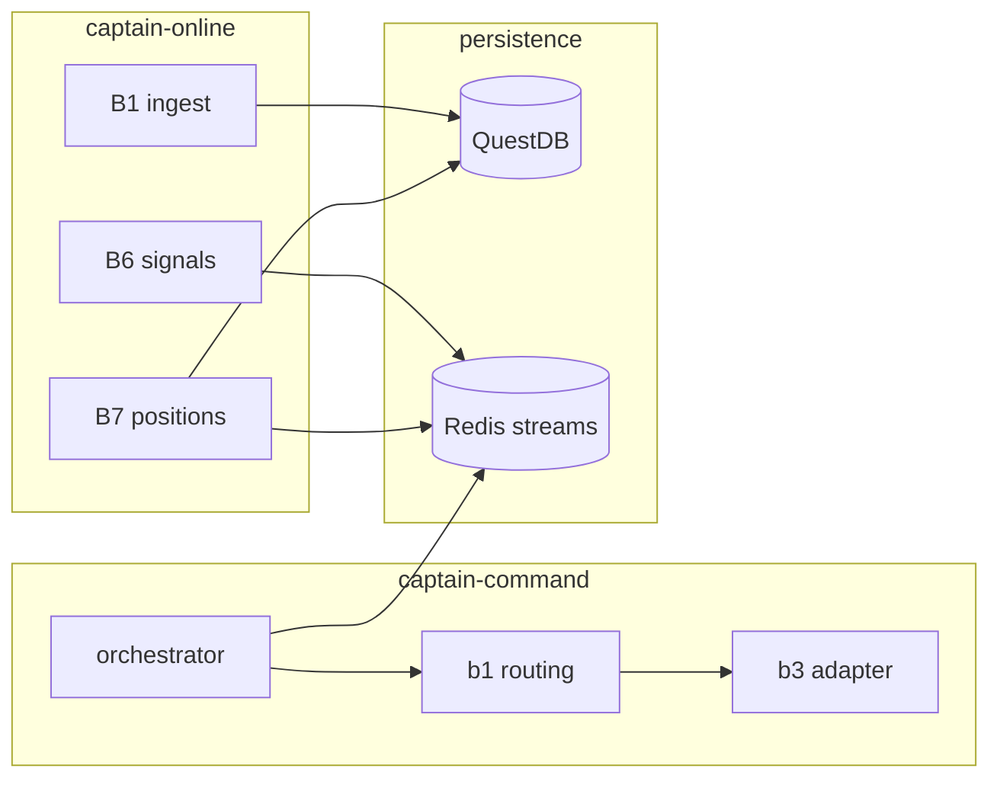

# 00 — Captain audit documentation index

**TL;DR**

- Master navigation for the May 2026 Captain reference pack under `docs/captain-audit/`.
- Lists glossary, reading order, git stamp, and where each subsystem is documented.
- Does **not** replace Obsidian specs — code + `shared/canonical_schemas.py` win for runtime truth.

**Audit stamp**

| Field | Value |
|-------|--------|
| Git commit | `ef24edf632eba2462527505d28c5a75b133fb612` |
| Branch | `main` |
| ISO datetime | `2026-05-12T14:08:20Z` |
| Pre-flight caches | `.audit-cache/` (mirror: `docs2/full-captain-explain-may26/caches/`) |

## 00.1 Reading order

| Order | Doc | Why read it |
|-------|-----|-------------|
| 1 | [01-ARCHITECTURE-OVERVIEW.md](01-ARCHITECTURE-OVERVIEW.md) | Slotting blocks + end-to-end loop |
| 2 | [02-QUESTDB-SCHEMA.md](02-QUESTDB-SCHEMA.md) | Money columns + migrations |
| 3 | [03-LIVE-CALCULATIONS.md](03-LIVE-CALCULATIONS.md) | Who computes what during sessions |
| 4 | [04-TRADE-LOGIC.md](04-TRADE-LOGIC.md) | Signals → sizing → compliance → brackets |
| 5 | [05-PARITY-SKIP.md](05-PARITY-SKIP.md) | Multi-instance skip + asset eligibility |
| 6 | [06-SCHEDULED-TASKS.md](06-SCHEDULED-TASKS.md) | Offline periodic jobs |
| 7 | [07-OFFLINE-TRAINING.md](07-OFFLINE-TRAINING.md) | AIM/HMM + offline learning cadence |
| 8 | [08-OPS-COMMANDS.md](08-OPS-COMMANDS.md) | Copy/paste ops |
| 9 | [09-KNOWN-ISSUES.md](09-KNOWN-ISSUES.md) | Spec audit + drift backlog |
| 10 | [10-VALIDATION-CHECKLIST.md](10-VALIDATION-CHECKLIST.md) | Health sweep |

## 00.2 Glossary

| Term | Meaning | Primary doc |
|------|---------|-------------|
| ORB | Opening Range Breakout strategy family | [04.2](04-TRADE-LOGIC.md#042-opening-range--direction) |
| AIM | Adaptive Intelligence Module modifiers (16 concepts) | [07.2](07-OFFLINE-TRAINING.md#072-aim-lifecycle--modifiers) |
| DMA | Dynamic Model Averaging over AIM weights | [07.3](07-OFFLINE-TRAINING.md#073-dma--decay-loop) |
| TSM | Trade State Machine / prop-firm rule simulator | [04.5](04-TRADE-LOGIC.md#045-tsm--circuit-breaker-touchpoints) |
| Parity skip | Multi-instance: tower skips batch based on SHA256 of batch key | [05.1](05-PARITY-SKIP.md#051-multi-instance-parity-content-hash) |
| Asset exclusion | Row filtered out of live session because `captain_status`/session/data-quality | [05.2](05-PARITY-SKIP.md#052-asset-eligibility-not-parity) |

## 00.3 Recent work surfaced by `/mem-search` (routed)

| Topic | Memory IDs | Routed doc |
|-------|------------|------------|
| Auto-trade flow / Topstep auth hardening | #2147, #2379–2380 | [03](03-LIVE-CALCULATIONS.md), [04](04-TRADE-LOGIC.md) |
| Redis stream consumer / parity duplicate guard | #2155, #2587 | [03.4](03-LIVE-CALCULATIONS.md#034-redis-streams--retry-semantics), [05](05-PARITY-SKIP.md) |
| QuestDB compaction / DECIMAL casts | #2730, PR commentary | [02](02-QUESTDB-SCHEMA.md), [08](08-OPS-COMMANDS.md) |
| GUI AIM modal / Pseudotrader warmup UI | #3219, #S423–S433 | [07.4](07-OFFLINE-TRAINING.md#074-gui-touchpoints) |
| API signal handler lifespan | #1570 | [03.5](03-LIVE-CALCULATIONS.md#035-command-fastapi--signal-handler) |

None intentionally omitted — if a memory row is absent, it was duplicate of the above themes.

## 00.4 Cross-reference map

## 00.5 Clarifications pending (owner)

See `.audit-cache/README.md` §Confirmation requested — GUI registry filenames vs `captain_offline/blocks/*.py`, and legacy naming `captain:signals:{user}` vs `stream:signals`.
