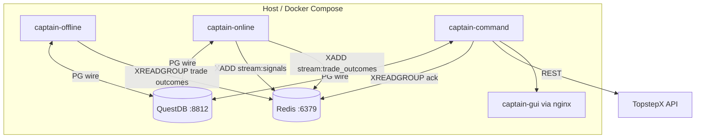

# 01 — Architecture overview

**TL;DR**

- Three Docker processes (Offline / Online / Command) share QuestDB + Redis Streams.
- GUI registry counts **45 labeled rows** (Online 14 + Offline 20 + Command 11) — filenames in registry **may drift** from `captain_offline/blocks/*.py`; trust filesystem + this doc.
- Covers pipeline sketch — **not** full pseudocode (see `docs2/spec-docs-02/offline/`).

**Audit stamp:** commit `ef24edf632eba2462527505d28c5a75b133fb612`, `2026-05-12T14:08:20Z`

## 01.1 Block inventory (GUI registry)

**Source of truth for labels/triggers:** `captain-gui/src/constants/blockRegistry.js`

| Subsystem | Count | Notes |
|-----------|-------|-------|
| ONLINE | 14 | Includes orchestrator + B1–B9 (split B1/B1f, B5/B5b/B5c) |
| OFFLINE | 20 | Includes orchestrator, bootstrap, versioning |
| COMMAND | 11 | Orchestrator + B1–B10 |

**Registry drift warning:** e.g. registry lists `b1_hmm_training.py` but repo ships `captain-offline/captain_offline/blocks/b1_aim16_hmm.py`. → Known issue [09-I05](09-KNOWN-ISSUES.md#09-i05).

## 01.2 Runtime topology



## 01.3 End-to-end trading feedback loop

**Analog:** Like a flight stack — Online is *real-time autopilot*, Command is *actuators + ATC messaging*, Offline is *maintenance & trend monitors overnight*.

| Stage | What happens | Code anchors |
|-------|----------------|--------------|
| 1 | Session open loads eligible assets | `captain-online/.../b1_data_ingestion.py` `_load_active_assets` ~49–101 |
| 2 | Regime + AIM + Kelly propose contracts | `b2_regime_probability.py`, `b3_aim_aggregation.py`, `b4_kelly_sizing.py` |
| 3 | Trade selection + CB screens | `b5_trade_selection.py`, `b5b_quality_gate.py`, `b5c_circuit_breaker.py` |
| 4 | Signals published | `b6_signal_output.py` → `publish_to_stream` → `STREAM_SIGNALS` (see `shared/redis_client.py` ~77–78) |
| 5 | Command consumes + routes | `captain-command/.../orchestrator.py` `_handle_signal` ~429–506 |
| 6 | Auto-execute bracket | `b3_api_adapter.py`, `shared/topstep_client.py` `place_bracket_order` ~342–382 |
| 7 | Monitor exit → D03 + outcomes stream | `b7_position_monitor.py` module doc ~22–26 |

Detailed calculations → [03](03-LIVE-CALCULATIONS.md). Trade rules → [04](04-TRADE-LOGIC.md).

## 01.4 Parameter — orchestrator poll cadence

| name | value | file | line | source-of-truth | rationale |
|------|-------|------|------|-----------------|----------|
| Heartbeat interval | ~30s | `captain-offline/.../orchestrator.py` | 1202–1204 | Code loop | Publishes Redis status |
| Scheduler sleep tick | 30s | same | 1233 | Code loop | Coarse cron emulation |

Verify offline heartbeat:

```bash
docker compose -f docker-compose.yml -f docker-compose.local.yml logs captain-offline 2>&1 | grep -i heartbeat | tail -n 5
```
