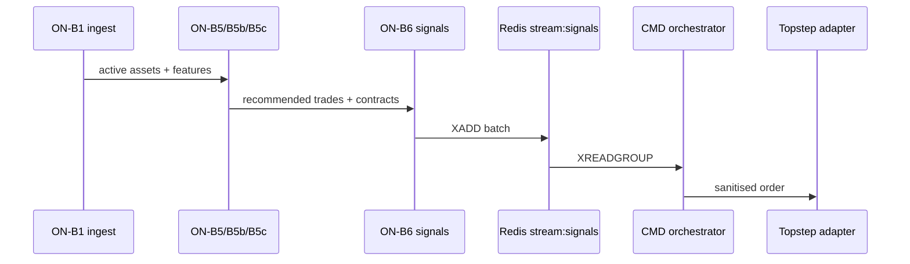

# 04 — Trade logic

**TL;DR**

- Signals carry **integer direction** (`±1`) until Command maps to **BUY/SELL** for TopstepX enums.
- TP/SL come from **locked strategy** multiples × opening range when features supply `or_range` + `entry_price`.
- Execution uses **atomic bracket MARKET** when estimates exist ([04.6](#046-bracket-construction)).
- RTS compliance gate runs **before** REST placement.

**Audit stamp:** commit `ef24edf632eba2462527505d28c5a75b133fb612`, `2026-05-12T14:08:20Z`

## 04.1 Signal generation pipeline



## 04.2 Opening range & direction

| Step | Rule | Code |
|------|------|------|
| Direction | Prefer live OR breakout `features["or_direction"]`; else `default_direction` | `b6_signal_output._determine_direction` ~244–256 |
| Pending | `direction == 0` skips signal | ~117–121 |

## 04.3 TP / SL multiples

| name | default | source | file | line |
|------|---------|--------|------|------|
| `tp_multiple` | `0.70` | `locked_strategy` JSON key per asset | `b6_signal_output.py` | 261 |
| `sl_multiple` | `0.35` | same | same | 283 |

Per-asset **override values** live in **`p3_d00_asset_universe.locked_strategy`** (JSON) seeded from P2 outputs — inspect without guessing defaults:

```bash
docker compose -f docker-compose.yml -f docker-compose.local.yml exec -T captain-command \
  sh -c 'PGPASSWORD=quest psql -h questdb -p 8812 -U admin -d qdb \
  -c "SELECT asset_id, locked_strategy FROM p3_d00_asset_universe LATEST ON last_updated PARTITION BY asset_id"'
```

Tick rounding: `_compute_tp` / `_compute_sl` ~271–299 call `get_tick_size(asset_id)`.

## 04.4 Contract sizing math

| Stage | Owner | Notes |
|-------|-------|-------|
| Kelly / concentration | `b4_kelly_sizing.py` | Reads EWMA + Kelly params (`p3_d05`, `p3_d12`) |
| Per-account map | `b6_signal_output._build_per_account` ~303+ | Emits contracts per account |

## 04.5 Compliance gates

| Gate | Where | Behavior |
|------|-------|----------|
| Global RTS JSON | `check_compliance_gate()` | MANUAL mode short-circuits adapter |
| Per-order cap | `compliance_check(order, account_id)` | Rejects before REST |

File: `captain-command/.../b3_api_adapter.py` ~211–224.

Verify gate file present in container mount:

```bash
docker compose -f docker-compose.yml -f docker-compose.local.yml exec -T captain-command \
  test -f /captain/config/compliance_gate.json && echo OK
```

## 04.6 Bracket construction

**Primary path:** `TopstepXAdapter.send_signal` computes tick distances from `entry_price` estimate (`_client.place_bracket_order`) — `captain-command/.../b3_api_adapter.py` ~241–263.

**Exchange mapping:** `shared/topstep_client.py` `place_bracket_order` ~377–381 sets:

- Entry `OrderType.MARKET`
- SL bracket `OrderType.STOP` (**4**)
- TP bracket `OrderType.LIMIT` (**1**)

## 04.7 Direction translation for API

| Signal value | Command mapping | API side |
|--------------|-----------------|----------|
| `1` | `"BUY"` | `OrderSide.BUY` (0) |
| `-1` | `"SELL"` | `OrderSide.SELL` (1) |

`captain-command/.../orchestrator.py` `_auto_execute_signal` ~586–591; adapter ~231.

Cross-link parity / skip routing: [05](05-PARITY-SKIP.md).
