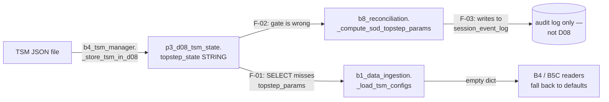
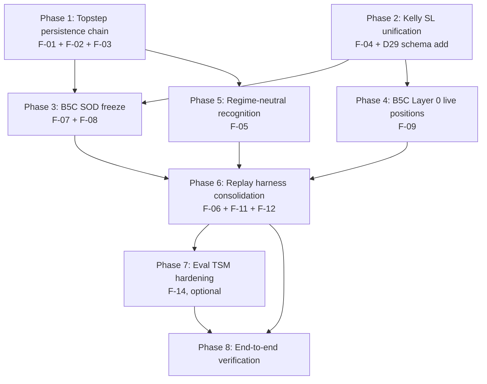

# Amendment Plan — 13 Findings, 8 Phases

## Phase 0 — Documentation Discovery & Authoritative References

### Sources consulted in audit + this plan

| Source | Location | What it provides |
|--------|----------|------------------|
| Spec: Topstep Optimisation Functions Part 6 | `docs2/spec-docs-01/Topstep Optimisation Functions.md` Part 6 lines 627–687 | Authoritative B5C pseudocode + P3-D08 SOD field map |
| Spec: Topstep Optimisation Functions Part 7 | same, lines 738–775 | Category A vs B parameter sourcing |
| Spec: nomaan_edits_fees_real (the real one) | `docs2/spec-docs-01/nomaan_edits_fees_real.md` Change 4 lines 268–298 | SOD math with φ included; canonical formula for `risk_per_trade_dollar`, `max_trades`, `daily_exposure`, `hard_halt_threshold` |
| Spec: Cross_Reference Change C1 | `docs2/spec-docs-01/Cross_Reference_PreDeploy_vs_V3.md` lines 175–183 | SOD parameter computation lives in Command Block 8 daily reconciliation (P3-PG-39) |
| Spec: Kelly Pipeline §8 | `docs2/spec-docs-01/08_Kelly_Sizing_Pipeline.md` line 260 | `risk_per_contract = strategy_sl × point_value` (silent on `strategy_sl` source — resolved by Isaac Q1: option b) |
| Spec: P2 Multi-Asset Results | `docs2/spec-docs-01/P2_MULTI_ASSET_RESULTS_SUMMARY.md` lines 50–62 | Confirms all 11 assets locked REGIME_NEUTRAL with C4/BINARY_ONLY classifier, no trained model — `pettersson_threshold` null is by design |
| Canonical schemas | `shared/canonical_schemas.py` lines 188–224 (D08), 573–583 (D29), 585–597 (D30), 349–359 (D23), 299–314 (D25) | Authoritative table DDLs |
| Test fixtures | `tests/fixtures/user_fixtures.py` lines 27–66 | Reference TSM dict shape including `topstep_params` JSON (line 50–56) — proves the data shape is already supported in tests |

### Allowed APIs — exact signatures to use, not invent

| API | Source | Use for |
|-----|--------|---------|
| `parse_json(string, default)` | `shared/json_helpers` (existing import in B1, B5C, B4) | Parsing JSON STRING columns from QuestDB |
| `get_cursor()` context manager | `shared/questdb_client` | All DB reads/writes |
| `_get_historical_volume_first_N_min(asset_id, minutes, lookback=20)` | `captain-online/.../b1_features.py:1215` | Historical first-N-min volume (existing pattern to mirror for OR range) |
| `store_opening_volume(asset_id, session_type, or_minutes, volume)` | `captain-online/.../b1_features.py:1238` | Existing INSERT pattern for D29 — extend with range parameter |
| `get_or_window_minutes(locked_strategy)` | `captain-online/.../b1_features.py:494` | Reads `OR_window_minutes` from `locked_strategy.strategy_params` (default 15 — note S1-RESOLUTION-LOG flagged 5 vs 15 mismatch with `session_registry.json`, out of scope here) |
| `run_circuit_breaker_screen(...)` | `captain-online/.../b5c_circuit_breaker.py:48` | Single canonical CB entry point; harness should call this rather than reimplement |
| `_update_account_balance(ac_id, new_balance)` | `captain-command/.../b8_reconciliation.py:503` | Reference pattern for "re-read latest D08 row, replace one field, INSERT corrected row" |

### Anti-patterns explicitly forbidden in this plan

1. **Inventing a new `p2_d07_regime_models` table** — Isaac Q5a confirmed V1 collapses P2-D06 + P2-D07 into `p3_d00.locked_strategy`. Do not add this table.
2. **Refactoring B4 risk_per_contract to use `or_range` directly from features** — `or_range` is only available in Phase B (after OR closes). B4 runs in Phase A. Use historical proxy only.
3. **Adding a separate `topstep_state_history` table** — `p3_d08_tsm_state` is already partitioned, WAL-enabled, and DEDUP-keyed on `(last_updated, account_id)`. Re-INSERT a corrected row using the existing `_update_account_balance` pattern.
4. **Using `daily OHLCV high-low` (D30) as the historical OR range proxy** — daily range is 30–100× first-5-min range. Use the new D29 column being added in Phase 2, not D30.
5. **Removing the `regime_uncertain=True` for REGIME_NEUTRAL** — Isaac Q6 confirmed keep current behaviour. Robust Kelly Layer 4 will continue to apply. Code change in Phase 5 is log-noise reduction only.
6. **Touching QuestDB columns in `p3_d08_tsm_state` other than via the existing INSERT-with-LATEST-row-rewrite pattern** — QuestDB is append-only; UPDATE doesn't exist. Don't introduce ALTER TABLE statements either; the columns we need (`topstep_params`, `topstep_state`) already exist in the canonical schema.

### Known gaps / out-of-scope items

- F-10 (CB defaults workability) — flagged in audit, requires Pseudotrader output to retune; not patchable now.
- `OR_window_minutes` default mismatch (15 in code, 5 in `session_registry.json`) — known per `docs2/audit_runs/2026-04-13_audit/S1-RESOLUTION-LOG.md`; out of scope.
- D33 `session_date` STRING vs TIMESTAMP — flagged in `shared/canonical_schemas.py:57-62`; out of scope.

---

## Phase 1 — Topstep Parameter Persistence Chain (F-01 + F-02 + F-03)

### Why these three are bundled

They form a single end-to-end data flow. Patching any one alone produces no visible change because the data is broken at three points:



After Phase 1: F-02 fixes the gate so SOD runs for the eval account; F-03 fixes the persistence target so SOD output reaches D08; F-01 fixes the SELECT so B1 actually loads it.

### What to implement

**1A — F-02: Gate the SOD computation on the right field**

File: [`captain-command/captain_command/blocks/b8_reconciliation.py`](captain-command/captain_command/blocks/b8_reconciliation.py)

Lines 60–75 currently iterate accounts and gate `_compute_sod_topstep_params` on `if ac.get("scaling_plan_active")`. Change the gate to `if ac.get("topstep_optimisation")`. The function body's XFA-only branch (the `get_scaling_tier` call at line 250) must stay gated on `scaling_plan_active` so Live/Eval accounts skip the scaling-tier sub-block.

Also extend `_get_all_accounts` SQL at lines 472–482 to SELECT `topstep_params` (currently absent) — the function builds the `ac` dict that the SOD computation reads from. Without this, even after the gate fix, `_compute_sod_topstep_params` will still see empty `topstep_params` because `_get_all_accounts` doesn't load it.

Spec reference: `nomaan_edits_fees_real.md` line 270 (`if not tsm.get("topstep_optimisation"): continue`).

**1B — F-03: Persist `topstep_state` to D08, not just session_event_log**

File: [`captain-command/captain_command/blocks/b8_reconciliation.py`](captain-command/captain_command/blocks/b8_reconciliation.py)

`_update_topstep_state` at lines 589–604 only INSERTs into `p3_session_event_log`. Rename to `_persist_topstep_state_to_d08` and follow the row-rewrite pattern used by `_update_account_balance` at lines 503–586:

1. SELECT the latest D08 row for the account (carry every column forward — same 31-column SELECT used in `_update_account_balance`).
2. Replace `topstep_state` field (column index 26 in the canonical schema).
3. INSERT a fresh row with `last_updated = now_et()`.
4. Keep the existing audit-log entry in `p3_session_event_log` — that's still useful for forensic trace.

Spec reference: `Topstep Optimisation Functions.md` Part 7 lines 762–770 ("Stored In: P3-D08[ac].topstep_state.*").

**1C — F-01: B1 loads `topstep_params` and `topstep_state` from D08**

File: [`captain-online/captain_online/blocks/b1_data_ingestion.py`](captain-online/captain_online/blocks/b1_data_ingestion.py)

`_load_tsm_configs` at lines 226–281: extend the SELECT clause (lines 230–241) to include `topstep_params, topstep_state`. Update the row-unpacking at lines 252–280 to add the two corresponding keys to the returned dict, parsing the JSON STRING columns via `parse_json(...)`.

Note the column order matters — append to the end of SELECT so the existing column indices in row-unpacking are stable.

(Note: `current_open_micros` was speculatively included in an earlier draft of this plan but does NOT exist as a D08 column in `shared/canonical_schemas.py:188-224`. It is intraday live state, sourced via Redis/position tracker in Phase 4 — not a D08 SELECT.)

### Documentation references

- Spec: `nomaan_edits_fees_real.md` Change 4 (correct SOD math)
- Spec: `Topstep Optimisation Functions.md` Part 6 lines 627–628 (B5C input contract)
- Spec: `Topstep Optimisation Functions.md` Part 7 line 768 (`L_halt → P3-D08[ac].topstep_state.hard_halt_threshold`)
- Pattern: `b8_reconciliation._update_account_balance` lines 503–586 (D08 row rewrite)
- Schema: `shared/canonical_schemas.py:188-224` (D08 has `topstep_params`, `topstep_state` already)
- Test fixture proving the dict shape is supported: `tests/fixtures/user_fixtures.py:50-56`

### Verification checklist

- [ ] Unit test: after `_compute_sod_topstep_params` runs for an Eval account (`scaling_plan_active=false, topstep_optimisation=true`), a fresh `p3_d08_tsm_state` row exists with `parse_json(row.topstep_state)["computed_sod"]["L_halt"] > 0`.
- [ ] Unit test: `_load_tsm_configs(account_id="20319784")` returns dict with `tsm["topstep_params"]["c"] == 0.5` and `tsm["topstep_state"]["computed_sod"]["E_daily_exposure"] > 0`.
- [ ] Integration test: B5C `_layer1_preemptive_halt` invoked with the loaded TSM no longer falls back to `c=0.5, e=0.01` defaults — verify by injecting `topstep_params` with non-default `c=0.3` and asserting `l_halt = 0.3 × 0.01 × balance`.
- [ ] Manual: `psql -c "SELECT topstep_state FROM p3_d08_tsm_state WHERE account_id='20319784' ORDER BY last_updated DESC LIMIT 1"` returns JSON containing `computed_sod` block populated within last reconciliation cycle.
- [ ] Replay harness `replay_full_pipeline.py` no longer prints `topstep=999` (B4 line 218 logging) — should print the actual SOD-derived cap.

### Anti-pattern guards

- Do NOT add `current_open_micros` to the D08 SELECT in this phase. It is not a D08 column. It will be wired via Redis / position tracker in Phase 4.
- Do NOT use `INSERT ... ON CONFLICT` — QuestDB doesn't support it. Use the DEDUP UPSERT KEYS already declared in the schema.
- Do NOT extend `topstep_state` JSON with fields not in the spec (Part 7 line 760–770 lists the canonical fields). Extra fields are forward-compatible but make schema audits harder.

### QuestDB impact

NONE. All affected columns (`topstep_params`, `topstep_state`) already exist in `p3_d08_tsm_state` per `shared/canonical_schemas.py:215-216`.

### Known cross-module surfaces affected

| File | Function | Reason |
|------|----------|--------|
| `b1_data_ingestion.py` | `_load_tsm_configs` | SELECT extended |
| `b8_reconciliation.py` | `_get_all_accounts`, `_compute_sod_topstep_params`, `_update_topstep_state` | Gate fix + persistence rewrite |
| `b4_kelly_sizing.py` | `_compute_topstep_daily_cap` (line 372) | Will start receiving real `topstep_state["computed_sod"]["E_daily_exposure"]` instead of falling back to 999. **No code change needed**, but behaviour changes from "no-op cap" to "real cap" — Phase 8 verification must confirm trades are not over-capped. |
| `b5c_circuit_breaker.py` | `_layer1_preemptive_halt`, `_layer2_budget`, `_layer4_correlation_sharpe` | Will start receiving real `topstep_params` instead of `{}`. **No code change needed in this phase** (Phase 3 makes them use SOD-locked values explicitly), but L_halt math changes from default to TSM-driven. |

---

## Phase 2 — Kelly SL Distance Unification (F-04)

### Resolution direction

Per Isaac Q1: option (b) — `sl_multiple × historical_avg_or_range`. B4 sizes against an expected SL distance derived from a 20-day OR average; B6 keeps live `sl_multiple × or_range`; the two converge as more sessions populate the historical average.

### What to implement

**2A — Schema add: extend `p3_d29_opening_volumes` with `or_range_first_m_min`**

File: [`shared/canonical_schemas.py`](shared/canonical_schemas.py) lines 573–583.

Add column `or_range_first_m_min DOUBLE` to `D29_OPENING_VOLUMES`. The DEDUP key `(ts, asset_id, session_date)` and partition stay identical. Existing rows get NULL for the new column — handled by the helper in 2B falling back gracefully.

**2B — `_get_historical_or_range` helper in `b1_features.py`**

File: [`captain-online/captain_online/blocks/b1_features.py`](captain-online/captain_online/blocks/b1_features.py)

Mirror `_get_historical_volume_first_N_min` at line 1215. New function `_get_historical_or_range(asset_id, minutes, lookback=20)` returns the average non-null `or_range_first_m_min` for the most recent `lookback` rows for `(asset_id, or_minutes=minutes)`. Returns `None` if fewer than 5 historical rows have non-null range — caller falls back.

Also update `store_opening_volume` at line 1238 to `store_opening_volume_and_range(asset_id, session_type, or_minutes, volume, or_range)` — single-call extension; the volume side is unchanged.

**2C — Call sites that compute and store today's OR range**

Both `orchestrator._recompute_aim15_volume` (lines 490–548) and `replay_full_pipeline._replay_recompute_aim15` (lines 325–393) currently call `store_opening_volume(asset, session_type, or_min, vol_now)` after OR closes. They have access to `or_range` via the OR tracker state. Extend both call sites to pass `or_range` to the new combined helper.

**2D — B4 risk_per_contract uses `sl_multiple × historical_avg_or_range × point_value`**

File: [`captain-online/captain_online/blocks/b4_kelly_sizing.py`](captain-online/captain_online/blocks/b4_kelly_sizing.py)

Lines 162–167 currently:
```python
strategy_sl = strategy.get("threshold", 4.0)  # SL distance in points
point_value = asset_detail.get("point_value", 50.0)
```

Replace `strategy_sl` derivation with a 4-step priority chain:
1. Try `_get_historical_or_range(asset, or_min, lookback=20)` × `strategy.get("sl_multiple", 0.10)` → primary path (Phase 2's design).
2. Fall back to `strategy.get("threshold")` (the existing static field if seeded).
3. Fall back to `4.0` (current default).
4. Log a `WARN` distinguishing which path fired so we can monitor cold-start behaviour.

`or_min` comes from `get_or_window_minutes(strategy)` at b1_features.py:494.

The same 4-step chain needs to land in `_compute_tsm_cap` at line 307–367 (it independently computes `risk_per_contract = strategy_sl * point_value` at line 331) and `_compute_topstep_daily_cap` at line 372–390 (line 387: `risk_per_trade = strategy_sl * point_value`). Extract a public helper `resolve_sizing_sl(asset, strategy, point_value)` into a new file `shared/sizing_helpers.py` (Option B per Isaac 2026-04-22) to avoid drift across three call sites and to enable cross-container reuse (B4, B5C, replay engine). Pattern follows `shared/aim_compute.py` and `shared/statistics.py:get_ewma_for_regime`.

**2E — B5C asset_sl resolution mirrors B4**

File: [`captain-online/captain_online/blocks/b5c_circuit_breaker.py`](captain-online/captain_online/blocks/b5c_circuit_breaker.py) lines 99–104.

Currently:
```python
asset_sl = sl_distance      # default 4.0
if locked_strategies:
    asset_sl = locked_strategies.get(u, {}).get("threshold", sl_distance)
```

Apply the same 4-step priority chain by importing the shared helper: `from shared.sizing_helpers import resolve_sizing_sl` (Option B — see Phase 2). This guarantees B4 and B5C agree on `rho_j` per spec — `Topstep Optimisation Functions.md` Part 6 line 635 defines `rho_j = contracts × (SL_distance × point_value + φ)` once.

**2F — Replay harness alignment**

File: [`scripts/replay_session.py`](scripts/replay_session.py) line 330: `sl_dist = strategy.get("threshold", 4.0)` — replace with the same shared helper.
File: [`shared/replay_engine.py`](shared/replay_engine.py) — the `compute_contracts` family already uses its own SL math; check lines 351–352 (`tp_multiple: 0.95, sl_multiple: 0.05`) — these are replay defaults and should follow the same chain when historical data is available.

### Documentation references

- Spec: `08_Kelly_Sizing_Pipeline.md` §8 line 260 (`risk_per_contract = strategy_sl × point_value`)
- Spec: `Topstep Optimisation Functions.md` Part 6 line 635 (`rho_j = contracts × (SL_distance × point_value + φ)`)
- Pattern: `_get_historical_volume_first_N_min` at `b1_features.py:1215` (mirror for OR range)
- Pattern: `store_opening_volume` at `b1_features.py:1238` (extend with range)
- Bootstrap pattern: `scripts/bootstrap_opening_volumes.py` already pulls historical bars — extend it to compute and store `or_range_first_m_min` for backfill.

### Verification checklist

- [ ] DDL: `CREATE TABLE` of D29 includes `or_range_first_m_min DOUBLE`. Existing rows survive (column added with implicit NULL).
- [ ] Backfill: re-run `scripts/bootstrap_opening_volumes.py` (extended) populates `or_range_first_m_min` for every existing D29 row from the corresponding intraday bars. Verify ~5 rows × 8 assets × 20 days have non-null OR range.
- [ ] Unit test: `_get_historical_or_range("MNQ", 5, lookback=20)` returns a value within the documented OR range from the P2 results doc (~80–120 points for MNQ per the replay log).
- [ ] Unit test: `shared.sizing_helpers.resolve_sizing_sl("MNQ", strategy, point_value=2.0)` with strategy = `{"sl_multiple": 0.10}` and 20 days of MNQ history returns ~10 points (`0.10 × 100 OR avg`), giving `risk_per_contract ≈ $20` instead of the legacy $8.
- [ ] Integration test: B4 sizing for MNQ produces a contract count consistent with `kelly × capital / 20` instead of `kelly × capital / 8`. Expect MNQ contracts to drop by ~2.5× from current 15 to ~6 (rough check).
- [ ] Integration test: B5C `rho_j` for MNQ matches B4's denominator (the entire point of this phase). Manual: capture both values in a single session log line for cross-check.
- [ ] No-regression: assets with no D29 history (cold start) hit the fallback chain and log a WARN. Verify the WARN fires at most once per asset per session.

### Anti-pattern guards

- Do NOT make B4 wait for OR to close. Phase A → B order is preserved.
- Do NOT compute the historical OR range from intraday bars at session boot — use the precomputed D29 column. Live computation adds 5–10s of latency at session open.
- Do NOT use `or_range` from the live features dict in B4 — that field only populates after `orchestrator._check_or_breakouts` injects it (Phase B).
- Do NOT delete the `threshold` field from `bootstrap_production.py:108` — keep it as the second fallback for cold-start situations where D29 has no rows.

### QuestDB impact

**SCHEMA CHANGE REQUIRED** — additive only.

| Table | Column added | Type | Default | Migration |
|-------|--------------|------|---------|-----------|
| `p3_d29_opening_volumes` | `or_range_first_m_min` | DOUBLE | NULL (existing rows) | `ALTER TABLE p3_d29_opening_volumes ADD COLUMN or_range_first_m_min DOUBLE;` — supported by QuestDB 9.3.3 |

Backfill: re-run `scripts/bootstrap_opening_volumes.py` once after the ALTER TABLE. The script already pulls intraday bars; extend the per-day loop to compute high–low over the OR window and INSERT with the new column populated.

Affected writers after this phase: `orchestrator._recompute_aim15_volume`, `replay_full_pipeline._replay_recompute_aim15`, `bootstrap_opening_volumes.py`.
Affected readers after this phase: `shared/sizing_helpers.resolve_sizing_sl` (new module), `b4_kelly_sizing` (imports helper), `b5c_circuit_breaker._check_all_layers` (imports helper), `replay_session.compute_contracts` (imports helper).

### Known cross-module surfaces affected

| File | Function | Change shape |
|------|----------|--------------|
| `shared/canonical_schemas.py` | `D29_OPENING_VOLUMES` constant | +1 column |
| `scripts/bootstrap_opening_volumes.py` | per-day loop | extend INSERT to include OR range |
| `scripts/seed_or_volumes_from_qc.py` | INSERT at line 93 | extend to include OR range (parallel script for QC-source seed) |
| `scripts/restore_live_delta.py` | line 168–179 (D29 restore) | extend INSERT column list |
| `scripts/backup_live_tables.py` | line 35 (D29 in backup list) | no change (CSV dump captures all columns) |
| `b1_features.py` | `_get_historical_volume_first_N_min`, `store_opening_volume` | new sibling function `_get_historical_or_range`; extend `store_opening_volume` to store range too |
| `shared/sizing_helpers.py` | NEW: `resolve_sizing_sl(asset, strategy, point_value, qdb_client)` | net-new module, Option B per Isaac 2026-04-22 |
| `b4_kelly_sizing.py` | `run_kelly_sizing`, `_compute_tsm_cap`, `_compute_topstep_daily_cap` | import + call `resolve_sizing_sl` |
| `b5c_circuit_breaker.py` | `run_circuit_breaker_screen` | import + call `resolve_sizing_sl` |
| `orchestrator.py` | `_recompute_aim15_volume` | pass `or_range` to extended store function |
| `replay_full_pipeline.py` | `_replay_recompute_aim15` | same |
| `replay_session.py` | `compute_contracts` | use shared helper |

---

## Phase 3 — B5C SOD Freeze Enforcement (F-07 + F-08)

### Why bundled

Both layers (L1 preemptive halt, L2 budget) read parameters that should be SOD-frozen but currently re-derive from `c × e × A` and `e × A` at every CB call. Same pattern, same fix.

### What to implement

**3A — L1: read SOD-locked `L_halt` with fallback**

File: [`captain-online/captain_online/blocks/b5c_circuit_breaker.py`](captain-online/captain_online/blocks/b5c_circuit_breaker.py) lines 263–293.

Currently:
```python
topstep_params = parse_json(tsm.get("topstep_params"), {})
c = topstep_params.get("c", 0.5)
e = topstep_params.get("e", 0.01)
A = tsm.get("current_balance", 0)
l_halt = c * e * A
```

After Phase 1 lands, `tsm["topstep_state"]` is populated. Add a primary path:
```python
topstep_state = parse_json(tsm.get("topstep_state"), {})
computed_sod = topstep_state.get("computed_sod", {})
l_halt = computed_sod.get("L_halt")
if l_halt is None or l_halt <= 0:
    # Fallback: SOD hasn't run yet (cold start, day-1)
    topstep_params = parse_json(tsm.get("topstep_params"), {})
    c = topstep_params.get("c", 0.5)
    e = topstep_params.get("e", 0.01)
    A = tsm.get("current_balance", 0)
    l_halt = c * e * A
    logger.warning("ON-B5C: L1 falling back to live L_halt=%.2f for %s (SOD not run)", l_halt, tsm.get("account_id"))
```

**3B — L2: read SOD-locked `E_daily_exposure` with fallback**

Lines 296–321: same pattern. Read `computed_sod.get("E_daily_exposure")`; fallback to `e × A`.

**3C — Document the SOD freeze contract**

Add a one-paragraph docstring to `_layer1_preemptive_halt` and `_layer2_budget` explaining that SOD-locked values are preferred and the fallback path is only for the cold-start window before first reconciliation.

### Documentation references

- Spec: `Topstep Optimisation Functions.md` Part 6 line 627 ("INPUT: SOD-locked params from P3-D08[ac]")
- Spec: `Topstep Optimisation Functions.md` Part 7 line 768 (`L_halt → P3-D08[ac].topstep_state.hard_halt_threshold`)
- Spec: same Part 7 line 767 (`E(A,e) → P3-D08[ac].topstep_state.daily_exposure`)
- Note field naming: `b8_reconciliation` line 261–267 stores as `L_halt` and `E_daily_exposure` (not the spec's `hard_halt_threshold` and `daily_exposure`). Field names must match between writer and reader. Decision: use writer's existing field names (`L_halt`, `E_daily_exposure`) and document the mapping.

### Verification checklist

- [ ] Unit test: with `topstep_state["computed_sod"]["L_halt"] = 1500`, B5C uses 1500 not the live recomputation `0.5 × 0.01 × balance = 750`.
- [ ] Unit test: with `topstep_state["computed_sod"] = {}` (cold start), B5C falls back to live `c × e × A` and emits the WARN.
- [ ] Integration test: change `c` from 0.5 to 0.3 in `topstep_params` mid-day (without running SOD); B5C should still use the SOD-locked L_halt (the pre-change frozen value), not 0.3 × 0.01 × A. Proves the freeze is real.
- [ ] No-regression: existing `tests/test_b5c_circuit.py` tests pass — they pass `tsm.topstep_params` directly without `topstep_state`, so they exercise the fallback path. Confirm the fallback log line doesn't break test assertions.

### Anti-pattern guards

- Do NOT remove the live-recomputation fallback. SOD hasn't run yet on day 1 (or after a fresh deploy); cold-start safety must hold.
- Do NOT silently use stale L_halt — if `computed_sod.computed_at` is more than 26 hours old, log a warning. (Optional polish; flag for future.)

### QuestDB impact

NONE (Phase 1 already covers reading `topstep_state`).

### Known cross-module surfaces affected

| File | Function | Change shape |
|------|----------|--------------|
| `b5c_circuit_breaker.py` | `_layer1_preemptive_halt`, `_layer2_budget` | Add SOD-preferred read with fallback |

---

## Phase 4 — B5C Layer 0 Live Position Read (F-09)

### What to implement

**4A — Wire `current_open_micros` from B7 position tracker into B5C**

File: [`captain-online/captain_online/blocks/b5c_circuit_breaker.py`](captain-online/captain_online/blocks/b5c_circuit_breaker.py) lines 236–260.

Currently `_layer0_scaling_cap` reads `tsm.get("current_open_micros", 0)` — always 0. Two implementation options:

- **(a) B5C imports B7's position tracker**: `from captain_online.blocks.b7_position_monitor import get_open_micros_for_account`. Lower coupling cost, but B5C → B7 import is a new dependency.
- **(b) Orchestrator passes `open_positions` snapshot to B5C as a kwarg**. Cleaner architecture (B5C remains pure-functional), but adds a kwarg that the production orchestrator and replay harness both need to populate.

**Recommendation: option (b)**. Matches the pattern of `locked_strategies` and `assets_detail` already passed as kwargs. Orchestrator at `orchestrator.py:614-626` already has `self.open_positions` available — pass `open_positions=self.open_positions` to `run_circuit_breaker_screen`. B5C internally computes `current_open_micros` per account by summing `position["contracts"]` (already in micro-equivalents per code at `b5c:252` comment) for matching `position["account"]`.

**4B — Update test fixtures**

File: [`tests/test_b5c_circuit.py`](tests/test_b5c_circuit.py) — add tests asserting Layer 0 blocks when `open_positions` totals exceed `scaling_tier_micros`.

### Documentation references

- Spec: `Topstep Optimisation Functions.md` Part 6 lines 638–645 (Layer 0 spec)
- Spec: same line 614 ("Tracking: P3 Online Block 7 already monitors open positions")
- Pattern: `orchestrator._handle_taken_skipped` at `orchestrator.py:862-906` builds the position dict that eventually appears in `self.open_positions`.

### Verification checklist

- [ ] Unit test: `open_positions=[{account: "A1", contracts: 25}]`, `scaling_tier_micros=30` (XFA tier 1), proposed = 10 → BLOCKED ("L0: scaling cap exceeded — open 25 + proposed 10 > tier cap 30").
- [ ] Unit test: same with `scaling_plan_active=False` (Live or Eval account) → not blocked (Layer 0 returns None per current line 244).
- [ ] Integration test: Eval account 20319784 (`scaling_plan_active=false`) is unaffected by this phase.

### Anti-pattern guards

- Do NOT add `current_open_micros` as a stored D08 column. It's intraday live state per spec — reading it from the orchestrator's in-memory list is correct.
- Do NOT count micros across accounts — sum only positions where `position["account"] == ac_id`.

### QuestDB impact

NONE.

### Known cross-module surfaces affected

| File | Function | Change shape |
|------|----------|--------------|
| `b5c_circuit_breaker.py` | `run_circuit_breaker_screen`, `_check_all_layers`, `_layer0_scaling_cap` | Accept `open_positions` kwarg; derive per-account micros |
| `orchestrator.py` | `_process_user_sizing` | Pass `open_positions=self.open_positions` |
| `replay_full_pipeline.py` | `run_phase_a` | Pass `open_positions=[]` (no live positions in replay) |
| `dry_run_phase_a.py` | line 322 | Pass `open_positions=[]` |

---

## Phase 5 — Regime-Neutral State Recognition (F-05)

### What to implement

Per Isaac Q3 + Q6: `pettersson_threshold = null` is the design state for REGIME_NEUTRAL assets (P2 confirmed all 11 assets locked NEUTRAL with no trained classifier). B2 should not log a per-asset WARN for this expected state. `regime_uncertain` STAYS True (Q6 = b) so Robust Kelly Layer 4 keeps applying.

**5A — Recognise REGIME_NEUTRAL early in `_binary_regime`**

File: [`captain-online/captain_online/blocks/b2_regime_probability.py`](captain-online/captain_online/blocks/b2_regime_probability.py) lines 95–116.

Add a guard at the top of `_binary_regime`:
```python
if model.get("regime_label") == "REGIME_NEUTRAL":
    # By design (P2 locked NEUTRAL): no classifier, no threshold.
    # Return 50/50 silently — outer caller still flags regime_uncertain=True
    # which keeps Robust Kelly Layer 4 active per spec.
    return {"HIGH_VOL": 0.5, "LOW_VOL": 0.5}
```

This prevents the `No pettersson_threshold for X` log noise. The outer `run_regime_probability` at lines 50–87 still flags `regime_uncertain[asset_id] = True` because `max_prob = 0.5 < 0.6` (per line 77).

**5B — Tighten the WARN message for genuine misconfigurations**

The remaining WARN path (`logger.warning("ON-B2: No pettersson_threshold for %s", asset_id)` at line 103) now only fires when `regime_label != REGIME_NEUTRAL` AND `pettersson_threshold` is missing — a real data issue. Upgrade this to ERROR severity since it indicates a P2-D06 seed mismatch rather than a benign default.

### Documentation references

- Spec: `P2_MULTI_ASSET_RESULTS_SUMMARY.md` lines 50–62 (REGIME_NEUTRAL is the locked outcome for all 11 assets; C4/BINARY_ONLY with Trained Model: None)
- Code: `b1_data_ingestion._load_regime_models` at lines 310–329 (returns `regime_label = "REGIME_NEUTRAL"` when not specified, so the new guard fires for every current asset)

### Verification checklist

- [ ] Replay: re-run `replay_full_pipeline.py`. Assert zero `No pettersson_threshold for X — using neutral` log lines.
- [ ] Unit test: `_binary_regime("ES", features, model={"regime_label": "REGIME_NEUTRAL"})` returns `{"HIGH_VOL": 0.5, "LOW_VOL": 0.5}` without warning.
- [ ] Unit test: `_binary_regime("ES", features, model={"regime_label": "HIGH_VOL", "pettersson_threshold": None})` returns None and ERROR-logs (genuine misconfiguration).
- [ ] Integration: `regime_uncertain["ES"] == True` after the change (preserves Robust Kelly Layer 4 per Isaac Q6 = b).

### Anti-pattern guards

- Do NOT change `regime_uncertain` semantics (Isaac Q6 = b).
- Do NOT remove the `pettersson_threshold` warning entirely — keep it as ERROR for non-NEUTRAL assets.
- Do NOT short-circuit `_classifier_regime` (lines 144–178); only `_binary_regime` needs the guard since BINARY_ONLY is the only path that surfaces `pettersson_threshold` ambiguity.

### QuestDB impact

NONE.

### Known cross-module surfaces affected

| File | Function | Change shape |
|------|----------|--------------|
| `b2_regime_probability.py` | `_binary_regime` | Early-return for REGIME_NEUTRAL; upgrade missing-threshold WARN to ERROR |

---

## Phase 6 — Replay Harness Consolidation (F-06 + F-11 + F-12)

### What to implement

**6A — F-06: Replay passes `locked_strategies` and `assets_detail` to B5C**

File: [`scripts/replay_full_pipeline.py`](scripts/replay_full_pipeline.py) lines 272–281.

Add the two missing kwargs:
```python
b5c = run_circuit_breaker_screen(
    ...,
    locked_strategies=b1["locked_strategies"],
    assets_detail=b1["assets_detail"],
    open_positions=[],  # added in Phase 4
)
```

**6B — F-11: Replace replay_session's reimplemented L1 with a call into production B5C**

File: [`scripts/replay_session.py`](scripts/replay_session.py) lines 408–421.

The hand-rolled L1 loop (`while final > 0 and (final * fallback_risk) >= l_halt: final -= 1`) is a different formula from B5C (binary block, no contract decrement). Delete the inline reimplementation; import and call `b5c_circuit_breaker.run_circuit_breaker_screen` with a single proposed asset/account pair. Loop only over assets, not contracts.

**6C — F-12: Add per-asset CB resolution test**

File: [`tests/test_b5c_circuit.py`](tests/test_b5c_circuit.py).

Add a test:
```python
def test_per_asset_resolution_via_locked_strategies():
    tsm = _make_topstep_tsm(["acc_eval_1"])
    locked_strategies = {"MNQ": {"sl_multiple": 0.10, "threshold": 4.0}}
    assets_detail = {"MNQ": {"point_value": 2.0}}
    result = run_circuit_breaker_screen(
        recommended_trades=["MNQ"],
        final_contracts={"MNQ": {"acc_eval_1": 15}},
        ...,
        locked_strategies=locked_strategies,
        assets_detail=assets_detail,
    )
    # Expect rho_j to use point_value=2.0 (not default 50.0), giving rho_j ≈ $120 not $3000
    # Assert no L1 block on rho_j=$120 vs L_halt=$750
    assert "MNQ" in result["recommended_trades"]
```

### Documentation references

- Production reference: `orchestrator.py:614-626` (canonical kwarg list)
- Already-correct mirror: `dry_run_phase_a.py:322-334`

### Verification checklist

- [ ] After 6A: re-run replay on tower 2 with the same date as the original audit (2026-04-21). Verify the four micros (M2K, MES, MNQ, MYM) no longer get blocked at L1 for the wrong reason.
- [ ] After 6B: `scripts/replay_session.py` produces `cb_blocked` decisions matching what production B5C would produce for the same inputs (within rounding).
- [ ] After 6C: pytest passes the new fixture.
- [ ] Cross-check: any remaining CB blocks in replay output should now have a real cause (e.g., genuine SOD-cap exceedance, real basket expectancy issue), not the scalar-defaults artifact.

### Anti-pattern guards

- Do NOT keep the old reimplementation as a fallback in `replay_session.py`. One canonical CB.
- Do NOT delete `_make_topstep_tsm` test fixture additions for `topstep_params` — Phase 1's new B5C reads will trip if test TSMs don't have `topstep_state` set; tests should mock both via the fixture.

### QuestDB impact

NONE.

### Known cross-module surfaces affected

| File | Function | Change shape |
|------|----------|--------------|
| `replay_full_pipeline.py` | `run_phase_a` | +2 kwargs in B5C call |
| `replay_session.py` | `compute_contracts` | Replace inline L1 with B5C call |
| `tests/test_b5c_circuit.py` | new test | +per-asset resolution coverage |
| `tests/fixtures/user_fixtures.py` | `make_tsm_config` | Optionally add a `topstep_state` fixture key with `computed_sod` populated, to enable Phase 3 SOD-preferred path testing |

---

## Phase 7 — Eval TSM Hardening (F-14)

### Background

Account 20319784 uses `topstep_150k_eval.json`. The TSM file is missing or null on:
- `pass_probability` (B4 line 295 → falls to `else` branch → multiplier 0.85)
- `evaluation_end_date` (B4 line 319–328 → falls to `budget_divisor = 20`)
- `max_daily_loss` (B4 line 334 → `max_by_mll = 999`)

These may all be intentional (no MDD-time-bound on eval, no daily loss limit on Combine, no historical pass probability yet). Worth confirming before committing to defaults silently.

### What to implement (low-priority, optional)

**7A — Add explicit defaults to the eval TSM JSON with comments**

File: [`config/tsm/providers/topstep_150k_eval.json`](config/tsm/providers/topstep_150k_eval.json).

Add comments (use a top-level `_notes` key since JSON has no comments) explaining why `pass_probability`, `evaluation_end_date`, and `max_daily_loss` are absent or null. Document the Topstep Combine rules that justify each.

**7B — B4 should log when defaults fire on eval accounts**

File: [`captain-online/captain_online/blocks/b4_kelly_sizing.py`](captain-online/captain_online/blocks/b4_kelly_sizing.py) lines 292–304 (`_apply_risk_goal`) and 318–328 (budget divisor lookup).

Add INFO-level log lines noting which default was used and why. Helps next time we audit.

### Documentation references

- TSM file schema: `nomaan_edits_fees_real.md` lines 396–423 (Required vs Optional fields register)

### Verification checklist

- [ ] Replay: log lines confirm which defaults fired for the eval account.
- [ ] Manual: confirm with Topstep documentation that the Combine has no MDD-time-bound / no MLL.

### Anti-pattern guards

- Do NOT set `pass_probability = 0.5` as a static default in the TSM file. It should be computed from rolling Pseudotrader output once data exists.
- Do NOT set `max_daily_loss` if Topstep Combine truly doesn't have one — false positives on the L2 budget cap would be worse than the current behaviour.

### QuestDB impact

NONE.

---

## Phase 8 — End-to-End Verification

### What to implement

**8A — Integration replay re-run**

Run `replay_full_pipeline.py` on tower 2 with the same date (2026-04-21) and assert:

- [ ] `tsm["topstep_params"]` is populated in B1 output (Phase 1 verification).
- [ ] `tsm["topstep_state"]["computed_sod"]` is populated and non-empty after Phase 1+2 land (Phase 1B SOD persistence).
- [ ] B4 logs: `risk/c=` values reflect per-asset historical OR range × sl_multiple × point_value (Phase 2 verification).
- [ ] B4 sizing produces materially different contract counts vs original audit run — micros should size down (M2K/MES/MNQ/MYM contracts likely 4–8 instead of 10–15).
- [ ] B5C logs: `rho_j` values match B4's denominator × contracts (Phase 2 + Phase 3 cross-module agreement).
- [ ] B5C: `L_halt` displayed in any block reasons matches `computed_sod.L_halt` from D08 (Phase 3 freeze enforcement).
- [ ] B6 publishes ≥1 signal (the entire point of the audit).
- [ ] Zero `No pettersson_threshold` warnings for current REGIME_NEUTRAL assets (Phase 5).

**8B — Smoke run with `verify_questdb_state.py`**

Run `scripts/verify_questdb_state.py` to confirm:

- [ ] D29 has `or_range_first_m_min` populated for ≥80% of recent rows (post-backfill).
- [ ] D08 has `topstep_state` non-null with `computed_sod` for account 20319784.
- [ ] No new schema warnings.

**8C — Pseudotrader sanity (optional)**

Run `b3_pseudotrader` with the new B5C to confirm circuit breaker decisions don't catastrophically tank P&L on historical data. Defer if no time — Pseudotrader has its own lifecycle and isn't on the BLOCKING critical path.

### Anti-pattern guards

- Do NOT skip the replay re-run. The original audit was driven by replay output; the proof of fix is replay output.
- Do NOT consider Phase 1 done until you can `psql` and see `computed_sod` in D08 with non-zero `L_halt`.

---

## Dependency Graph & Recommended Execution Order



**Critical path:** P1 → P2 → P3 → P6 → P8.
P4, P5, P7 are parallelisable.
P2's D29 schema add is the only QuestDB change; sequence it BEFORE the bootstrap backfill and BEFORE the B4/B5C reader code that depends on the new column.

## Effort Estimate (rough)

| Phase | Code change | Test change | Schema | Backfill | Estimate |
|-------|------------|-------------|--------|----------|----------|
| 1     | M | M | none | none | 4–6h |
| 2     | L | M | S | M | 6–8h |
| 3     | S | S | none | none | 1–2h |
| 4     | S | S | none | none | 1–2h |
| 5     | XS | XS | none | none | 30m |
| 6     | XS | S | none | none | 1–2h |
| 7     | XS | none | none | none | 30m |
| 8     | none | none | none | none | 1h |
| **Total** | | | | | **~16–22h focused work** |

## Final Cross-Module Impact Matrix

Files modified, total: 12 source + 5 scripts + 2 test files + 1 schema = 20.

| File | Phases touching it |
|------|---------------------|
| `captain-online/captain_online/blocks/b1_data_ingestion.py` | 1 |
| `captain-online/captain_online/blocks/b1_features.py` | 2 |
| `captain-online/captain_online/blocks/b2_regime_probability.py` | 5 |
| `captain-online/captain_online/blocks/b4_kelly_sizing.py` | 2 |
| `captain-online/captain_online/blocks/b5c_circuit_breaker.py` | 2, 3, 4 |
| `captain-online/captain_online/blocks/orchestrator.py` | 2, 4 |
| `captain-command/captain_command/blocks/b8_reconciliation.py` | 1 |
| `shared/canonical_schemas.py` | 2 |
| `tests/test_b5c_circuit.py` | 6 |
| `tests/fixtures/user_fixtures.py` | 6 |
| `scripts/replay_full_pipeline.py` | 2, 4, 6 |
| `scripts/replay_session.py` | 2, 6 |
| `scripts/bootstrap_opening_volumes.py` | 2 |
| `scripts/seed_or_volumes_from_qc.py` | 2 |
| `scripts/restore_live_delta.py` | 2 |
| `shared/replay_engine.py` | 2 (light review) |
| `config/tsm/providers/topstep_150k_eval.json` | 7 |

## Modules NOT touched (verified safe)

These were checked for cross-cutting impact and confirmed unaffected:

| File | Why unaffected |
|------|----------------|
| `captain-online/captain_online/blocks/b3_aim_aggregation.py` (delegates to `shared/aim_compute.py`) | AIM logic unchanged; Phase 5 only touches B2 |
| `shared/aim_compute.py` | No `pettersson_threshold` references |
| `captain-online/captain_online/blocks/b5_trade_selection.py` | Uses `final_contracts` dict; Phase 2 only changes the values, not the shape |
| `captain-online/captain_online/blocks/b5b_quality_gate.py` | Quality gate runs on edge × modifier × maturity; unaffected by SL distance changes |
| `captain-online/captain_online/blocks/b6_signal_output.py` | Already uses `sl_multiple × or_range`; Phase 2 doesn't change B6 |
| `captain-online/captain_online/blocks/b7_position_monitor.py` | Phase 4 only reads `open_positions` snapshot, doesn't change B7 |
| `captain-online/captain_online/blocks/b8_or_tracker.py` | OR detection unchanged |
| `captain-offline/captain_offline/blocks/b8_kelly_update.py` | Kelly fraction estimation unchanged; Phase 2 only changes how the fraction is converted to contracts |
| `captain-offline/captain_offline/blocks/b8_cb_params.py` | β_b estimation unchanged |
| `captain-command/captain_command/blocks/b3_api_adapter.py` | Order placement unchanged |
| `captain-command/captain_command/blocks/b1_core_routing.py` | Signal routing unchanged |
| `captain-command/captain_command/blocks/b4_tsm_manager.py` | TSM file → D08 INSERT already includes `topstep_state` column (line 410); Phase 1's persistence rewrite reuses the column, no schema/code change needed here |

## Rollback Strategy

If any phase introduces a regression:

- **Phase 1**: Single `git revert` per file. The SQL extension is additive — a SELECT with extra columns is backwards-compatible if the dict keys are unused.
- **Phase 2**: D29 column is additive (NULL on existing rows). Reverting code restores `threshold` field reads. ALTER TABLE ADD COLUMN is reversible via `ALTER TABLE p3_d29_opening_volumes DROP COLUMN or_range_first_m_min;` if absolutely needed.
- **Phase 3-7**: Pure code reverts — no data migration needed.
- **Phase 8** is verification only — nothing to roll back.

## Open Items / Future Work (Not in This Plan)

| Item | Why deferred | Suggested timing |
|------|--------------|------------------|
| F-10: CB defaults workability | Needs Pseudotrader data | Post-Phase 8, after 30 days of live runs |
| `OR_window_minutes` 5-vs-15 default mismatch | Out of audit scope | Separate ticket |
| D33 `session_date` STRING-vs-TIMESTAMP | Out of audit scope | Separate ticket |
| pseudotrader grid search (`P3-PG-09C`) for tuning `c, e, lambda` per account | Needs trade history | Post-Phase 8 + 30 days |
| Multi-instrument `phi` selection in SOD computation (currently uses ES as default — `b8_reconciliation.py:217`) | Eval account trades multiple instruments | Phase 9 candidate |

---

*Plan complete. Ready for execution by phase. No code, config, or QuestDB changes have been made by this planning session — the plan is the deliverable.*
