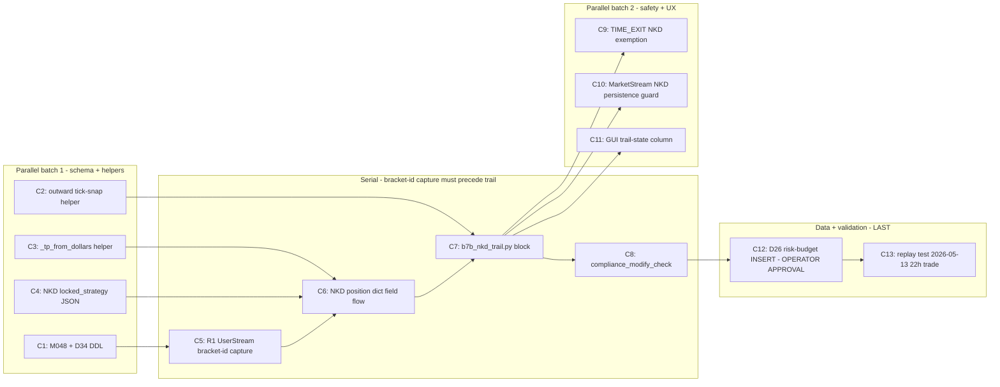

# PLAN — NKD Pivot Implementation

> **SUPERSEDED (in part) — 2026-05-19**
> Isaac's confirmed spec post-dates this plan. Three decisions here are incorrect:
> - **§1 DEC-3 / §5 phase math**: Phase B is NOT a linear taper `D_init → 450` over `[1500, 4000)`. It is a **discrete step ladder**: Phase B = `$1,000` flat over `[2000, 3000)`, Phase C = `$450` flat over `[3000, 4450)`.
> - **§1 DEC-8 / §5 jitter spec**: Jitter J does NOT only shift phase-boundary thresholds. J is added to the **broker dollar buffer** (SL) AND the **TP dollar target** at order-placement time. Phase boundaries are clean.
> - **§4 C4 / C6**: `snapped_d_init` is NOT derived from `OR-range × sl_multiple`. It is a **fixed `$1,025`** for all NKD trades.
>
> See **[`day_2/PLAN.md`](../day_2/PLAN.md)** for the corrective commits C14, C15, C16.
> See **[`day_2/COMPLETION_CHECKLIST.md`](../day_2/COMPLETION_CHECKLIST.md)** for the full C1–C13 status audit.
>
> All other DECs (C1, C2, C5, C8, C9, C10, C11) remain valid and fully implemented.


**Source of truth for the existing system state:** [NKD_PIVOT_AUDIT.md](NKD_PIVOT_AUDIT.md). This plan
is the executor-ready follow-up; every file:line citation here was re-verified against HEAD
`d6737178` (audit baseline) before writing.

**Status:** PLAN-ONLY. No code edits, no migrations applied, no DB writes performed. Operator
must confirm this plan (via `CreatePlan` prompt) before any commit lands.

---

## 0. TL;DR — what changes and in what order

13 atomic commits, each independently validatable. Critical path is **C1 → C6 → C7 → C8 → C13**.
Items C1, C2, C3, C4, C9, C10, C11 are parallelisable. C12 is a data-only operator-run step that
lands last (Intervention A, requires explicit operator approval per §6). Tower rollout: **Nomaan
first** (PARITY=0, jitter J disabled — simpler case), then **Isaac** (PARITY=1, jitter active).



---

## 1. Locked decisions (carried from operator review of the audit)

| ID | Decision | Resolution | Anchor |
|---|---|---|---|
| DEC-1 | Trail-state persistence target | **New table `p3_d34_nkd_trail_state`** (D31-D33 already taken — audit §3.1). NOT extra columns on D23 (wrong cardinality: D23 is per-`(account, session)`, trail is per-`signal_id`). | [NKD_PIVOT_AUDIT.md](NKD_PIVOT_AUDIT.md) §3.1 |
| DEC-2 | NKD TP override route | **BOTH** — `locked_strategy` JSON gets `tp_dollars: 4450` + `is_nkd_trail: true` (auditable, future-tunable per asset, freeze-approved per doc 07.5) AND a small `_tp_from_dollars` helper in [b6_signal_output.py](captain-online/captain_online/blocks/b6_signal_output.py) that activates whenever `tp_dollars` is present. Single code surface, declarative config. | operator |
| DEC-3 | Trail-loop home | **New block `b7b_nkd_trail.py`** in `captain-online/captain_online/blocks/`, invoked from the online main loop after `monitor_positions`. Cleaner test surface than inline B7 branching; one new block-registry entry in `captain-gui/src/constants/blockRegistry.js`. | audit §5.5 |
| DEC-4 | Ratchet enforcement | **Stateful HWM** persisted on the `p3_d34` row (`current_stop_price`, `current_buffer`, `phase`). Hot path reads from `captain:open_positions` Redis hash; cold/audit path reads from D34. Trail block computes phase + buffer STATELESSLY each poll, then refuses to weaken the stop. | audit §5.4 H1 |
| DEC-5 | Risk-budget intervention | **Intervention A only** — UPSERT `p3_d26_hmm_opportunity_state` with `opportunity_weights={"NY":0.10,"LON":0.10,"APAC":0.80}`, `cold_start=false`, `n_observations=60`. Zero code change, reversible, lands AFTER explicit operator approval (§6). | audit §4.2 |
| DEC-6 | Compliance wrapper for `/modify` | **New wrapper** — `compliance_modify_check(account_id, asset, current_execution_mode)` in [b12_compliance_gate.py](captain-command/captain_command/blocks/b12_compliance_gate.py); trail block calls it before each `modify_order`. Halts trail (no flatten) if MANUAL-mode locks in mid-position. | audit §8.2 |
| DEC-7 | Tick re-subscribe at session boundary | **Explicit re-subscribe needed** — audit §6.2 identifies that `MarketStream.remove_contract` may drop NKD at session rollover. Add guard in [captain-online/captain_online/main.py](captain-online/captain_online/main.py) (or session-rollover hook in orchestrator) that retains NKD's `contract_id` in the subscription set as long as `captain:open_positions` contains an NKD entry. | audit §6.2 |
| DEC-8 | Tick-rounding helper | **New asymmetric outward rounder** `tick_snap_outward(price, asset_id, direction)` in [shared/contract_resolver.py](shared/contract_resolver.py). Existing `_compute_sl` rounder rounds INWARD (narrower stop) — opposite of NKD spec. | audit §5.3 |
| DEC-9 | Migration ID | **`M048_create_d34_nkd_trail_state`** — next free after `M047_d23_dedup_include_session_id` ([shared/canonical_schemas.py:1052-1053](shared/canonical_schemas.py)). | verified |
| Bracket capture | How to get real SL/TP order IDs after atomic `place_bracket_order` | **R1 — UserStream capture.** Listen on `_on_order_update` in [captain-online/captain_online/main.py:227-240](captain-online/captain_online/main.py); within ~3s of an entry placement disambiguate by `type` (4=STOP→`sl_order_id`, 1=LIMIT→`tp_order_id`). Defence-in-depth for every asset, not just NKD. | operator, audit §5.1 |
| NKD margin | Canonical `margin_per_contract` | **$7,700** (current live D00 + bootstrap_production.py). Plan defers margin change to a separate ticket; NKD pivot is sizing-agnostic at `size=1`. | operator, audit §9.2 |

---

## 2. P0 operator confirmations needed before execution

**None of the DECs are blocking.** Two soft P1 items that should be confirmed before C12 / C13 lands but do not block C1-C11:

1. **Replay-data availability for 2026-05-12/13 NKD 22h trade (§11.2 of audit, §12.8).** Does
   a tick-level (sub-1-min) bar export exist? If not, C13 falls back to synthetic ticks
   driven by the trade's 1-min OHLC bars — assert tolerance widens from ±$50 to ±$200 and
   note in the test docstring.
2. **Per-tower jitter activation semantics (audit §12.7).** Spec is clear (`INSTANCE_PARITY=="1"`
   only). Plan treats unset `INSTANCE_PARITY` identically to `"0"` (jitter OFF). Operator
   should confirm this before Isaac tower deploy so an accidentally-unset env doesn't yield
   silent J=0 on the tower that should have jitter.

If either of those is unanswered by the time C12 / C13 are scheduled, the executor must STOP
and ask. They do not block C1-C11.

---

## 3. Migration plan — `M048_create_d34_nkd_trail_state`

### 3.1 Canonical entry to append in [shared/canonical_schemas.py](shared/canonical_schemas.py)

**Constant** (add to `CANONICAL_DDLS` near D33, e.g. just after line 694 where `D33_OPENING_VOLATILITY` ends):

```sql
CREATE TABLE IF NOT EXISTS p3_d34_nkd_trail_state (
    signal_id          STRING,
    account_id         SYMBOL,
    asset              SYMBOL,
    contract_id        STRING,
    entry_order_id     STRING,
    sl_order_id        LONG,
    tp_order_id        LONG,
    direction          INT,
    contracts          INT,
    entry_price        DECIMAL(14, 6),
    snapped_d_init     DECIMAL(18, 2),
    tp_dollars         DECIMAL(18, 2),
    jitter_x           DECIMAL(10, 8),
    jitter_y           INT,
    jitter_j           DECIMAL(18, 8),
    phase              SYMBOL,
    current_buffer     DECIMAL(18, 2),
    current_stop_price DECIMAL(14, 6),
    current_pnl        DECIMAL(18, 2),
    modify_seq         LONG,
    last_modify_status STRING,
    last_modify_error  STRING,
    last_updated       TIMESTAMP
) TIMESTAMP(last_updated) PARTITION BY DAY WAL
DEDUP UPSERT KEYS(last_updated, signal_id, modify_seq);
```

**Migration entry** (append to `CANONICAL_MIGRATIONS` after [shared/canonical_schemas.py:1053](shared/canonical_schemas.py)):

```python
(
    "M048_create_d34_nkd_trail_state",
    D34_NKD_TRAIL_STATE,
),
```

Note: `CANONICAL_MIGRATIONS` entries are normally `ALTER TABLE` strings, but [init_questdb.py:18-60](scripts/init_questdb.py) applies any SQL string. The `CREATE TABLE IF NOT EXISTS` form is idempotent and re-applies cleanly. If reviewer prefers, split into a no-op CREATE that the DDL pass already handles — both work, neither blocks.

### 3.2 Rollback SQL

```sql
DROP TABLE IF EXISTS p3_d34_nkd_trail_state;
```

QuestDB DROP is destructive and WAL-aware. Rollback should only be invoked if M048 application itself fails — once the trail block writes a single row, rollback wipes audit-trail data and must be a deliberate operator action.

### 3.3 `COLUMN_TYPES` delta

**No manual delta required.** [shared/canonical_schemas.py:1064-1086](shared/canonical_schemas.py) auto-derives `COLUMN_TYPES` from `CANONICAL_DDLS` via `_COLUMN_LINE_RE`. The existing regression test `tests/test_canonical_column_types.py` will pick up D34 automatically — verify locally with:

```bash
PYTHONPATH=./:./captain-online:./captain-offline:./captain-command \
  python3 -m pytest tests/test_canonical_column_types.py -v
```

### 3.4 Deploy ordering

The migration MUST land before any code that writes to D34. Per workspace rule §2, the on-tower flow is:

```fish
git pull --ff-only origin main
for svc in captain-offline captain-online captain-command
    rm -rf $svc/_config
    cp -r config $svc/_config
end
dco build --no-cache captain-command captain-online
dco up -d
cmd-run init_questdb.py   # idempotent; applies M048
```

Validation: `curl -s -G "http://127.0.0.1:9000/exec" --data-urlencode "query=SHOW TABLES" | grep p3_d34` returns the new table name.

### 3.5 Doc 09 known-issue compliance

- **I02 (D04 partial-row INSERT):** D34 writes are FULL-ROW UPSERTs every `modify_seq` increment — every write is a complete snapshot. Compliant.
- **I03 (missing version snapshots on D01/D02):** D34 IS an event log; each row IS a snapshot. Add explicit comment in the DDL block above documenting that snapshot-before-update does NOT apply to event-log tables.

---

## 4. Code change plan (per file, in dependency order)

> Format: `[path:line_range]` then *current behaviour*, *new behaviour*, *risk*, *test*.
> Edits are grouped by commit; commits are atomic and independently validatable.

### C1 — schema (no code consumers)

Covered by §3 above. The only file edit is [shared/canonical_schemas.py](shared/canonical_schemas.py) (add `D34_NKD_TRAIL_STATE` constant + `M048` entry in `CANONICAL_MIGRATIONS`).

### C2 — outward tick-snap helper

**[shared/contract_resolver.py:99-105]**

- Current behaviour: `get_tick_size(asset_id) -> float` returns the tick increment. No tick-snapping helper exists.
- New behaviour: add module-level function `tick_snap_outward(price: float, asset_id: str, direction: int) -> float`:
  - `tick = get_tick_size(asset_id)`
  - if `direction == 1`: `return floor(price / tick) * tick` (LONG: lower price → wider stop)
  - if `direction == -1`: `return ceil(price / tick) * tick` (SHORT: higher price → wider stop)
  - precision: match existing `_compute_sl` `ndigits` derivation ([b6_signal_output.py:295](captain-online/captain_online/blocks/b6_signal_output.py))
- Risk: low — pure function, no existing callers to break.
- Test: new file `tests/test_tick_snap_outward.py`:
  - `test_long_floors_for_nkd` — `tick_snap_outward(38022.5, "NKD", 1) == 38020.0`
  - `test_short_ceils_for_nkd` — `tick_snap_outward(38022.5, "NKD", -1) == 38025.0`
  - `test_long_already_grid_aligned` — `tick_snap_outward(38020.0, "NKD", 1) == 38020.0`
  - `test_short_already_grid_aligned` — `tick_snap_outward(38025.0, "NKD", -1) == 38025.0`
  - `test_unknown_asset_raises` — passing a non-D00 asset raises `KeyError` (mirror existing `get_tick_size` behaviour)

### C3 — `_tp_from_dollars` helper in B6

**[captain-online/captain_online/blocks/b6_signal_output.py:259-278]**

- Current behaviour: `_compute_tp(strategy, features, direction, asset_id)` always derives TP from `strategy["tp_multiple"] * features["or_range"]`. No path for a dollar-denominated TP.
- New behaviour:
  - Add helper `_tp_from_dollars(dollars: float, entry: float, direction: int, point_value: float, size: int, asset_id: str) -> float`:
    - `tp_distance_points = dollars / (point_value * max(1, size))`
    - `tp_raw = entry + (tp_distance_points * direction)`
    - return inward-snapped TP: LONG → `floor(tp_raw / tick) * tick` (TP at-or-below dollar ceiling), SHORT → `ceil(tp_raw / tick) * tick`. This is the EXISTING `_compute_tp` rounding semantics (lines 271-278) — reuse the same `tick` derivation block.
  - Modify `_compute_tp`: prepend `tp_dollars = strategy.get("tp_dollars")` check; if present and entry is known, return `_tp_from_dollars(tp_dollars, entry, direction, point_value, size, asset_id)`. Else fall through to the existing OR-range formula.
  - **`size` is per-signal** — pass it through from `_publish_signals`'s context. NKD pivot at `size=1` makes this trivial; the helper is still correct for `size>1`.
- Risk: medium — `_compute_tp` is on the hot path for every signal. The `strategy.get("tp_dollars")` short-circuit must be evaluated cleanly when absent (every non-NKD asset). Defensive: only trigger the new branch when `tp_dollars is not None`. Mutation to `_compute_tp`'s signature requires updating the one call site in `_publish_signals` (currently around [b6_signal_output.py:138-176](captain-online/captain_online/blocks/b6_signal_output.py)) to pass `size`.
- Test: extend `tests/test_b6_signal.py` (current coverage at [tests/test_b6_signal.py:114-127](tests/test_b6_signal.py)):
  - `test_compute_tp_with_tp_dollars_nkd_long` — `strategy={"tp_dollars": 4450}`, entry=38000, point_value=5.0, size=1, direction=1 → expect `floor((38000 + 4450/5) / 5) * 5 = floor(38890 / 5) * 5 = 38890.0` (already grid-aligned).
  - `test_compute_tp_with_tp_dollars_fallback` — `tp_dollars=None` → uses old OR-range formula unchanged.
  - `test_compute_tp_with_tp_dollars_short` — `direction=-1`, NKD short, verifies ceil-snap.

### C4 — NKD `locked_strategy` JSON patch (doc 07.5 FREEZE APPROVAL)

**[scripts/bootstrap_production.py:48 (NKD strategy entry)]**

- Current behaviour: NKD `locked_strategy` is `{"m": 6, "k": 6, "OO": 0.8533, "tp_multiple": 0.70, "sl_multiple": 0.35, ...}`.
- New behaviour: extend NKD's locked_strategy dict with the trail-control fields:
  ```python
  "tp_dollars": 4450,
  "is_nkd_trail": True,
  "trail_step_dollars": 500,
  "trail_phase_b_start_dollars": 1500,
  "trail_phase_c_start_dollars": 4000,
  "trail_phase_c_buffer_dollars": 450,
  ```
  Existing `tp_multiple` stays for fallback semantics (if someone manually clears `tp_dollars`); `sl_multiple` stays as the **snapped `D_init` source** (audit §5.3 path).
- Per doc 07.5 freeze rule: this is a `config/` mutation that requires explicit operator approval BEFORE the bootstrap_production.py change lands. Operator approval captured in the commit message and `docs2/context/` trail.
- Risk: medium — mutating a frozen locked_strategy. Mitigation: the new fields are ADDITIVE (no removal, no semantic change to existing fields), and the consumer code (C3, C7) treats missing keys as fallback. Other 9 assets get NO change.
- Test:
  - `tests/test_bootstrap_nkd_trail_fields.py` — assert post-bootstrap D00 row for NKD has all six new fields with the values above.
  - Doc 08.2 query post-deploy: `SELECT asset_id, locked_strategy FROM p3_d00_asset_universe WHERE asset_id='NKD' LATEST ON last_updated PARTITION BY asset_id` — confirm JSON includes the new keys.

### C5 — R1 UserStream bracket-child capture (defence-in-depth, all assets)

This is the most invasive single commit. It resolves audit §5.1 (BLOCKING `sl_order_id="BRACKET"` sentinel) and audit candidate I10. Three surfaces:

**[captain-command/captain_command/blocks/b3_api_adapter.py:264-284] — push pending bracket entry to Redis**

- Current behaviour: after successful `place_bracket_order`, result is built with `sl_order_id: "BRACKET"`, `tp_order_id: "BRACKET"` (lines 274-275) and returned synchronously.
- New behaviour: after `bracket_resp.get("success")`, also push the entry into a Redis hash `bracket:pending:{account_id}` keyed by `entry_oid` with value `{"signal_id": signal_id, "asset": asset_id, "side": side, "timestamp": ms_now, "expected_sl_dollars": <distance>}`, TTL 10 seconds. This lets the UserStream callback in C5b match a freshly-arriving STOP / LIMIT child to the entry it belongs to.
- Risk: low — pure addition; if Redis write fails, fall through to existing sentinel behaviour (logged as warning).
- Test: extend `tests/test_b3_api_adapter_sltp.py` ([tests/test_b3_api_adapter_sltp.py:381-390](tests/test_b3_api_adapter_sltp.py)) with `test_bracket_pushes_pending_to_redis` (mock Redis client; assert HSET called with expected fields).

**[captain-online/captain_online/main.py:227-240] — `_on_order_update` enriches `captain:open_positions`**

- Current behaviour: `_on_order_update` only publishes to `CH_USER_EVENTS` Redis pubsub channel.
- New behaviour: when an order arrives with `accountId == our_account_id` AND `status == FILLED` (or just placed — needs ProjectX status code confirmation in the implementation), match it against any pending entry in `bracket:pending:{account_id}`:
  - if order's `type == 4` (STOP) and side is OPPOSITE the pending entry's side → capture as `sl_order_id`
  - if order's `type == 1` (LIMIT) and side is OPPOSITE the pending entry's side → capture as `tp_order_id`
  - update `captain:open_positions[signal_id]` JSON: replace the `"BRACKET"` sentinel with the real `id`
  - when both children captured, HDEL the pending entry
- Risk: medium — race with `monitor_positions` reading `captain:open_positions` mid-update. Mitigation: hold `_position_lock` for the update window (same lock used by `_handle_taken_skipped` at [captain-online/captain_online/blocks/orchestrator.py:1205-1212](captain-online/captain_online/blocks/orchestrator.py)).
- Risk: medium — UserStream may deliver the order BEFORE the position dict has been written to `captain:open_positions` (race between command's `_auto_execute_signal` publishing TAKEN and the bracket-child order arriving). Mitigation: if no matching position is found, retain the captured ID in `bracket:children:{account_id}:{entry_oid}` for up to 30s and let `_handle_taken_skipped` consume it on TAKEN.
- Test: new file `tests/test_userstream_bracket_capture.py`:
  - `test_capture_long_sl_then_tp` — feed mock STOP order then LIMIT order; assert position hash gains real `sl_order_id` then `tp_order_id`.
  - `test_capture_race_order_before_position` — feed bracket children BEFORE the TAKEN signal; assert IDs are buffered and applied at TAKEN time.
  - `test_capture_timeout_purges_stale_pending` — sleep past 30s without children; assert no leak.
  - `test_non_bracket_orders_pass_through` — feed an unrelated order; assert no position mutation.

**[captain-online/captain_online/blocks/orchestrator.py:1196-1203] — accept-then-overwrite for sl_order_id / tp_order_id**

- Current behaviour: `_handle_taken_skipped` writes `sl_order_id: data.get("sl_order_id")` directly into the position dict (line 1202-1203). If `data["sl_order_id"] == "BRACKET"`, that sentinel persists.
- New behaviour: same write logic, but after writing the position dict check `bracket:children:{account_id}:{entry_oid}` — if children IDs were captured by `_on_order_update` BEFORE TAKEN arrived, apply them immediately and HDEL the staging entry.
- Risk: low — additive logic; if no staging entry exists, behaviour identical to today.
- Test: covered by `test_capture_race_order_before_position` in the previous file.

### C6 — NKD position-dict field flow (signal → command → online)

Touches three orchestrators to thread the new NKD-trail fields end-to-end. Each is small but they must land together so the field schema is consistent across processes.

**[captain-online/captain_online/blocks/b6_signal_output.py:138-176]**

- Current behaviour: per-account signal payload includes `direction, contracts, tp_level, sl_level, ...` but NOT `tp_dollars` or `is_nkd_trail`.
- New behaviour: when `strategy.get("is_nkd_trail")` is True, include `is_nkd_trail: True`, `tp_dollars: <strategy['tp_dollars']>`, and `snapped_d_init: <abs(entry - sl_level) * point_value * size>` in the signal payload. These propagate through `STREAM_SIGNALS` (`captain:signals:{user_id}` channel per [CLAUDE.md Redis Channels](CLAUDE.md)).
- Risk: low — additive fields; non-NKD payloads unchanged.
- Test: extend `tests/test_b6_signal.py` with `test_nkd_signal_includes_trail_fields`.

**[captain-command/captain_command/blocks/orchestrator.py:586-700] (`_auto_execute_signal`)**

- Current behaviour: forwards `entry_order_id`, `sl_order_id`, `tp_order_id`, `bracket`, `fill_price` to Online via `_publish_taken_skipped`.
- New behaviour: also forward `is_nkd_trail`, `tp_dollars`, `snapped_d_init` from the original signal through to the TAKEN message.
- Risk: low — additive.
- Test: extend the command-orchestrator integration test suite to assert the TAKEN message includes the new fields.

**[captain-online/captain_online/blocks/orchestrator.py:1169-1204] (`_handle_taken_skipped`)**

- Current behaviour: position dict at lines 1169-1204 has 21 fields.
- New behaviour: extend with `is_nkd_trail` (bool), `tp_dollars` (Decimal-or-None), `snapped_d_init` (Decimal-or-None), `jitter_x` (None, populated by trail block on first poll), `jitter_y` (None), `jitter_j` (None), `current_phase` (None), `current_buffer` (None), `current_stop_price` (None), `modify_seq` (0).
- Risk: low — additive; existing consumers (`monitor_positions`, `b2_gui_data_server`) tolerate unknown keys (verified in audit).
- Test: extend the open-position-dict shape test in `tests/test_online_orchestrator.py` (or equivalent) with `test_handle_taken_nkd_extends_dict`.

### C7 — new trail block `b7b_nkd_trail.py`

**New file: [captain-online/captain_online/blocks/b7b_nkd_trail.py]**

Pure-function core (testable without IO) + thin IO wrapper. Public surface:

| Function | Purpose |
|---|---|
| `sample_isaac_jitter(parity_env: str) -> tuple[Decimal, int, Decimal]` | Sample once per trade. Returns `(X, Y, J)`. If `parity_env != "1"`: return `(Decimal(0), 0, Decimal(0))`. Else: `X ~ uniform(0.01, 1.00)`, `Y ~ choice(-1, +1)`, `J = Decimal(20) * X * Y` |
| `compute_nkd_phase(pnl_dollars: Decimal, d_init: Decimal, jitter_j: Decimal) -> tuple[str, Decimal]` | Stateless phase + buffer derivation. Returns `("A"\|"B"\|"C"\|"TP_HIT", buffer_dollars)`. Implements the full §locked-spec decision tree including the degenerate `D_init <= 450` collapse |
| `apply_ratchet(current_stop: Decimal, candidate_stop: Decimal, direction: int) -> Decimal` | Returns the more conservative of the two. LONG: `max(current_stop, candidate_stop)`. SHORT: `min(current_stop, candidate_stop)` |
| `scan_nkd_trails(open_positions, account_id, client, redis, qdb) -> list[dict]` | Async/sync IO entry point called from the online main loop. Returns list of `{signal_id, phase, buffer, stop_price, modify_status}` for diagnostics |

Phase decision tree (locked spec, expanded):

```
phase_b_start = max(d_init, Decimal(1500) + jitter_j)
phase_c_start = Decimal(4000) + jitter_j
tp_target = Decimal(4450)

if pnl_dollars < 0:
    return ("A", d_init)              # Phase A — pre-profit, stop at D_init below entry
if pnl_dollars < phase_b_start:
    return ("A", d_init)              # Phase A — stepped at $500 boundaries (caller handles step)
if pnl_dollars < phase_c_start:
    # Phase B — linear taper D_init -> 450 across [phase_b_start, phase_c_start)
    if d_init <= Decimal(450):
        return ("B", d_init)          # Degenerate: collapse, stop stays at D_init
    progress = (pnl_dollars - phase_b_start) / (phase_c_start - phase_b_start)
    buffer = d_init - (progress * (d_init - Decimal(450)))
    return ("B", buffer)
if pnl_dollars < tp_target:
    return ("C", Decimal(450))        # Phase C — tight trail at $450
# pnl >= 4450: TP zone — let broker fill LIMIT, do not modify SL further
return ("TP_HIT", Decimal(450))
```

Stop-price computation (called per poll, after phase decision):

```
For LONG:  stop_raw = mark - buffer / (point_value * size)
For SHORT: stop_raw = mark + buffer / (point_value * size)
stop_candidate = tick_snap_outward(stop_raw, "NKD", direction)
stop_new = apply_ratchet(current_stop, stop_candidate, direction)

if stop_new != current_stop:
    # Phase A only: gate by $500 PnL boundary so we don't modify on every tick
    if phase == "A":
        if floor(pnl / 500) == floor(prev_pnl / 500):
            return  # haven't crossed a step yet
    compliance_modify_check(account_id, "NKD", execution_mode) or return
    client.modify_order(account_id, sl_order_id, stop_price=float(stop_new))
    modify_seq += 1
    persist row to p3_d34_nkd_trail_state
    update captain:open_positions[signal_id]
```

- Risk: high — this IS the new behaviour. Mitigations:
  - Stateless phase computation: no boundary-stepping bugs even when multiple $500 boundaries are crossed in one 10s poll (audit §5.4 H1).
  - Ratchet guard prevents stop retreat (H4).
  - Step gate in Phase A prevents modify spam.
  - All `modify_order` failures logged + alerted but DO NOT retry mechanically (next poll re-derives state, H2).
  - If `quote_cache` for NKD is stale (>30s old), SKIP this poll's modify and emit CRITICAL alert (audit §6.3).
  - PnL >= 4450: no further modifies, let LIMIT fill (H5).
- Test: new file `tests/test_b7b_nkd_trail.py`. Covers:
  - `test_phase_a_step_ratchet` — pnl < phase_b_start, stop only updates on $500 boundaries
  - `test_phase_b_linear_taper_at_boundaries` — at pnl == phase_b_start: buffer == d_init; at pnl == phase_c_start - 1: buffer ≈ 450; midpoint check
  - `test_phase_b_linear_taper_at_midpoint` — pnl == (phase_b_start + phase_c_start) / 2: buffer == (d_init + 450) / 2
  - `test_phase_c_tight_trail` — pnl ∈ [4000+J, 4450): buffer == 450, single update at phase entry
  - `test_phase_tp_hit_no_modify` — pnl >= 4450: phase returns TP_HIT, no broker call
  - `test_ratchet_never_retreats_long` — long position, oscillating mark, stop monotone-increasing
  - `test_ratchet_never_retreats_short` — short position, stop monotone-decreasing
  - `test_degenerate_d_init_le_450_collapses_phases` — d_init=300: phases A/B/C all return buffer=300 until TP
  - `test_isaac_jitter_nomaan_tower_returns_zero` — parity_env in {"", "0", None}: J=0
  - `test_isaac_jitter_isaac_tower_sampled_once` — parity_env="1": X in [0.01,1.00], Y in {-1,1}, |J| in [0.2, 20.0]
  - `test_isaac_jitter_same_across_polls` — sample once at trade init, persist on D34, re-load on subsequent polls
  - `test_isaac_jitter_does_not_touch_broker_prices` — verify J only affects threshold comparisons, never appears in modify_order stop_price arg
  - `test_modify_skipped_when_stop_unchanged` — second poll with no PnL move: 0 broker calls
  - `test_tp_never_exceeded` — across 1000 random PnL trajectories: TP fills at 4450 exactly, never above

Plus the integration tests below (separate files):

- `tests/test_b7b_modify_failure_retries.py` — mock `client.modify_order` returns `{success: False}`; assert next poll re-attempts with refreshed price; assert CRITICAL alert published
- `tests/test_b7b_fast_crossing_multiple_boundaries.py` — single poll where PnL jumps from 0 to 4200; assert ONE modify call for final state (not 8 calls for each $500 boundary)
- `tests/test_b7b_external_close.py` — UserStream `_on_position_update` delivers `size=0` mid-trail; assert trail loop drops the signal and emits no further modifies
- `tests/test_b7b_stale_quote_skips_modify.py` — `quote_cache` timestamp > 30s old; assert no modify call, CRITICAL alert emitted

### C8 — `compliance_modify_check` wrapper

**[captain-command/captain_command/blocks/b12_compliance_gate.py:180-214]**

- Current behaviour: `compliance_check(signal, account_id)` gates ORDER PLACEMENT. No equivalent for `/Order/modify`.
- New behaviour: add `compliance_modify_check(account_id: int, asset: str, execution_mode: str) -> tuple[bool, str | None]`:
  - if `execution_mode != "AUTO"`: return `(False, f"execution_mode={execution_mode} — trail modify halted")`
  - if not `instrument_permitted(asset, tsm)`: return `(False, "instrument no longer permitted")`
  - else: return `(True, None)`
- Risk: low — pure-function wrapper around existing helpers.
- Test: `tests/test_b12_compliance_modify_check.py`:
  - `test_auto_mode_nkd_permitted_returns_true`
  - `test_manual_mode_returns_false_with_reason`
  - `test_nkd_removed_from_d00_returns_false`

Trail block calls `compliance_modify_check` BEFORE every `client.modify_order` (see C7).

### C9 — TIME_EXIT NKD exemption

**[captain-online/captain_online/blocks/b7_position_monitor.py:310-322]**

- Current behaviour: TIME_EXIT loop flattens any position when wall-clock >= close_time - 5min and `overnight_allowed == false`. Currently dormant because `_parse_close_time` returns `None` on dict-typed `trading_hours` ([b7_position_monitor.py:1150-1160](captain-online/captain_online/blocks/b7_position_monitor.py) — see audit candidate I11). NKD spec requires 22h holds.
- New behaviour: insert immediately before the time-exit guard:
  ```python
  if pos.get("asset") == "NKD" or pos.get("is_nkd_trail"):
      continue  # NKD pivot 2026-05: NKD positions intentionally span session boundaries
  ```
  Check BOTH `asset == "NKD"` AND `is_nkd_trail` so that if NKD is generalised to a second APAC asset in future, the flag-driven branch survives.
- Risk: medium — relies on `_parse_close_time` continuing to return `None` for the active TSM config. If/when audit candidate I11 is FIXED (`_parse_close_time` accepts dict-form `trading_hours`), this exemption becomes critical — without it, NKD would be force-flattened. The exemption MUST land BEFORE any I11 fix; document in commit message.
- Test: new `tests/test_b7_time_exit_nkd_exemption.py`:
  - `test_nkd_position_not_flattened_at_time_exit` — patch wall-clock to past close_time, NKD position survives
  - `test_non_nkd_position_still_flattens` — same wall-clock, MGC position is flattened (negative control)

### C10 — MarketStream NKD persistence guard

**[captain-online/captain_online/main.py + shared/topstep_stream.py:318-334]**

- Current behaviour: MarketStream subscribes assets per session's active asset set. At session rollover the orchestrator may call `remove_contract(NKD)` if NKD is not in NY's active set, dropping the quote subscription and forcing trail loop to fall back to REST 1-min bars (audit §6.2).
- New behaviour:
  - Add `is_subscribed(contract_id: str) -> bool` getter to `MarketStream`.
  - At session rollover (in the online orchestrator's session-switch path — search for the call site of `_load_active_assets`), before calling any `remove_contract`, check `captain:open_positions` for any entry with `asset == "NKD"`. If present, retain NKD's `contract_id` in the subscription set.
- Risk: low — additive guard. If misapplied, worst case is NKD stays subscribed across an empty session (extra bandwidth, no correctness impact).
- Test: `tests/test_marketstream_nkd_persistence.py`:
  - `test_nkd_retained_when_open_position_present` — mock open position, trigger session rollover, assert `remove_contract("CON.F.US.NKD.M26")` NOT called
  - `test_nkd_removed_when_no_open_position` — empty open_positions, session rollover, assert remove called

### C11 — GUI panel column

**[captain-command/captain_command/blocks/b2_gui_data_server.py:413-468]**

- Current behaviour: `_get_open_positions_from_redis` projects the position dict to the GUI. Doesn't expose the new trail-state fields.
- New behaviour: extend the projection to include `current_phase`, `current_buffer`, `current_stop_price`, `jitter_j`, `modify_seq` when present.

**[captain-gui/src/components/trading/* + captain-gui/src/constants/blockRegistry.js]**

- Current behaviour: Trade panel renders entry/SL/TP/PnL columns. `blockRegistry.js` lists existing blocks for Online.
- New behaviour:
  - Trade panel: add columns for `current_phase` (A/B/C/TP), `current_buffer` ($), `current_stop_price`, jitter `J` (only visible when Isaac tower / value != 0)
  - `blockRegistry.js`: register `b7b_nkd_trail` block (pre-existing registry drift flagged in audit as 09-I05 — this commit adds one entry, doesn't address the broader drift)
- Risk: low — front-end only; absent fields render as `—`.
- Test: snapshot test for the extended TradePanel; verify `blockRegistry.js` entry.

### C12 — Risk-budget reallocation (Intervention A) — OPERATOR APPROVAL REQUIRED

**New file: [scripts/nkd_pivot_d26_override.py]**

- Current behaviour: `p3_d26_hmm_opportunity_state` is populated by either the offline HMM trainer (when wired) or starts cold (`cold_start=true`, `n_observations=0` → `session_budget_shares` returns equal 1/3 each per [shared/sod_session_budget.py:84-128](shared/sod_session_budget.py)).
- New behaviour: script idempotently INSERTs a new D26 row with:
  ```json
  {
    "hmm_params": "{}",
    "current_state_probs": "{}",
    "opportunity_weights": "{\"NY\": 0.10, \"LON\": 0.10, \"APAC\": 0.80}",
    "prior_alpha": "{}",
    "last_trained": "<now>",
    "training_window": 60,
    "n_observations": 60,
    "cold_start": false,
    "last_updated": "<now>"
  }
  ```
  This forces [shared/sod_session_budget.py:84-128](shared/sod_session_budget.py) full-HMM mode (n_observations >= 60 → pure HMM weights, floored at 0.05 per line 63). Floor never trips because `0.10 > 0.05`. Result: `{NY: 0.10, LON: 0.10, APAC: 0.80}`.

**Downstream effects (before / after, no rebuild required — reads `LATEST ON last_updated`):**

| Consumer | File:line | Before (cold start) | After (Intervention A) |
|---|---|---|---|
| Per-session E_daily_exposure | [captain-online/.../b4_kelly_sizing.py:226-238](captain-online/captain_online/blocks/b4_kelly_sizing.py) | NY/LON/APAC: ~33% each of E | NY/LON: 10% each; APAC: 80% |
| Per-session topstep_daily_cap | [b4_kelly_sizing.py:416-457](captain-online/captain_online/blocks/b4_kelly_sizing.py) | ~33% each of contract cap | NY/LON shrink to ~30% of prior; APAC ~2.4x prior |
| Per-session L_halt (preemptive halt) | [b8_reconciliation.py:_compute_sod_topstep_params](captain-command/captain_command/blocks/b8_reconciliation.py) | NY/LON/APAC: ~$500 each | NY/LON: ~$150 each; APAC: ~$1200 |

- **OPERATOR APPROVAL** required before this script runs on a tower. Plan deliberately puts this AFTER all code commits so the trail logic is proven safe on Nomaan tower (low-stakes) before the budget shifts.
- Risk: medium — abuses HMM semantic. Reversible: re-run the script with cold-start values, or wait for HMM trainer to overwrite once wired (audit 09-I01). Operator should mark the source row with a comment field if D26 gets one (currently no such column — document the override in `docs2/context/`).
- Test: `tests/test_nkd_pivot_d26_override.py` — runs the script against a test QuestDB instance, asserts `LATEST ON last_updated` returns the override values; asserts `session_budget_shares` returns the expected `(0.10, 0.10, 0.80)` decimal tuple.

### C13 — replay test against 2026-05-13 22h trade

**New file: [tests/test_nkd_replay_22h.py]**

- Re-uses `scripts/replay_full_pipeline.py:663` (existing harness — already wires `["NKD"]` for APAC).
- Feeds the actual 22h trade's tick sequence (operator confirms data availability per §2 P1.1) through:
  - B6 → entry signal generated
  - C3 path → tp_level computed via `_tp_from_dollars(4450, ...)`
  - C5 path → bracket placement + UserStream child capture
  - C7 → trail loop fires across 7920 polls (22h × 360 polls/h)
- Asserts:
  - Final realised PnL ∈ [$7075, $7175] (±$50 of $7125 if tick data available; widen to ±$200 if 1-min OHLC fallback)
  - TP fill price ≤ entry + 4450/5 (NKD `point_value=5`, so 890 points = $4450)
  - At least 6 `modify_order` calls in Phase A (one per $500 PnL crossing)
  - At least 4 `modify_order` calls in Phase B (entry + at-least-3 boundary crossings)
  - Exactly 1 `modify_order` call in Phase C entry
  - Zero `modify_order` calls with `stop_price` weakening (ratchet enforcement)
  - Zero TIME_EXIT triggers for the NKD position despite spanning NY + LON close times
  - D34 final row count: `modify_seq` matches total `modify_order` calls

---

## 5. NKD `locked_strategy` JSON patch — doc 07.5 freeze approval path

**Before** (current D00 row, per [scripts/bootstrap_production.py:48](scripts/bootstrap_production.py)):

```json
{
  "m": 6,
  "k": 6,
  "OO": 0.8533,
  "tp_multiple": 0.70,
  "sl_multiple": 0.35,
  "regime_class": "REGIME_NEUTRAL",
  "complexity_tier": "C1"
}
```

**After** (proposed):

```json
{
  "m": 6,
  "k": 6,
  "OO": 0.8533,
  "tp_multiple": 0.70,
  "sl_multiple": 0.35,
  "regime_class": "REGIME_NEUTRAL",
  "complexity_tier": "C1",
  "tp_dollars": 4450,
  "is_nkd_trail": true,
  "trail_step_dollars": 500,
  "trail_phase_b_start_dollars": 1500,
  "trail_phase_c_start_dollars": 4000,
  "trail_phase_c_buffer_dollars": 450
}
```

**Approval path** (per doc 07.5):

1. Operator signs off on this PLAN.md (confirms DEC-2 BOTH route).
2. Executor opens commit C4 with this exact JSON delta + commit message citing operator approval.
3. Bootstrap script runs on tower via `cmd-run bootstrap_production.py` to UPSERT the new D00 row.
4. Validation: doc 08.2 query confirms the new keys are present.
5. Existing 9 assets get ZERO change.

**Why both routes (JSON + code helper):**

- JSON gives auditability + future tunability (e.g. change `tp_dollars` to 5000 without code edit).
- Code helper (`_tp_from_dollars` in C3) is the actual computation; the JSON just declaratively supplies the dollar value.
- Single source of truth: if `tp_dollars` is set, it wins; else fall back to OR-range × `tp_multiple`. Other 9 assets retain `tp_multiple` route automatically.

---

## 6. Risk-budget reallocation (Intervention A) — operator approval block

Lifted from C12 above for visibility. **Lands LAST, AFTER all code commits, ONLY with explicit operator approval.**

**Concrete change:** single INSERT into `p3_d26_hmm_opportunity_state` via [scripts/nkd_pivot_d26_override.py](scripts/nkd_pivot_d26_override.py) (new file in C12).

**Before / after parameter values:**

| Parameter | Before | After |
|---|---|---|
| `opportunity_weights` (D26) | `{}` or stale cold-start | `{"NY": 0.10, "LON": 0.10, "APAC": 0.80}` |
| `cold_start` (D26) | `true` | `false` |
| `n_observations` (D26) | `0` (or low) | `60` |
| NY session_budget share | 1/3 ≈ 0.333 | 0.10 |
| LON session_budget share | 1/3 ≈ 0.333 | 0.10 |
| APAC session_budget share | 1/3 ≈ 0.333 | 0.80 |
| NY E_daily_exposure (B4) | E × 0.333 | E × 0.10 |
| APAC E_daily_exposure (B4) | E × 0.333 | E × 0.80 |
| NY effective_l_halt (B8 SOD) | L_halt × 0.333 | L_halt × 0.10 |
| APAC effective_l_halt (B8 SOD) | L_halt × 0.333 | L_halt × 0.80 |

**Source files for the consumed shares:**

- [shared/sod_session_budget.py:84-128](shared/sod_session_budget.py) — `session_budget_shares(hmm_state)`
- [shared/sod_session_budget.py:163-188](shared/sod_session_budget.py) — `get_session_e_exposure`
- [captain-online/captain_online/blocks/b4_kelly_sizing.py:226-238](captain-online/captain_online/blocks/b4_kelly_sizing.py) — per-session contract cap
- [captain-online/captain_online/blocks/b4_kelly_sizing.py:416-457](captain-online/captain_online/blocks/b4_kelly_sizing.py) — `_compute_topstep_daily_cap`
- [captain-command/captain_command/blocks/b8_reconciliation.py](captain-command/captain_command/blocks/b8_reconciliation.py) — `_compute_sod_topstep_params` (writes L_halt/E into D23 SOD-locked columns)

**Reversibility:** re-run the override script with cold-start values, or let the HMM trainer overwrite once wired (audit 09-I01). No code change required either way.

**Operator approval gate:**

- Plan stamps `STATUS: AWAITING OPERATOR APPROVAL FOR C12` in PLAN.md until the operator signs off.
- C12 commit message MUST cite the operator approval in the commit body.
- C12 is the ONLY commit that materially shifts live capital allocation; all other commits are mechanically additive.

---

## 7. Test plan

### 7.1 Unit tests (new files)

| Test file | Asserts |
|---|---|
| `tests/test_tick_snap_outward.py` | Long floors / short ceils for NKD; precision matches `_compute_sl` ndigits; unknown asset raises |
| `tests/test_b7b_nkd_trail.py` (covers all phase-math + jitter + ratchet — see C7 test list) | 14 test cases: phase A/B/C boundaries + midpoints, ratchet monotonicity, jitter sampling Nomaan/Isaac, jitter persistence across polls, jitter never reaches broker prices, edge `D_init <= 450`, TP never exceeded |
| `tests/test_b6_signal_tp_dollars.py` | `_tp_from_dollars` for NKD long/short; fallback when `tp_dollars` absent |
| `tests/test_b12_compliance_modify_check.py` | AUTO + permitted asset → True; MANUAL → False; asset removed from D00 → False |
| `tests/test_userstream_bracket_capture.py` | Long SL then TP capture; race: orders arrive before TAKEN; timeout purges stale pending; unrelated orders pass through |
| `tests/test_bootstrap_nkd_trail_fields.py` | Post-bootstrap NKD D00 row contains all 6 new locked_strategy keys |
| `tests/test_nkd_pivot_d26_override.py` | Script INSERTs expected D26 row; `session_budget_shares` returns `(0.10, 0.10, 0.80)` after override |

### 7.2 Integration tests (new files)

| Test file | Asserts |
|---|---|
| `tests/test_b7b_modify_failure_retries.py` | `client.modify_order` → `{success: False}` triggers CRITICAL alert; next poll re-attempts with refreshed price; no mechanical retry |
| `tests/test_b7b_fast_crossing_multiple_boundaries.py` | Single poll where PnL jumps 0 → $4200 issues ONE modify call for final phase B state, not 8 calls for each $500 boundary |
| `tests/test_b7b_external_close.py` | UserStream `_on_position_update` size=0 mid-trail drops the signal; trail loop emits no further modifies |
| `tests/test_b7b_stale_quote_skips_modify.py` | `quote_cache` timestamp > 30s old skips modify; CRITICAL alert emitted |
| `tests/test_b7_time_exit_nkd_exemption.py` | NKD position survives past close_time; non-NKD position still flattened (negative control) |
| `tests/test_marketstream_nkd_persistence.py` | NKD subscription retained when open NKD position present at session rollover; removed when no open positions |
| `tests/test_nkd_session_span_22h.py` | NKD position opens APAC day-N, survives NY-open + LON-close + LON-open rollovers, exits during day-N+1 APAC |
| `tests/test_nkd_compliance_lockdown_halts_trail.py` | `execution_mode` flips to MANUAL mid-position → trail loop logs + halts modifies (does NOT close) |

### 7.3 Replay test (new file)

`tests/test_nkd_replay_22h.py` — see C13 detail above. Uses [scripts/replay_full_pipeline.py:663](scripts/replay_full_pipeline.py) as the harness.

### 7.4 Per-commit doc 08 / doc 10 validation

Each commit's validation step:

| Commit | Pre-commit gate | Post-commit gate (local) | Post-deploy gate (tower) |
|---|---|---|---|
| C1 | None | `pytest tests/test_canonical_column_types.py` | `curl -s -G "http://127.0.0.1:9000/exec" --data-urlencode "query=SHOW TABLES" \| grep p3_d34` |
| C2 | None | `pytest tests/test_tick_snap_outward.py` | Lint regression: `python3 scripts/lint_decimal_boundary.py` (doc 08.4) |
| C3 | None | `pytest tests/test_b6_signal_tp_dollars.py tests/test_b6_signal.py` | `dco logs captain-online \| grep "tp_dollars"` after first NKD signal |
| C4 | Operator approval per doc 07.5 | `pytest tests/test_bootstrap_nkd_trail_fields.py` | Doc 08.2 query: `SELECT locked_strategy FROM p3_d00_asset_universe WHERE asset_id='NKD' LATEST ON last_updated` — assert keys present |
| C5 | None | `pytest tests/test_userstream_bracket_capture.py tests/test_b3_api_adapter_sltp.py` | First NKD trade: `dco logs captain-online \| grep "Position .* enriched: brokerage sl_order_id"` confirms capture |
| C6 | None | `pytest tests/test_b6_signal.py tests/test_online_orchestrator.py` | Inspect `captain:open_positions` HGET: `is_nkd_trail`, `tp_dollars` fields present |
| C7 | None | `pytest tests/test_b7b_nkd_trail.py tests/test_b7b_modify_failure_retries.py tests/test_b7b_fast_crossing_multiple_boundaries.py tests/test_b7b_external_close.py tests/test_b7b_stale_quote_skips_modify.py` | First NKD trade: `dco logs captain-online \| grep "ON-B7B-NKD"`; D34 query: `SELECT count() FROM p3_d34_nkd_trail_state` |
| C8 | None | `pytest tests/test_b12_compliance_modify_check.py tests/test_nkd_compliance_lockdown_halts_trail.py` | Inspect compliance gate logs |
| C9 | None | `pytest tests/test_b7_time_exit_nkd_exemption.py` | (Hard to observe live since `_parse_close_time` returns None; integration test is the proof) |
| C10 | None | `pytest tests/test_marketstream_nkd_persistence.py` | `dco logs captain-online \| grep -i "Subscribed to CON.F.US.NKD"` — confirm present across session rollover with open NKD position |
| C11 | None | GUI snapshot tests | Manual: open Trade panel, confirm phase/buffer/stop columns render |
| C12 | **OPERATOR APPROVAL** | `pytest tests/test_nkd_pivot_d26_override.py` | Doc 07.1 query: `SELECT opportunity_weights FROM p3_d26_hmm_opportunity_state LATEST ON last_updated` — assert new weights; observe next session B4 cap shift |
| C13 | C1-C12 deployed | `pytest tests/test_nkd_replay_22h.py` | Replay harness reports final PnL within tolerance |

Plus the standing doc 10 checklist run after each tower deploy:

- 10.1 compose health: `dco ps` all healthy + `curl http://127.0.0.1:8000/docs` → 200
- 10.2 QuestDB smoke + `p3_d00_asset_universe` rows present
- 10.3 Redis PING + `XINFO GROUPS stream:signals`
- 10.4 process heartbeats + offline scheduler banner
- 10.5 AUTO_EXECUTE + INSTANCE_PARITY env values match tower role
- 10.6 broker connectivity (no auth failures in `captain-command` logs)
- 10.7 `lint_decimal_boundary.py` passes
- 10.8 `.audit-cache/README.md` commit hash matches `git rev-parse HEAD`

---

## 8. Deployment plan

### 8.1 Atomic commit ordering (with per-commit validation)

| # | Commit | Dependency | Validation gate |
|---|---|---|---|
| C1 | `feat(schema): M048 + p3_d34_nkd_trail_state DDL` | None | C1 §3.4 |
| C2 | `feat(shared): tick_snap_outward asymmetric rounder` | None | C2 unit tests + lint |
| C3 | `feat(b6): _tp_from_dollars helper + tp_dollars short-circuit` | None | C3 unit tests |
| C4 | `feat(config): NKD locked_strategy gains trail-control fields` | doc 07.5 operator approval | C4 unit test + doc 08.2 query |
| C5 | `feat(stream): R1 UserStream bracket-child capture (defence-in-depth)` | C1 (writes to D34 via trail later) | C5 unit + integration tests |
| C6 | `feat(orchestrator): thread is_nkd_trail / tp_dollars / snapped_d_init end-to-end` | C3, C5 | C6 unit tests + Redis HGET inspection |
| C7 | `feat(online): b7b_nkd_trail block — phase math + ratchet + modify dispatch + D34 persistence` | C1, C2, C5, C6 | C7 unit + 4 integration tests |
| C8 | `feat(b12): compliance_modify_check wrapper` | C7 (trail calls it) | C8 unit + lockdown integration test |
| C9 | `fix(b7): exempt NKD from TIME_EXIT auto-flatten` | None (independent safety) | C9 integration test |
| C10 | `fix(stream): retain NKD subscription across session rollover when open` | None | C10 integration test |
| C11 | `feat(gui): trail-state column in TradePanel + blockRegistry entry` | C7 (data flow) | GUI snapshot tests |
| C12 | `chore(ops): D26 HMM weight override for APAC-heavy reallocation (Intervention A)` | **OPERATOR APPROVAL** + all of C1-C11 on tower | C12 doc 07.1 query |
| C13 | `test(replay): NKD 22h trade against new trail block` | C1-C12 deployed | C13 replay harness within tolerance |

Each commit message format:

```
<type>(<scope>): <imperative summary>

<body explaining why, citing audit / spec / operator decision>

Refs: NKD_PIVOT_AUDIT.md §X.Y, PLAN.md §<commit number>
```

### 8.2 Per-commit dual-remote push (workspace rule §1)

After every commit:

```fish
git push origin HEAD
git push multi-user HEAD

git fetch origin; and git fetch multi-user
test (git rev-parse HEAD) = (git rev-parse origin/main); and \
test (git rev-parse HEAD) = (git rev-parse multi-user/main); \
 and echo "OK: both remotes synced" or echo "MISMATCH"
```

A commit is NOT done until both remotes show the same SHA as local HEAD.

### 8.3 Tower rollout sequence

**Recommendation: Nomaan tower first (PARITY=0, J=0 — the simpler case).**

Rationale: jitter is OFF on Nomaan tower, so trail behaviour is fully deterministic. If trail logic is correct on Nomaan, Isaac tower's +J variant is a strict superset (J only widens phase thresholds outward, never modifies broker prices). Failures on Nomaan are easier to debug; failures only on Isaac would point at jitter-specific bugs.

**Per-tower sequence:**

```fish
# 0. Pre-flight: dual-remote SHA parity check (workspace rule §1)
git fetch origin; and git fetch multi-user
test (git rev-parse origin/main) = (git rev-parse multi-user/main); \
 or echo "ABORT — remotes out of sync"

# 1. Pull
git pull --ff-only origin main

# 2. Sync config (workspace rule §5 stale-config entry)
for svc in captain-offline captain-online captain-command
    rm -rf $svc/_config
    cp -r config $svc/_config
end

# 3. Build affected services
dco build --no-cache captain-online captain-command
dco up -d

# 4. Apply migration M048 (idempotent)
cmd-run init_questdb.py

# 5. Verify D34 exists
curl -s -G "http://127.0.0.1:9000/exec" \
    --data-urlencode "query=SHOW TABLES" | grep p3_d34

# 6. Apply C4 bootstrap update (NKD locked_strategy)
cmd-run bootstrap_production.py
curl -s -G "http://127.0.0.1:9000/exec" \
    --data-urlencode "query=SELECT locked_strategy FROM p3_d00_asset_universe WHERE asset_id='NKD' LATEST ON last_updated PARTITION BY asset_id"
# Confirm tp_dollars + is_nkd_trail keys present

# 7. Run doc 10 validation checklist top-to-bottom

# 8. Monitor next NKD signal:
dco logs -f captain-online | grep -i "NKD\|ON-B7B"

# 9. After first NKD position opens, verify bracket-child capture (C5):
dco logs captain-online | grep -i "Position .* enriched: brokerage sl_order_id"

# 10. (Nomaan tower COMPLETE.) Then repeat steps 1-9 on Isaac tower.

# 11. ONLY AFTER both towers green on a real NKD position:
#     OPERATOR EXPLICITLY APPROVES C12 (risk-budget reallocation).
cmd-run nkd_pivot_d26_override.py
curl -s -G "http://127.0.0.1:9000/exec" \
    --data-urlencode "query=SELECT opportunity_weights, cold_start, n_observations FROM p3_d26_hmm_opportunity_state LATEST ON last_updated"
# Confirm 10/10/80 + cold_start=false + n_observations=60

# 12. Restart captain-online so next session SOD re-reads D26:
dco restart captain-online
```

### 8.4 Pre-go-live checklist (doc 10 mapping)

Run for EACH tower before declaring "NKD live":

- [ ] (10.1) `dco ps` — all 9 containers running + healthy
- [ ] (10.1) `curl http://127.0.0.1:8000/docs` → 200
- [ ] (10.2) `SHOW TABLES` includes `p3_d34_nkd_trail_state`
- [ ] (10.2) `p3_d00_asset_universe` NKD row has all 6 new locked_strategy keys (C4)
- [ ] (10.3) Redis PING OK
- [ ] (10.3) `XINFO GROUPS stream:signals` shows consumer group present
- [ ] (10.4) `captain-online` logs show heartbeats + APAC session open trace
- [ ] (10.5) `printenv AUTO_EXECUTE` inside `captain-command` == `true`
- [ ] (10.5) `printenv INSTANCE_PARITY` matches tower role (Nomaan: `0` or unset; Isaac: `1`)
- [ ] (10.6) `b3_api_adapter` log shows successful broker auth
- [ ] (10.7) `python3 scripts/lint_decimal_boundary.py` → 0 errors
- [ ] (10.8) `.audit-cache/README.md` commit hash == `git rev-parse HEAD`
- [ ] NEW: `captain-online` log shows `MarketStream subscribed: CON.F.US.NKD.M26`
- [ ] NEW: `captain-online` block-registry includes `b7b_nkd_trail`
- [ ] NEW: GUI Trade panel shows Phase / Buffer / Stop columns (placeholder values acceptable pre-trade)

### 8.5 Rollback procedure (per commit)

| Commit | Rollback |
|---|---|
| C1 | `DROP TABLE p3_d34_nkd_trail_state` + revert canonical_schemas.py change. Data loss: trail audit log wiped (acceptable if rolling back day 1). |
| C2-C3 | `git revert` — pure-function helpers, no state |
| C4 | Re-run `bootstrap_production.py` with the OLD NKD locked_strategy (operator keeps a snapshot). LATEST ON respects the new write. |
| C5 | `git revert` — falls back to "BRACKET" sentinel; trail loop in C7 then fails compliance (sl_order_id is a string, modify_order rejects). MUST be reverted alongside C7. |
| C6 | `git revert` — extends but never removes fields; non-NKD positions unaffected. |
| C7 | `git revert` — trail loop disables; NKD positions then run with broker-side OCO bracket only (no ratchet trail). LIMIT TP at $4450 still fills as expected. |
| C8 | `git revert` — trail loop bypasses compliance check on modify (audit §8.2 documented assumption inheritance). Functional but loses MANUAL-mode lockdown protection. |
| C9 | `git revert` — TIME_EXIT branch returns to dead-code state (per audit §7.2 + I11). NKD still safe today; would become unsafe if I11 fixed without C9 in place. |
| C10 | `git revert` — quote subscription drops at session rollover; trail loop falls back to REST 1-min bars + CRITICAL stale-quote alerts. Degraded but not dangerous. |
| C11 | `git revert` — GUI loses trail-state columns; data still in Redis + D34. |
| C12 | Re-run `nkd_pivot_d26_override.py` with cold-start values (`opportunity_weights={}, cold_start=true, n_observations=0`). Budget shares revert to equal 1/3 at next SOD. |
| C13 | Test-only — no production rollback needed. |

**Compound rollback (full pivot abort):** revert C12 first (restores capital allocation), then C7 (disables trail), then C9 (re-enables TIME_EXIT — but TSM config dict still makes it dormant). Other commits can stay or be reverted at leisure.

---

## 9. Doc patches (proposed)

| Doc | Patch |
|---|---|
| [02-QUESTDB-SCHEMA.md](docs/captain-audit/02-QUESTDB-SCHEMA.md) §02.2 | Add `p3_d34_nkd_trail_state` row to the DECIMAL columns table: `entry_price DECIMAL(14,6); snapped_d_init DECIMAL(18,2); tp_dollars DECIMAL(18,2); jitter_x DECIMAL(10,8); jitter_j DECIMAL(18,8); current_buffer DECIMAL(18,2); current_stop_price DECIMAL(14,6); current_pnl DECIMAL(18,2)`. Update §02.3 to read "M001-M048" with note "M048: D34 NKD trail-state event log (PLAN.md §3)". |
| [03-LIVE-CALCULATIONS.md](docs/captain-audit/03-LIVE-CALCULATIONS.md) | Add §03.x noting that the trail block's live PnL reuses [b7_position_monitor.py:236-249](captain-online/captain_online/blocks/b7_position_monitor.py) formula byte-for-byte. |
| [04-TRADE-LOGIC.md](docs/captain-audit/04-TRADE-LOGIC.md) | Add new §04.x "NKD trailing-stop pivot": document the 3-phase ratchet, the `tp_dollars=4450` override path, the `_tp_from_dollars` helper, the asymmetric outward tick-snap helper, and the `/api/Order/modify` execution mechanism (NOT type=5, NOT cancel+replace). |
| [05-PARITY-SKIP.md](docs/captain-audit/05-PARITY-SKIP.md) §05.3 | Add explicit note: **"Isaac jitter `J = 20·X·Y` (NKD trail thresholds only) is a SEPARATE mechanism from §05.1 batch parity skip. The two share the `INSTANCE_PARITY` env var but operate on different surfaces (parity gates batches before placement; jitter perturbs an open position's internal phase thresholds). Confirmed orthogonal in PLAN.md §1 DEC-1."** |
| [06-SCHEDULED-TASKS.md](docs/captain-audit/06-SCHEDULED-TASKS.md) | **No change** — trail loop runs on the existing 10s B7 polling cycle, not via the scheduler. Document that the trail block is invoked from the online main loop in the §06.x "Online cadence" section. |
| [09-KNOWN-ISSUES.md](docs/captain-audit/09-KNOWN-ISSUES.md) | Add three new entries: **I10** (RESOLVED by C5) `b3_api_adapter sl_order_id="BRACKET"` sentinel → real ID via UserStream capture; **I11** (PARTIALLY RESOLVED by C9 + future I11 fix tracked) `_parse_close_time` returns None silently on dict-form `trading_hours`; **I12** (optional, LOW) `config/contract_ids.json` tick_size unit clarification. |
| [10-VALIDATION-CHECKLIST.md](docs/captain-audit/10-VALIDATION-CHECKLIST.md) | Append §10.9 "NKD pivot gates" with the 3 new checklist items from §8.4 above (D34 exists, NKD locked_strategy has trail fields, MarketStream subscribed to NKD). |

---

## 10. Operator log entry template (per doc 10)

Append to `docs2/context/tracking_context.md` (and dual-remote push per workspace rule §1.7) after each tower deploy:

```markdown
### YYYY-MM-DD HH:MM ET — NKD pivot deploy: Tower <A|B>

- Operator: <name>
- Commits deployed: C1-C13 SHAs <a1b2c3..>..<z9y8x7..>
- Pre-flight: dual-remote SHA parity OK / MISMATCH (cite SHAs)
- M048 applied: YES / NO (cite `SHOW TABLES` output)
- C4 NKD locked_strategy: tp_dollars=<value>, is_nkd_trail=<bool>
- C12 D26 override applied: YES / NO / DEFERRED (cite `opportunity_weights` value)
- Doc 10 checklist: <N>/<N> items green
- First NKD signal observed at: <timestamp> / NONE
- First NKD position TAKEN: signal_id=<id>, entry=<price>, contracts=<n>
- First trail modify_order: D34 modify_seq=<n>, last_modify_status=<OK|REJECTED>
- Anomalies: <list or NONE>
- Rollback executed: NO / YES (cite commits reverted)
- Next watch checkpoint: <NY open | LON open | APAC open | session_close>
```

---

## 11. Risk register

| Risk | Likelihood | Impact | Mitigation | Owner |
|---|---|---|---|---|
| **C5 UserStream capture races** — bracket child order arrives via WebSocket BEFORE the TAKEN signal is published, leading to lost SL/TP IDs | Medium | High | Staging hash `bracket:children:{account_id}:{entry_oid}` with 30s TTL; `_handle_taken_skipped` consumes on TAKEN. Tested by `test_capture_race_order_before_position` in C5. | Executor |
| **C7 modify spam** — rapid PnL oscillation issues N `modify_order` calls/poll, exceeding broker rate limits | Low-Medium | Medium | Phase A step gate (only modify on $500 boundary crossing); ratchet refuses to weaken stop. Per audit §5.4 H1, phase computation is STATELESS so single poll covers any boundary jump. | Executor |
| **C12 budget shift starves non-NKD assets mid-evaluation** — operator approves Intervention A while a non-NKD position is open, B4 next session shrinks cap to 10% of prior | Medium | Medium | C12 lands LAST, AFTER all code is proven on Nomaan tower. Operator should not approve C12 if non-NKD positions are open. Document in operator log entry. | Operator |
| **Replay data unavailable for 2026-05-13 22h trade** — C13 cannot run with tick-level precision; falls back to 1-min OHLC | Medium | Low | Widened tolerance ±$200 documented in test docstring. Replay is informative, not a deploy-gate (C13 lands AFTER tower deploy). | Operator |
| **Isaac tower jitter sampling diverges** — if `random.uniform` seed differs between processes, J is sampled differently than expected | Low | Low | J is per-trade, not per-process; persisted on first poll to D34 and re-loaded on subsequent polls. Audit §5.6 covers this. | Executor |
| **2-3 day deadline pressure** — full critical path (C1→C5→C6→C7→C8→C13) is ~3 dev-days. C5 UserStream capture is the largest single commit (M) — if it slips, C7 cannot land | High | High | C5 is the gate. Allocate dev day 1 to C5 + its tests; C7 follows on day 2; C8/C9/C10 in parallel; C12 + tower validation on day 3. If C5 slips, fall back option: ship a temporary R3 (non-OCO fallback path) for NKD only until R1 stabilises — see audit §5.1 options. | Operator |
| **Doc 07.5 freeze approval delay on C4** | Low | Medium | Operator pre-approval captured in PLAN.md confirmation step. C4 commit message cites this. If freeze review wants more time, C4 can land as a code-only change (the `_tp_from_dollars` helper alone) with `tp_dollars=4450` hardcoded as a default for NKD until JSON patch lands — but this defeats the "future-tunable" benefit of DEC-2 BOTH. | Operator |
| **TIME_EXIT I11 fix lands before C9** — `_parse_close_time` accepts dict-form `trading_hours`, TIME_EXIT activates, NKD force-flattened at 16:08 ET | Low (no current I11 work-in-flight) | Critical | C9 lands EARLY in the sequence (no dependencies) so the exemption is in place BEFORE I11 work. Document explicit dependency in I11 fix PR description. | Executor |
| **MarketStream rapid-fail CB trips during NKD 22h hold** — `_RAPID_THRESHOLD_S=10`, `_MAX_RAPID_FAILURES=5`; if NY-open chaos trips the CB, `quote_cache` goes stale, trail falls back to REST 1-min bars | Medium | Medium | C10 retains NKD subscription; trail block skips modify when quote is >30s stale and emits CRITICAL alert (audit §6.3). Worst case: stop sits at last-known level until quote recovers — non-fatal because LIMIT TP still fills. | Executor |
| **NKD margin mismatch ($7700 vs $11000)** — if D00 says $7700 but reality is $11000, B4 may size > available margin, broker rejects on entry | Low | Medium | NKD pivot is sizing-agnostic at size=1 (operator confirmed); margin discrepancy deferred to separate ticket. Document in operator log if a >1-contract NKD signal ever fires. | Operator |
| **D34 partition growth** — `PARTITION BY DAY` with one row per `modify_seq` could grow significantly across many NKD trades | Low | Low | Each trade adds tens of rows. At even 100 trades/month, D34 stays <10k rows. Doc 02 standard retention policies apply. | None — non-issue |

---

## 12. Effort estimate (operator's 2-3 day deadline)

| Commit | Size | Day | Parallelisable |
|---|---|---|---|
| C1 | XS | Day 1 AM | Yes |
| C2 | XS | Day 1 AM | Yes — parallel with C1 |
| C3 | XS | Day 1 AM | Yes — parallel with C1, C2 |
| C4 | XS | Day 1 PM (after operator approval) | Yes — depends only on operator |
| C5 | **M** | Day 1 full | Serial — gate for C6, C7 |
| C6 | S | Day 2 AM | Serial — depends on C3, C5 |
| C7 | **M** | Day 2 full | Serial — depends on C1, C2, C5, C6 |
| C8 | S | Day 2 PM | Parallel with end of C7 |
| C9 | XS | Day 2 PM | Yes — independent |
| C10 | S | Day 2 PM | Yes — independent |
| C11 | S | Day 3 AM | Yes — parallel with deploy |
| C12 | XS | Day 3 PM (after Nomaan deploy proves safe) | Serial — operator approval gate |
| C13 | M | Day 3 PM (after C12) | Serial — replay |

**Critical path total: ~2.5 dev-days** (C1 → C5 → C6 → C7 → tower deploy → C12 → C13). The 2-3 day deadline is achievable but TIGHT. The largest variable is C5 (UserStream capture) — if WebSocket message timing / status code edge cases require more than 1 day, the deadline slips.

**Compression options** if Day 1 looks tight on C5:

1. Ship R3 (fallback non-OCO path) as a temporary NKD-only branch in `b3_api_adapter.send_signal` (audit §5.1 R3). Day-0 ship, real `sl_order_id` captured immediately. Defer R1 to a hardening pass next week.
2. Defer C13 replay test — operator runs it on tower as a pre-market validation per [docs2/pre-market-22-04-deadline/PRE_MARKET_CHECKLIST.md](docs2/pre-market-22-04-deadline/PRE_MARKET_CHECKLIST.md).
3. Defer C8 compliance wrapper — document inheritance assumption in trail block docstring (audit §8.2 documented option).

These compressions only kick in if the deadline genuinely slips. Default plan ships C5 R1 + C8 wrapper + C13 replay test.

---

## 13. Final notes

- This plan is **plan-only**. No code, no migrations, no D26 writes have been performed.
- Operator must confirm via the CreatePlan prompt before commit C1 lands.
- Every file:line citation in this document was re-verified against HEAD `d6737178` while writing PLAN.md.
- The 5 modified-but-uncommitted files flagged in [NKD_PIVOT_AUDIT.md](NKD_PIVOT_AUDIT.md) §0.2 should be committed or stashed BEFORE C1 lands so the NKD pivot commits land clean.
- After execution, append the operator log entry from §10 to `docs2/context/tracking_context.md` and dual-remote push per workspace rule §1.7.
