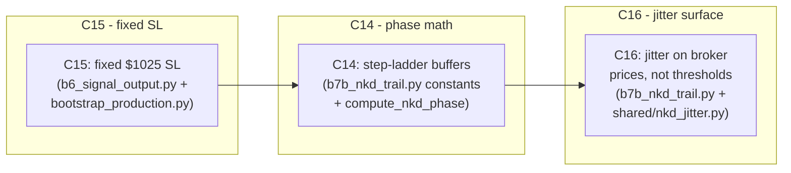

# NKD Pivot — Day 2 Implementation Plan

**Generated:** 2026-05-19  
**Supersedes (in part):** [`docs2/quick-fixes/NKD_Pivot/day_1/PLAN.md`](../day_1/PLAN.md) — specifically §1 DEC-3, DEC-8, and §5 phase math  
**Completion checklist:** [`docs2/quick-fixes/NKD_Pivot/day_2/COMPLETION_CHECKLIST.md`](COMPLETION_CHECKLIST.md)  
**Isaac spec source:** memory entries #3343, #3342 — confirmed 2026-05-19  
**Status:** PLAN-ONLY. No code edits have been made.

---

## 0. TL;DR

Three atomic commits fix the three spec mismatches identified in `COMPLETION_CHECKLIST.md`. All other day-1 commits (C1–C13) are structurally sound and do not need reverting. Critical path: **C15 → C14 → C16** (SL first, then phase math, then jitter — each buildable independently but this order keeps tests green at each step).



---

## 1. Isaac's locked spec (supersedes day-1 DEC-3, DEC-8, and §5 phase math)

| Parameter | Confirmed value |
|---|---|
| Initial SL (`D_init`) | **$1,025 fixed** for every NKD trade |
| Phase A buffer ($0 → $2,000 profit) | $1,025 (hold at `D_init`) |
| Phase B buffer ($2,000 → $3,000 profit) | **$1,000 flat step** |
| Phase C buffer ($3,000 → $4,450 profit) | **$450 flat step** |
| TP target | $4,450 (broker LIMIT, hard ceiling) |
| Jitter J (`INSTANCE_PARITY=="1"` only) | One signed J per trade; `|J| ∈ [0.2, 20.0]`; added in DOLLARS to the SL buffer sent to the broker AND to the TP dollar target at B6 signal placement. Phase boundaries ($2,000 / $3,000 / $4,450) stay clean. |
| Non-NKD assets | No change |

Specifically, the following day-1 decisions are amended:

| Day-1 DEC | Was | Now |
|---|---|---|
| DEC-3 (trail-loop phase math) | Phase B: linear taper `D_init → 450` over `[1500, 4000)` | Step ladder: Phase B = `$1,000` flat over `[2000, 3000)`, Phase C = `$450` flat over `[3000, 4450)` |
| DEC-8 (tick-rounding helper) | `tick_snap_outward` applies to trail SL only | Same — unchanged. But jitter J now also perturbs the dollar input before tick-snap |
| §5 jitter spec | J perturbs phase THRESHOLDS only; broker prices never see J | J perturbs broker SL buffer AND broker TP dollar target |

---

## 2. New commits

### C14 — `feat(b7b_nkd_trail): step-ladder buffers + corrected phase boundaries`

**Commit message template:**
```
feat(b7b_nkd_trail): step-ladder buffers per Isaac confirmed spec

Phase B starts at $2000 profit (was $1500) with a flat $1000 buffer.
Phase C starts at $3000 profit (was $4000) with a flat $450 buffer.
Replaces the continuous linear taper with a discrete 3-step ladder.
jitter_j is removed from phase-boundary comparisons here (J will be
applied to broker prices in C16 instead).

Refs: NKD_Pivot/day_2/PLAN.md §2.C14, Isaac spec memory #3343
```

**File: [`captain-online/captain_online/blocks/b7b_nkd_trail.py`](../../../../captain-online/captain_online/blocks/b7b_nkd_trail.py)**

#### Constants block (lines 63–83 — before / after)

Before:
```python
_PHASE_B_START_BASE_DOLLARS = Decimal("1500")
_PHASE_C_START_BASE_DOLLARS = Decimal("4000")
_TP_TARGET_DOLLARS = Decimal("4450")
_PHASE_C_BUFFER_DOLLARS = Decimal("450")
_PHASE_A_STEP_DOLLARS = Decimal("500")
```

After:
```python
_PHASE_B_START_BASE_DOLLARS = Decimal("2000")   # profit level where Phase B starts
_PHASE_C_START_BASE_DOLLARS = Decimal("3000")   # profit level where Phase C starts ($450 trail)
_TP_TARGET_DOLLARS          = Decimal("4450")
_PHASE_B_BUFFER_DOLLARS     = Decimal("1000")   # flat buffer during Phase B
_PHASE_C_BUFFER_DOLLARS     = Decimal("450")    # flat buffer during Phase C and TP zone
_PHASE_A_STEP_DOLLARS       = Decimal("500")    # Phase A modify gate
```

#### `compute_nkd_phase` (lines 123–179 — complete replacement)

Current implementation uses a linear taper formula. Replace with:

```python
def compute_nkd_phase(
    pnl_dollars: Decimal,
    d_init: Decimal,
    jitter_j: Decimal,            # retained in signature for backward compat;
                                   # ignored for phase boundaries per Isaac spec
) -> tuple[str, Decimal]:
    """Stateless phase + buffer derivation — 3-step ladder.

    Phase A  pnl < 2000                -> buffer = d_init  (hold initial SL)
    Phase B  2000 <= pnl < 3000        -> buffer = 1000    (trail $1000 behind mark)
    Phase C  3000 <= pnl < 4450        -> buffer = 450     (tight trail)
    TP_HIT   pnl >= 4450               -> buffer = 450     (let LIMIT TP fill)

    Jitter J is NOT applied to phase boundaries (phase boundaries are clean
    per Isaac's confirmed spec). J is applied to the dollar buffer at the
    broker-price computation stage in _scan_one_trail (C16).

    Degenerate case: when d_init <= 450 the Phase B $1000 step may exceed
    d_init. We floor Phase B's buffer at d_init so the stop never retreats.
    """
    if pnl_dollars < _PHASE_B_START_BASE_DOLLARS:
        return (_PHASE_A, d_init)

    if pnl_dollars < _PHASE_C_START_BASE_DOLLARS:
        # Phase B: $1000 flat, but never wider than d_init
        buffer_b = min(_PHASE_B_BUFFER_DOLLARS, d_init)
        return (_PHASE_B, buffer_b)

    if pnl_dollars < _TP_TARGET_DOLLARS:
        return (_PHASE_C, _PHASE_C_BUFFER_DOLLARS)

    return (_PHASE_TP, _PHASE_C_BUFFER_DOLLARS)
```

Note: `jitter_j` is retained in the signature so call sites don't break before C16 lands. In C16 it will be removed from the signature entirely once jitter is re-wired to the broker-price step.

#### Module docstring (lines 14–39)

Replace the phase table:
```
3-phase ratchet:
  Phase A  pnl <  2000           -> stop @ d_init ($1025 for all NKD trades)
  Phase B  pnl <  3000           -> stop @ $1000 behind mark (flat step)
  Phase C  pnl <  4450           -> stop @ $450  behind mark (tight trail)
  TP_HIT   pnl >= 4450           -> no further modify (LIMIT TP fills)
```

Remove the line referencing "linear taper" and remove the jitter-in-threshold language from the docstring. Remove the "(1500 + J)" and "(4000 + J)" threshold language (was lines 18–19).

#### Test impact

Rewrite the following test methods in [`tests/test_b7b_nkd_trail.py`](../../../../tests/test_b7b_nkd_trail.py):

| Old test | New assertion |
|---|---|
| `test_phase_b_start_boundary_returns_phase_b_at_d_init` (line 202) | `compute_nkd_phase(2000, 1025, 0) == ("B", 1000)` |
| `test_phase_b_just_before_c_returns_buffer_near_450` (line 209) | `compute_nkd_phase(2999, 1025, 0) == ("B", 1000)` (was `≈ 450`) |
| `test_phase_b_midpoint_at_d_init_1750` (line 218) | `compute_nkd_phase(2500, 1750, 0) == ("B", 1000)` (flat, not midpoint average) |
| `test_phase_b_midpoint_at_d_init_1500` (line 228) | `compute_nkd_phase(2500, 1500, 0) == ("B", 1000)` |
| `test_phase_c_returns_tight_450` (line 237) | Adjust pnl to `3001` instead of `4001` |
| `TestPhaseTaper` class (lines 467–505) | Rename to `TestPhaseBStep`; replace linear interpolation assertions with `buffer == 1000` across the phase |

Add new tests:
- `test_phase_b_constant_1000` — `pnl ∈ {2000, 2500, 2999}` all return `buffer == Decimal(1000)`
- `test_phase_c_starts_at_3000` — `pnl = 3000` returns `("C", Decimal(450))`
- `test_phase_b_degenerate_when_d_init_lt_1000` — `d_init = 800`, Phase B returns `buffer = Decimal(800)` (floored at d_init)

Rewrite [`tests/test_b7b_isaac_jitter_stress.py`](../../../../tests/test_b7b_isaac_jitter_stress.py) tests that reference Phase B threshold at `1500`:
- `test_phase_b_start_shifts_by_j` (line 299) — remove entirely (J no longer shifts boundaries)
- `test_phase_c_start_shifts_by_j` (line 312) — remove entirely
- `test_phase_disagrees_inside_jitter_window` (line 339) — remove entirely
- `test_pre_snap_buffer_diverges_throughout_phase_b` (line 355) — keep structure, update expected values to step-ladder shape

**Risk:** medium. The phase math is a pure function tested extensively. All call sites (only `_scan_one_trail`) will work unchanged since the return shape `(str, Decimal)` is the same. The linear-taper case for degenerate `d_init <= 450` becomes `buffer = min(1000, d_init) = d_init` — same behaviour as before for that edge case.

---

### C15 — `feat(b6+bootstrap): NKD initial SL fixed at $1025`

**Commit message template:**
```
feat(b6+bootstrap): NKD initial SL fixed at $1025 per Isaac spec

Replace OR-range * sl_multiple SL computation for NKD trail trades
with a fixed $1025 dollar amount. snapped_d_init in the signal
payload and position dict is now always 1025.0 regardless of the
opening range. Broker SL bracket is placed using tick_snap_outward
from entry ± ($1025 / point_value) price points.

locked_strategy JSON gains sl_dollars_fixed:1025,
trail_phase_b_buffer_dollars:1000; boundary values corrected
from 1500→2000 and 4000→3000 to match Isaac spec.

Refs: NKD_Pivot/day_2/PLAN.md §2.C15, Isaac spec memory #3343
```

**File: [`captain-online/captain_online/blocks/b6_signal_output.py`](../../../../captain-online/captain_online/blocks/b6_signal_output.py)**

#### Add helper `_sl_from_dollars` (add after `_tp_from_dollars`, around line 302)

```python
def _sl_from_dollars(
    dollars: float,
    entry: float,
    direction: int,
    point_value: float,
    size: int,
    asset_id: str,
) -> float:
    """Compute stop-loss level from a dollar-denominated distance.

    Converts a dollar amount to price distance, then snaps OUTWARD (wider
    than the dollar threshold, so the stop is at least as far as requested):
    LONG  -> floor (stop price lower, further below entry)
    SHORT -> ceil  (stop price higher, further above entry)

    This is the asymmetric OUTWARD rounder documented in NKD_PIVOT_AUDIT.md
    §5.3. Used for NKD trail trades where D_init is a fixed dollar amount.
    """
    from shared.contract_resolver import tick_snap_outward
    sl_distance_points = dollars / (point_value * max(1, size))
    sl_raw = entry - (sl_distance_points * direction)
    return tick_snap_outward(sl_raw, asset_id, direction)
```

#### Amend the NKD trail fields block (lines 141–152)

Before:
```python
if strategy.get("is_nkd_trail"):
    point_value = float(asset_detail.get("point_value", 50.0))
    entry_price_raw = asset_features.get("entry_price")
    if entry_price_raw is not None and sl_level is not None:
        snapped_d_init = abs(float(entry_price_raw) - float(sl_level)) * point_value
    else:
        snapped_d_init = None
    nkd_trail_fields = {
        "is_nkd_trail": True,
        "tp_dollars": strategy.get("tp_dollars"),
        "snapped_d_init": snapped_d_init,
    }
```

After:
```python
if strategy.get("is_nkd_trail"):
    point_value = float(asset_detail.get("point_value", 50.0))
    entry_price_raw = asset_features.get("entry_price")
    # Fixed dollar SL per Isaac spec — always $1025, never OR-range derived
    sl_dollars_fixed = float(strategy.get("sl_dollars_fixed", 1025))
    snapped_d_init = sl_dollars_fixed
    # Override sl_level used for the broker bracket with the fixed-dollar SL.
    # _sl_from_dollars snaps outward (wider) to the NKD tick grid.
    if entry_price_raw is not None:
        sl_level = _sl_from_dollars(
            sl_dollars_fixed, float(entry_price_raw),
            direction, point_value, total_size, u
        )
    nkd_trail_fields = {
        "is_nkd_trail": True,
        "tp_dollars": strategy.get("tp_dollars"),
        "snapped_d_init": snapped_d_init,
    }
```

Note: `sl_level` is reassigned here for NKD after the initial `_compute_sl` call at line 124. The `sl_level` variable is used by B3 adapter when placing the bracket order, so this override ensures the broker bracket is placed at the correct fixed-dollar distance.

**File: [`scripts/bootstrap_production.py`](../../../../scripts/bootstrap_production.py)**

#### NKD entry in `P2_STRATEGIES` (lines 48–51 — before / after)

Before:
```python
"NKD": {"m": 6, "k": 6, ...,
        "tp_dollars": 4450, "is_nkd_trail": True, "trail_step_dollars": 500,
        "trail_phase_b_start_dollars": 1500, "trail_phase_c_start_dollars": 4000,
        "trail_phase_c_buffer_dollars": 450},
```

After:
```python
"NKD": {"m": 6, "k": 6, ...,
        "tp_dollars": 4450, "is_nkd_trail": True, "trail_step_dollars": 500,
        "sl_dollars_fixed": 1025,
        "trail_phase_b_start_dollars": 2000,   # Phase A→B boundary (was 1500)
        "trail_phase_b_buffer_dollars": 1000,  # Phase B flat buffer
        "trail_phase_c_start_dollars": 3000,   # Phase B→C boundary (was 4000)
        "trail_phase_c_buffer_dollars": 450},
```

#### Forwarding tuple `_NKD_TRAIL_KEYS` (lines 120–123)

Add `"sl_dollars_fixed"` and `"trail_phase_b_buffer_dollars"` to the tuple so `_build_locked_strategy` forwards them into the D00 `locked_strategy` JSON:

```python
_NKD_TRAIL_KEYS = (
    "tp_dollars", "is_nkd_trail", "trail_step_dollars",
    "sl_dollars_fixed",
    "trail_phase_b_start_dollars", "trail_phase_b_buffer_dollars",
    "trail_phase_c_start_dollars", "trail_phase_c_buffer_dollars",
)
```

#### Test impact

Add to [`tests/test_b6_signal.py`](../../../../tests/test_b6_signal.py):
- `test_nkd_signal_uses_fixed_1025_sl` — build a fixture with `is_nkd_trail: True, sl_dollars_fixed: 1025`, any `or_range` value; assert `signal["snapped_d_init"] == 1025.0`
- `test_non_nkd_signal_unaffected` — ES/MES signal unchanged, `snapped_d_init` absent from signal payload
- `test_nkd_sl_level_uses_fixed_dollar_distance` — assert that `sl_level` in the NKD signal is derived from `1025 / point_value` points from entry (not `sl_multiple * or_range`)

Add to [`tests/test_bootstrap_nkd_trail_fields.py`](../../../../tests/test_bootstrap_nkd_trail_fields.py):
- `test_sl_dollars_fixed_in_locked_strategy` — assert `locked_strategy["sl_dollars_fixed"] == 1025`
- `test_trail_phase_b_buffer_in_locked_strategy` — assert `locked_strategy["trail_phase_b_buffer_dollars"] == 1000`
- `test_trail_phase_b_start_is_2000` — assert `locked_strategy["trail_phase_b_start_dollars"] == 2000`
- `test_trail_phase_c_start_is_3000` — assert `locked_strategy["trail_phase_c_start_dollars"] == 3000`

**Risk:** medium. The `sl_level` override at B6 affects the SL price sent to B3's bracket placement. Existing non-NKD assets are guarded by the `if strategy.get("is_nkd_trail")` branch — zero behavioural change. NKD SL ticks at B3 will now be `round(1025 / (point_value * tick_size))` = `round(1025 / (5.0 * 5.0))` = `41 ticks`. Document expected value in the test and in the pre-market checklist.

---

### C16 — `feat(b7b_nkd_trail+shared): jitter applies to broker SL buffer and TP target`

**Commit message template:**
```
feat(b7b_nkd_trail+shared): jitter shifts broker SL buffer + TP target

Isaac confirmed jitter J applies uniformly to both SL and TP, not
just to phase-boundary thresholds. This commit:
1. Moves sample_isaac_jitter to shared/nkd_jitter.py so B6 can
   sample J at signal-build time and bake it into the TP bracket price.
2. B6 uses J in _tp_from_dollars(4450 + J, ...) on Isaac tower.
3. _scan_one_trail applies effective_buffer = buffer + J to the
   compute_stop_price call (with a $100 floor).
4. Removes J from compute_nkd_phase signature and phase-threshold
   comparisons (phase boundaries stay clean).
5. Inverts the "forbidden" docstring comment at the old lines 99-104.

Refs: NKD_Pivot/day_2/PLAN.md §2.C16, Isaac spec memory #3343
```

This is the most complex of the three commits. It involves three files and must be careful about the jitter lifecycle (B6 → Redis → trail block).

#### New file: `shared/nkd_jitter.py`

Move `sample_isaac_jitter` out of `b7b_nkd_trail.py` into a shared module so both B6 (signal placement) and the trail block can import it. Keep identical signature and logic; add a module docstring explaining the lifecycle:

```python
"""shared/nkd_jitter.py — Per-trade Isaac-tower jitter sampler.

Lifecycle
---------
1. B6 (`b6_signal_output.py`) calls ``sample_isaac_jitter`` ONCE per NKD
   signal on Isaac tower (INSTANCE_PARITY == "1"). J is included in the
   signal payload and used immediately to jitter the TP bracket price via
   ``_tp_from_dollars(4450 + J, ...)``.
2. J is threaded through the signal → TAKEN message → position dict so
   ``b7b_nkd_trail._scan_one_trail`` can read it from the position dict on
   every poll without re-sampling.
3. Defence-in-depth: if the trail block encounters a position where
   ``jitter_j`` is None (e.g. replay tests that bypass B6), it samples
   fresh using this same function.

J only modifies dollar amounts sent to the broker. Phase boundaries
($2000 / $3000 / $4450) are clean and never jittered.
"""
import os
import random
from decimal import Decimal
from typing import Optional

_JITTER_X_MIN = 0.01
_JITTER_X_MAX = 1.00
_JITTER_SCALE = Decimal("20")  # |J| ∈ [0.2, 20.0]


def sample_isaac_jitter(
    parity_env: Optional[str],
) -> tuple[Decimal, int, Decimal]:
    """Sample once-per-trade jitter parameters.

    Nomaan tower (INSTANCE_PARITY != "1"): returns (0, 0, 0).
    Isaac tower  (INSTANCE_PARITY == "1"): X ~ U(0.01, 1.00),
                                           Y ~ choice({-1, +1}),
                                           J = 20 * X * Y.
    """
    if parity_env != "1":
        return (Decimal("0"), 0, Decimal("0"))
    x_float = random.uniform(_JITTER_X_MIN, _JITTER_X_MAX)
    x = Decimal(str(round(x_float, 8)))
    y = random.choice([-1, 1])
    j = _JITTER_SCALE * x * Decimal(y)
    return (x, y, j)
```

Update `b7b_nkd_trail.py` to import from `shared.nkd_jitter` and remove its local copy of `sample_isaac_jitter`.

#### Changes to `b6_signal_output.py`

In the `is_nkd_trail` block (after C15's changes, around line 141):

```python
if strategy.get("is_nkd_trail"):
    ...
    # Sample J on Isaac tower; zero on Nomaan. J persists for the trade lifetime.
    from shared.nkd_jitter import sample_isaac_jitter
    parity_env = os.environ.get("INSTANCE_PARITY", "")
    jitter_x, jitter_y, jitter_j = sample_isaac_jitter(parity_env)

    nkd_trail_fields = {
        "is_nkd_trail": True,
        "tp_dollars": strategy.get("tp_dollars"),
        "snapped_d_init": snapped_d_init,
        "jitter_x": float(jitter_x),
        "jitter_y": jitter_y,
        "jitter_j": float(jitter_j),
    }
```

In `_compute_tp` (or its call site for NKD), pass the already-sampled J through:
```python
# In _compute_tp's tp_dollars branch (line 325):
tp_dollars_effective = float(tp_dollars) + float(jitter_j)  # 4450 + J
return _tp_from_dollars(tp_dollars_effective, float(entry), direction,
                        point_value, size, asset_id)
```

Because `_compute_tp` doesn't currently have access to `jitter_j`, the cleanest path is to call `_tp_from_dollars` directly in the NKD trail fields block (where we already have `jitter_j` in scope) and store the computed `tp_level` in `nkd_trail_fields`. The main signal loop already assigns `tp_level = _compute_tp(...)` — for NKD, override it in the trail fields block and let `nkd_trail_fields["tp_level_override"]` (or simply recompute `tp_level` there) take precedence in the signal dict construction.

Simplest approach: compute NKD `tp_level` inline in the trail fields block:

```python
if strategy.get("is_nkd_trail") and entry_price_raw is not None:
    tp_dollars_base = float(strategy.get("tp_dollars", 4450))
    tp_level_nkd = _tp_from_dollars(
        tp_dollars_base + float(jitter_j),
        float(entry_price_raw), direction, point_value, total_size, u
    )
    # Override tp_level for NKD; the existing _compute_tp result is discarded
    nkd_trail_fields["_tp_level_override"] = tp_level_nkd
```

Then in the signal dict construction:
```python
signal = {
    ...
    "tp_level": nkd_trail_fields.pop("_tp_level_override", tp_level),
    ...
}
```

This is the least-invasive way to inject J into the TP price without restructuring `_compute_tp`.

#### Changes to `b7b_nkd_trail.py`

1. **Remove `sample_isaac_jitter`** (or replace with a thin re-export): `from shared.nkd_jitter import sample_isaac_jitter`.
2. **Remove `jitter_j` from `compute_nkd_phase` signature** (after C14 is in; phase math is already clean).
3. **Invert the "forbidden" docstring** at (old) lines 99–104:
   ```
   J applies to broker dollar amounts at the price-computation stage:
     effective_buffer = buffer + J   (SL)
     tp_effective     = 4450 + J     (TP, sampled at B6 placement time)
   Phase BOUNDARIES ($2000 / $3000 / $4450) are NOT jittered.
   ```
4. **In `_scan_one_trail`**, after `phase, buffer = compute_nkd_phase(...)`, add:
   ```python
   # Apply Isaac-tower jitter to broker SL dollar buffer.
   # J is a signed dollar offset; floor at $100 so an extreme negative J
   # cannot produce an absurdly tight stop on a $0.20 buffer.
   _EFFECTIVE_BUFFER_FLOOR = Decimal("100")
   effective_buffer = max(buffer + jitter_j, _EFFECTIVE_BUFFER_FLOOR)
   ```
   Then pass `effective_buffer` (not `buffer`) into `compute_stop_price`.
5. **Persist `effective_buffer`** in the D34 row alongside the canonical `buffer` so audits can see what was actually sent to the broker vs what the phase decided.
6. **First-poll defence**: the trail block already handles `jitter_j = None` (line 713–724 — checks `jitter_j_raw is None`). After C16, when `jitter_j` is pre-populated from the signal payload (threaded through C15's B6 changes), the first-poll check becomes a no-op on Isaac tower. It still fires for replay tests that inject positions without going through B6. Leave the defence-in-depth sampling in place.

#### Changes to `compute_nkd_phase` signature (finalising C14)

```python
# Before (after C14 patch):
def compute_nkd_phase(pnl_dollars, d_init, jitter_j):  # jitter_j retained but unused

# After C16:
def compute_nkd_phase(pnl_dollars, d_init):  # jitter_j removed
```

Update the one call site at `_scan_one_trail` line ~735 accordingly.

#### Test impact (heavy)

Tests that assert the OLD spec and must be changed:

| Test | File | Change |
|---|---|---|
| `test_isaac_jitter_does_not_touch_broker_prices` | `test_b7b_isaac_jitter_stress.py:299` | **INVERT** — now asserts broker prices DO diverge by J |
| `test_tp_target_constant_is_unjittered_4450` | `test_b7b_isaac_jitter_stress.py:282` | **INVERT** — TP placed at `4450 + J` on Isaac tower |
| `test_broker_stop_diverges_on_at_least_some_polls` | `test_b7b_isaac_jitter_stress.py:375` | Keep but update: divergence is now due to J in buffer, not threshold shift |
| `test_phase_b_start_shifts_by_j` | `test_b7b_isaac_jitter_stress.py:299` | **DELETE** — boundaries are clean |
| `test_phase_c_start_shifts_by_j` | `test_b7b_isaac_jitter_stress.py:312` | **DELETE** — boundaries are clean |
| `test_phase_disagrees_inside_jitter_window` | `test_b7b_isaac_jitter_stress.py:339` | **DELETE** — no longer applicable |

New tests to add:

| Test | File | Asserts |
|---|---|---|
| `test_jitter_widens_broker_sl_buffer_by_j` | `test_b7b_isaac_jitter_stress.py` | `effective_buffer = buffer + J`; broker stop price diverges from Nomaan tower stop by exactly J/point_value ticks |
| `test_jitter_shifts_broker_tp_by_j` | `test_b6_signal.py` | On Isaac tower, NKD signal `tp_level` equals `_tp_from_dollars(4450 + J, ...)` |
| `test_jitter_persists_from_b6_to_trail_block` | new `tests/test_nkd_jitter_lifecycle.py` | B6 samples J → position dict contains `jitter_j` → trail block reads it without re-sampling |
| `test_jitter_buffer_floor_refuses_sub_100_stop` | `test_b7b_isaac_jitter_stress.py` | With extreme negative J (e.g. -20) and Phase C buffer 450: `effective_buffer = max(450 + (-20), 100) = 430` (floor never tripped here but assert it never goes below 100) |
| `test_nomaan_tower_zero_j_zero_effective_offset` | `test_b7b_isaac_jitter_stress.py` | `INSTANCE_PARITY != "1"`: `jitter_j == 0`, `effective_buffer == buffer`, TP at exactly 4450 |

**Risk:** high. This rewires the Isaac-tower behaviour that was tested extensively in yesterday's stress suite. The key safeguard is that Nomaan tower (`INSTANCE_PARITY = 0`) sees `J = 0` → `effective_buffer = buffer + 0 = buffer` — identical to the current behaviour. Isaac tower is the only runtime change. Requires explicit pre-deploy operator sign-off on Isaac tower BEFORE the APAC trade window. Confirm `INSTANCE_PARITY=1` is set correctly on Isaac tower (`printenv INSTANCE_PARITY` inside `captain-online` container) before deploy.

---

## 3. Doc patches (alongside C14–C16)

| Doc | Change | Commit |
|---|---|---|
| [`day_1/NKD_PIVOT_AUDIT.md §5.4 + §5.6`](../day_1/NKD_PIVOT_AUDIT.md) | Add `> **SUPERSEDED by day_2/PLAN.md §2:** linear taper replaced by step ladder; J no longer applied to phase thresholds.` banner at the top of §5.4 and §5.6 | C14 |
| [`day_1/PLAN.md §1 DEC-3, DEC-8`](../day_1/PLAN.md) | Add `> **SUPERSEDED:** see day_2/PLAN.md §1.` note inline | C14 |
| [`docs2/runbooks/apac-nkd-pre-market-checklist.md`](../../../../docs2/runbooks/apac-nkd-pre-market-checklist.md) | Update any prose referencing `$1500 Phase B start`, `$4000 Phase C start`, or "linear taper". Update expected `snapped_d_init` to `1025.0`. Update expected SL bracket ticks to `41 ticks = 1025 / (5 × 5)`. Add note on Isaac tower: TP bracket placed at `4450 + J` and first-poll stop at `1025 + J`. | C15, C16 |

---

## 4. Deploy ordering

Three commits, all serial (C14 → C15 → C16). Per workspace rule §1, push to BOTH remotes after each commit. Tower order: **Nomaan first**.

```fish
# On each tower after all three commits land:
git pull --ff-only origin main
for svc in captain-offline captain-online captain-command
    rm -rf $svc/_config
    cp -r config $svc/_config
end
dco build --no-cache captain-online captain-command
dco up -d
cmd-run bootstrap_production.py   # re-applies C15 D00 JSON delta (idempotent)
```

**Validation gates per commit:**

| Commit | Local gate | Post-deploy tower gate |
|---|---|---|
| C14 | `pytest tests/test_b7b_nkd_trail.py -v` — all Phase B/C tests green with step values | `dco logs captain-online \| grep "ON-B7B-NKD"` — next NKD position shows phase B buffer = 1000 |
| C15 | `pytest tests/test_b6_signal.py tests/test_bootstrap_nkd_trail_fields.py -v` | D00 query: `SELECT locked_strategy FROM p3_d00_asset_universe WHERE asset_id='NKD' LATEST ON last_updated PARTITION BY asset_id` — confirm `sl_dollars_fixed: 1025, trail_phase_b_start_dollars: 2000` |
| C16 | `pytest tests/test_b7b_isaac_jitter_stress.py -v` (rewritten suite) | **Isaac tower only:** `dco logs captain-online \| grep "jitter_j"` — confirm non-zero J on first NKD trade poll; `D34 query: SELECT jitter_j, current_buffer FROM p3_d34_nkd_trail_state` — confirm broker buffer ≠ phase buffer when J ≠ 0 |

**Pre-deploy gate for Isaac tower (C16):**
```fish
# Inside captain-online container on Isaac tower:
dco exec captain-online printenv INSTANCE_PARITY
# Must return "1"; if blank or "0" C16 effect is zero (safe but wrong configuration)
```

---

## 5. Risk register (delta-only)

| Risk | Likelihood | Impact | Mitigation |
|---|---|---|---|
| **TP jitter coordination (C16 Option A)**: B6 samples J and bakes into bracket; trail block reads from position dict. If position dict read fails (e.g. restart mid-trade), trail samples fresh J ≠ original → TP bracket price and trail SL drift out of sync | Low | Medium | Defence-in-depth: trail block logs CRITICAL if it samples fresh J on Isaac tower when `jitter_j` was already non-None in the position dict. `test_jitter_persists_from_b6_to_trail_block` covers the expected path. |
| **Mid-position rollover**: C14–C16 deployed while NKD position is open. Trail block switches from linear taper to step ladder mid-flight. Phase B stop may jump from linear-interpolated value to flat $1,000. | Low-Medium | Medium | Deploy **only when no open NKD position**. Check: `redis-cli HGET captain:open_positions '*' \| grep is_nkd_trail` should return empty. Deploy in pre-market window per [apac-nkd-pre-market-checklist.md](../../../../docs2/runbooks/apac-nkd-pre-market-checklist.md). |
| **Isaac tower INSTANCE_PARITY misconfigured**: C16 deploys but `INSTANCE_PARITY` is unset or `"0"` on Isaac tower → jitter J = 0 → TP placed at exact $4,450 (not jittered) → breaks Isaac's anti-copy-trade requirement | Low | Medium | Pre-deploy gate: confirm `printenv INSTANCE_PARITY` inside `captain-online` returns `"1"`. Add to pre-market checklist §14. |
| **Test churn**: ~30 assertions across `test_b7b_*` need rewriting | Certain | Low | Mechanical rewrites, no logic decisions. Pair each code commit with its test commit in the same PR so CI never goes red between commits. |
| **B6 import cycle (C16)**: `b6_signal_output.py` importing `shared.nkd_jitter` at module level could cause circular import if `shared` transitively imports from `captain_online` | Low | Low | `shared/nkd_jitter.py` only imports `os`, `random`, `decimal` — no captain_online dependency. Import is safe. Verify with `python3 -c "from captain_online.blocks.b6_signal_output import generate_signals"` in the container after build. |
| **C12 timing**: operator may want to run Intervention A (D26 override) before or alongside C14–C16. | N/A | N/A | C12 is a data-only change, independent of C14–C16. Operator can run it at any time. Recommend running AFTER C14–C16 are stable and a real NKD trade has been observed. |

---

## 6. Effort estimate

| Commit | Size | Notes |
|---|---|---|
| C14 (step-ladder phase math) | XS–S | Pure function rewrite + mechanical test updates |
| C15 (fixed SL + bootstrap JSON) | S | New helper + 2 call-site changes + 4 test additions |
| C16 (jitter surface) | M | New shared module + B6 changes + trail block changes + heavy test rewrite |
| **Total** | ~0.5 dev-day | Mostly mechanical; C16 carries highest review risk |

---

## 7. Open questions (none blocking C14 / C15)

1. **C16 only — Isaac tower sign-off**: operator must explicitly confirm Isaac tower is safe to deploy before C16 is pushed to `multi-user`. C14 and C15 are Nomaan-tower-safe and can ship immediately.
2. **C13 replay test assertions**: after C14 lands, `tests/test_nkd_replay_22h.py` may have stale Phase-B assertions. Update them in the C14 commit.
3. **D34 schema update for `effective_buffer`**: the plan calls for persisting both `buffer` and `effective_buffer` to D34. Currently D34 has only `current_buffer`. Two options: (a) rename `current_buffer` → `current_buffer` (canonical) and add `effective_buffer_dollars` column via M049 migration, or (b) store `effective_buffer` in `current_buffer` and accept that the column is "broker-applied" not "canonical". Option (b) is simpler and loses no audit information since J is already persisted in `jitter_j`. Default: **Option (b)** unless Nomaan wants the distinction in D34.
