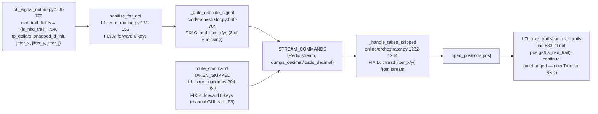

# Batch 1 — F2 + F3: NKD Trail-Control Field Forwarding

**Generated:** 2026-05-19 (planning agent, Opus 4.7)
**Status:** PLAN ONLY — no code edited, no tests run, no commits.
**Severity:** CRITICAL BLOCKER — without this, the NKD trailing-stop ratchet has been silently inert on every NKD trade since C6 landed.
**Source audit:** [`REJECTED_ORDERS_AUDIT.md`](REJECTED_ORDERS_AUDIT.md) §0 F2/F3, §4 (full proof), §7 Option B, §8.2 (jitter symmetry).
**Build plan:** [`BUILD_PLAN.md`](BUILD_PLAN.md) §2 "Batch 1".
**Workspace rules:** [`.cursor/rules/captain-deploy-and-tower-discipline.mdc`](../../../../../.cursor/rules/captain-deploy-and-tower-discipline.mdc) §1 (dual-remote push) and §2 (fish-shell discipline).

---

## 1. Summary (F2 + F3, with line citations)

B6 builds six NKD trail-control fields at the top level of every NKD signal in [`captain-online/captain_online/blocks/b6_signal_output.py`](../../../../../captain-online/captain_online/blocks/b6_signal_output.py) at lines 168-176 (`is_nkd_trail`, `tp_dollars`, `snapped_d_init`, `jitter_x`, `jitter_y`, `jitter_j`) and lifts them into the published signal via `**nkd_trail_fields` at line 196. **F2:** `sanitise_for_api` in [`captain-command/captain_command/blocks/b1_core_routing.py`](../../../../../captain-command/captain_command/blocks/b1_core_routing.py) lines 131-153 returns an explicit allow-list dict that omits all six NKD keys, so they are stripped at the Command→API boundary. `_auto_execute_signal` in [`captain-command/captain_command/blocks/orchestrator.py`](../../../../../captain-command/captain_command/blocks/orchestrator.py) tries to forward `is_nkd_trail`/`tp_dollars`/`snapped_d_init` at lines 701-703 via `sanitised_order.get(...)`, but each call returns `None` because those keys were never put into `sanitised_order`. The receiving `_handle_taken_skipped` in [`captain-online/captain_online/blocks/orchestrator.py`](../../../../../captain-online/captain_online/blocks/orchestrator.py) at lines 1232-1244 then coerces `bool(None) → False` for `is_nkd_trail` at line 1234 and hard-codes `jitter_x`/`jitter_y`/`jitter_j` to `None` at lines 1238-1240 instead of reading them from the stream message. Every NKD position lands with `is_nkd_trail = False`, and `b7b_nkd_trail.scan_nkd_trails` silently `continue`s past it at [`captain-online/captain_online/blocks/b7b_nkd_trail.py`](../../../../../captain-online/captain_online/blocks/b7b_nkd_trail.py) line 533 — no phase transition, no `modify_order` call, no D34 row, for the entire 22h trade. **F3:** the same allow-list gap exists in `route_command`'s TAKEN_SKIPPED publish at `b1_core_routing.py` lines 204-229 (manual GUI TAKEN path) — currently a latent bug because GUI does not yet ship NKD-aware payloads, but it must be patched defensively in this commit to prevent a future GUI regression from re-introducing F2 via a different code path. The fix is purely additive: forward six keys end-to-end across three files (four edit sites) so the field flow becomes `B6 → sanitise_for_api → _auto_execute_signal → STREAM_COMMANDS → _handle_taken_skipped → position dict → b7b_nkd_trail` with type coercion at the final hop (`as_money_or_none` for Decimal-valued fields, `bool(...)` for `is_nkd_trail`, `int(...) | None` for `jitter_y`).

---

## 2. Field flow diagram (post-fix)



---

## 3. Exact before/after diffs (4 edit sites in 3 files)

### EDIT SITE A — `sanitise_for_api` adds the 6 NKD keys (F2 primary fix)

**File:** [`captain-command/captain_command/blocks/b1_core_routing.py`](../../../../../captain-command/captain_command/blocks/b1_core_routing.py)
**Lines:** 131-153
**Why:** The signal carries the 6 NKD fields at the top level via `**nkd_trail_fields` (b6 line 196). The explicit allow-list dict here is the choke point — anything not listed is dropped.

**BEFORE (current code, lines 131-153):**

```131:153:captain-command/captain_command/blocks/b1_core_routing.py
def sanitise_for_api(signal: dict, ac_id: str, ac_detail: dict) -> dict:
    """Return the 6-field sanitised order — nothing else leaves Captain.

    Spec: Command lines 139-160.  PROHIBITED_FIELDS never sent externally.
    Additional internal context (_context) is carried for TAKEN command
    publishing but is NOT sent to the brokerage API.
    """
    ctx = signal.get("_context", {})
    return {
        "asset": signal.get("asset"),
        "direction": signal.get("direction"),
        "size": ac_detail.get("contracts", 0),
        "tp": signal.get("tp_level"),
        "sl": signal.get("sl_level"),
        "timestamp": signal.get("timestamp", now_et().isoformat()),
        "signal_id": signal.get("signal_id"),
        "user_id": signal.get("user_id"),
        "session": signal.get("session"),
        "entry_price": ctx.get("entry_price"),
        "regime_state": ctx.get("regime_state"),
        "combined_modifier": ctx.get("combined_modifier"),
        "aim_breakdown": ctx.get("aim_breakdown"),
    }
```

**AFTER (proposed):**

```python
def sanitise_for_api(signal: dict, ac_id: str, ac_detail: dict) -> dict:
    """Return the sanitised order — original 13 fields plus 6 NKD trail-control
    fields (None for all non-NKD assets per F2 fix, audit §4 + §7 Option B).

    Spec: Command lines 139-160.  PROHIBITED_FIELDS never sent externally.
    Additional internal context (_context) is carried for TAKEN command
    publishing but is NOT sent to the brokerage API.

    NKD pivot (F2): is_nkd_trail / tp_dollars / snapped_d_init / jitter_x /
    jitter_y / jitter_j are forwarded so _auto_execute_signal can publish
    them on STREAM_COMMANDS for b7b_nkd_trail. For non-NKD assets these
    keys are absent on the signal and resolve to None.
    """
    ctx = signal.get("_context", {})
    return {
        "asset": signal.get("asset"),
        "direction": signal.get("direction"),
        "size": ac_detail.get("contracts", 0),
        "tp": signal.get("tp_level"),
        "sl": signal.get("sl_level"),
        "timestamp": signal.get("timestamp", now_et().isoformat()),
        "signal_id": signal.get("signal_id"),
        "user_id": signal.get("user_id"),
        "session": signal.get("session"),
        "entry_price": ctx.get("entry_price"),
        "regime_state": ctx.get("regime_state"),
        "combined_modifier": ctx.get("combined_modifier"),
        "aim_breakdown": ctx.get("aim_breakdown"),
        "is_nkd_trail": signal.get("is_nkd_trail"),
        "tp_dollars": signal.get("tp_dollars"),
        "snapped_d_init": signal.get("snapped_d_init"),
        "jitter_x": signal.get("jitter_x"),
        "jitter_y": signal.get("jitter_y"),
        "jitter_j": signal.get("jitter_j"),
    }
```

**Type behaviour:** all 6 values pass through unchanged from the signal — `signal.get(...)` returns whatever B6 put there (`True`/`int`/`float`/`int`/`float`) for NKD, or `None` for non-NKD. Decimal coercion happens at the final hop in `_handle_taken_skipped`, not here.

---

### EDIT SITE B — `route_command` TAKEN_SKIPPED publish adds the 6 NKD keys (F3 fix)

**File:** [`captain-command/captain_command/blocks/b1_core_routing.py`](../../../../../captain-command/captain_command/blocks/b1_core_routing.py)
**Lines:** 204-229
**Why:** The manual GUI TAKEN path (`POST /api/commands` → `route_command`) re-publishes a fresh TAKEN_SKIPPED message onto `STREAM_COMMANDS`. Without these 6 keys, any future GUI client that DID send NKD-aware payloads would still see the trail go inert. Defensive: `data.get(...)` returns `None` if the GUI didn't ship the field, matching the non-NKD behaviour.

**BEFORE (current code, lines 204-229):**

```204:229:captain-command/captain_command/blocks/b1_core_routing.py
        publish_to_stream(STREAM_COMMANDS, {
            "type": "TAKEN_SKIPPED",
            "_source": "orchestrator",
            "action": action,
            "signal_id": signal_id,
            "user_id": user_id,
            "asset": data.get("asset"),
            "direction": data.get("direction"),
            "actual_entry_price": data.get("actual_entry_price"),
            "entry_price": data.get("entry_price"),
            "contracts": data.get("contracts"),
            "tp_level": data.get("tp_level"),
            "sl_level": data.get("sl_level"),
            "point_value": data.get("point_value", 50.0),
            "risk_amount": data.get("risk_amount", 0),
            "account_id": data.get("account_id"),
            "session": data.get("session"),
            "regime_state": data.get("regime_state"),
            "combined_modifier": data.get("combined_modifier"),
            "aim_breakdown": data.get("aim_breakdown"),
            "tsm_id": data.get("tsm_id"),
            # Phase 3a: forward bracket flag and entry order id when present
            # so Online B7 can resolve the actual exchange fill on close.
            "bracket": bool(data.get("bracket", False)),
            "entry_order_id": data.get("entry_order_id"),
        })
```

**AFTER (proposed):**

```python
        publish_to_stream(STREAM_COMMANDS, {
            "type": "TAKEN_SKIPPED",
            "_source": "orchestrator",
            "action": action,
            "signal_id": signal_id,
            "user_id": user_id,
            "asset": data.get("asset"),
            "direction": data.get("direction"),
            "actual_entry_price": data.get("actual_entry_price"),
            "entry_price": data.get("entry_price"),
            "contracts": data.get("contracts"),
            "tp_level": data.get("tp_level"),
            "sl_level": data.get("sl_level"),
            "point_value": data.get("point_value", 50.0),
            "risk_amount": data.get("risk_amount", 0),
            "account_id": data.get("account_id"),
            "session": data.get("session"),
            "regime_state": data.get("regime_state"),
            "combined_modifier": data.get("combined_modifier"),
            "aim_breakdown": data.get("aim_breakdown"),
            "tsm_id": data.get("tsm_id"),
            # Phase 3a: forward bracket flag and entry order id when present
            # so Online B7 can resolve the actual exchange fill on close.
            "bracket": bool(data.get("bracket", False)),
            "entry_order_id": data.get("entry_order_id"),
            # NKD pivot (F3): forward trail-control fields from the manual
            # GUI TAKEN payload so b7b_nkd_trail engages even on manual takes.
            # Absent for all non-NKD assets (key not present → None → ignored
            # by b7b at line 533 'if not pos.get(is_nkd_trail): continue').
            "is_nkd_trail": data.get("is_nkd_trail"),
            "tp_dollars": data.get("tp_dollars"),
            "snapped_d_init": data.get("snapped_d_init"),
            "jitter_x": data.get("jitter_x"),
            "jitter_y": data.get("jitter_y"),
            "jitter_j": data.get("jitter_j"),
        })
```

**Why all 6 keys, not just 3:** the manual GUI TAKEN path must be functionally identical to the auto-execute path. If a future GUI client sends a NKD signal manually, all 6 jitter fields must thread through identically so Isaac-tower per-trade J symmetry is preserved (audit §8.2).

---

### EDIT SITE C — `_auto_execute_signal` TAKEN_SKIPPED publish adds the 3 missing jitter keys

**File:** [`captain-command/captain_command/blocks/orchestrator.py`](../../../../../captain-command/captain_command/blocks/orchestrator.py)
**Lines:** 698-703 (within the larger publish dict at 666-704)
**Why:** The auto-execute path already attempts to forward 3 of the 6 NKD keys (`is_nkd_trail`, `tp_dollars`, `snapped_d_init`). Now that EDIT SITE A makes them actually present in `sanitised_order`, those `.get(...)` calls will succeed. We also need to add the 3 missing jitter keys (`jitter_x`, `jitter_y`, `jitter_j`) so Isaac-tower jitter symmetry (§8.2) is preserved end-to-end.

**BEFORE (current code, lines 698-703, within `publish_to_stream` at 666-704):**

```698:703:captain-command/captain_command/blocks/orchestrator.py
                # NKD pivot: forward trail-control fields from the original signal
                # so the online orchestrator can wire them into the position dict.
                # Absent for all non-NKD assets (key not present → None → ignored).
                "is_nkd_trail": sanitised_order.get("is_nkd_trail"),
                "tp_dollars": sanitised_order.get("tp_dollars"),
                "snapped_d_init": sanitised_order.get("snapped_d_init"),
            })
```

**AFTER (proposed):**

```python
                # NKD pivot: forward trail-control fields from the original signal
                # so the online orchestrator can wire them into the position dict.
                # Absent for all non-NKD assets (key not present → None → ignored
                # by b7b at line 533 'if not pos.get(is_nkd_trail): continue').
                # Pre-F2, the .get() reads returned None because sanitise_for_api
                # stripped these keys; post-F2 they thread through end-to-end.
                "is_nkd_trail": sanitised_order.get("is_nkd_trail"),
                "tp_dollars": sanitised_order.get("tp_dollars"),
                "snapped_d_init": sanitised_order.get("snapped_d_init"),
                # NKD pivot §8.2: forward signed-J jitter components so the
                # broker-side SL buffer on Isaac tower trails with the same J
                # B6 used for the TP bracket (per-trade J symmetry).
                "jitter_x": sanitised_order.get("jitter_x"),
                "jitter_y": sanitised_order.get("jitter_y"),
                "jitter_j": sanitised_order.get("jitter_j"),
            })
```

**No other changes** in `_auto_execute_signal` — the rest of the publish dict at lines 666-697 is unchanged.

---

### EDIT SITE D — `_handle_taken_skipped` threads jitter into the position dict (replaces hard-coded None)

**File:** [`captain-online/captain_online/blocks/orchestrator.py`](../../../../../captain-online/captain_online/blocks/orchestrator.py)
**Lines:** 1232-1244
**Why:** After EDIT SITES A/B/C the stream message carries the 6 NKD keys. Currently this function hard-codes `jitter_x/y/j = None` at lines 1238-1240, defeating the threading. Replace with `as_money_or_none(...)` for the Decimal-valued fields and explicit `int(...) | None` for `jitter_y`.

**BEFORE (current code, lines 1232-1244):**

```1232:1244:captain-online/captain_online/blocks/orchestrator.py
                # NKD pivot trail-control fields (None for all non-NKD assets).
                # Populated by B6 → Command orchestrator → here when is_nkd_trail=True.
                "is_nkd_trail": bool(data.get("is_nkd_trail", False)),
                "tp_dollars": as_money_or_none(data.get("tp_dollars")),
                "snapped_d_init": as_money_or_none(data.get("snapped_d_init")),
                # Trail state fields — None on entry; updated by b7b_nkd_trail on each poll.
                "jitter_x": None,
                "jitter_y": None,
                "jitter_j": None,
                "current_phase": None,
                "current_buffer": None,
                "current_stop_price": None,
                "modify_seq": 0,
            }
```

**AFTER (proposed):**

```python
                # NKD pivot trail-control fields (None for all non-NKD assets).
                # Populated by B6 → Command orchestrator → here when is_nkd_trail=True.
                # F2 fix: tp_dollars / snapped_d_init / jitter_* now thread through
                # sanitise_for_api → _auto_execute_signal → STREAM_COMMANDS → here.
                "is_nkd_trail": bool(data.get("is_nkd_trail", False)),
                "tp_dollars": as_money_or_none(data.get("tp_dollars")),
                "snapped_d_init": as_money_or_none(data.get("snapped_d_init")),
                # F2 §8.2: jitter_x/y/j threaded from B6 sample. The defence-in-depth
                # re-sample at b7b_nkd_trail.py:660-669 still wins when these are
                # None (e.g. replay tests or pre-F2 Redis hash rehydration), but the
                # normal Isaac-tower path now reuses B6's J for per-trade symmetry.
                "jitter_x": as_money_or_none(data.get("jitter_x")),
                "jitter_y": (
                    int(data["jitter_y"])
                    if data.get("jitter_y") is not None else None
                ),
                "jitter_j": as_money_or_none(data.get("jitter_j")),
                "current_phase": None,
                "current_buffer": None,
                "current_stop_price": None,
                "modify_seq": 0,
            }
```

**Why `as_money_or_none` for jitter_x/jitter_j but `int(...) | None` for jitter_y:**

- `jitter_x` and `jitter_j` are Decimal-valued monetary-shape fields. After Redis-stream round-trip via `dumps_decimal`/`loads_decimal(coerce_json_int=False)`, B6's `float(...)` values come back as `Decimal` (because `parse_float=Decimal`). `as_money_or_none` is idempotent on Decimal inputs (returns the same Decimal) and converts None/blank to None. This matches the shared `decimal_boundary` discipline at [`shared/decimal_boundary.py:53-69`](../../../../../shared/decimal_boundary.py).
- `jitter_y` is a discrete sign category (`-1`, `0`, `+1`) from `sample_isaac_jitter`. After `loads_decimal(coerce_json_int=False)`, JSON ints stay `int`. `int(...) | None` preserves the integer nature; using `as_money_or_none` here would wrap it in Decimal, which `b7b_nkd_trail` does not expect (the existing `_make_nkd_position_from_signal` test helper at [`tests/test_nkd_jitter_lifecycle.py:157`](../../../../../tests/test_nkd_jitter_lifecycle.py) stores `jitter_y` as a plain int).

---

## 4. The 6 NKD fields and their target types

After the four edits land, the field flow shapes types at each hop. The "final target type" is the type the field holds in the `open_positions` dict consumed by `b7b_nkd_trail.scan_nkd_trails`:

- **`is_nkd_trail`**
  - B6 emits: Python `True` (only when `strategy.get("is_nkd_trail")` is truthy at b6:142; key absent on non-NKD signals).
  - Stream round-trip: JSON `true`/`false` → Python `bool`.
  - Coercion in `_handle_taken_skipped`: `bool(data.get("is_nkd_trail", False))` → `True` for NKD, `False` for non-NKD (or when the key was absent / forwarded as `None`).
  - **Final type:** `bool` (never `None`).
  - Consumed by: `b7b_nkd_trail.py:533` (`if not pos.get("is_nkd_trail"): continue`).

- **`tp_dollars`**
  - B6 emits: `strategy.get("tp_dollars")` — typically `int(4450)` from D00 locked_strategy (see [`scripts/bootstrap_production.py`](../../../../../scripts/bootstrap_production.py)).
  - Stream round-trip: JSON int → Python `int` (with `coerce_json_int=False`).
  - Coercion in `_handle_taken_skipped`: `as_money_or_none(int_4450)` → `Decimal("4450")`.
  - **Final type:** `Decimal | None`.
  - Consumed by: informational only inside `b7b_nkd_trail` and D34 persistence (phase boundaries are read from `b7b_nkd_trail._TP_TARGET_DOLLARS`, not from this field).

- **`snapped_d_init`**
  - B6 emits: `float(sl_dollars_fixed)` — typically `1025.0` (b6:147).
  - Stream round-trip: JSON float → `Decimal` (`parse_float=Decimal`).
  - Coercion in `_handle_taken_skipped`: `as_money_or_none(Decimal("1025.0"))` → `Decimal("1025.0")` (idempotent).
  - **Final type:** `Decimal | None`.
  - Consumed by: `b7b_nkd_trail.py:639-643` (`snapped_d_init_raw = pos.get("snapped_d_init"); if snapped_d_init_raw is None: raise ValueError("snapped_d_init is None")`) and `compute_nkd_phase(pnl, snapped_d_init)` at line 680. **CRITICAL:** if this is `None`, b7b raises `invalid_state` and the trail no-ops. Post-fix, this must be `Decimal("1025.0")` for every NKD position.

- **`jitter_x`**
  - B6 emits: `float(jitter_x)` where `jitter_x` is the Decimal returned by `sample_isaac_jitter` (range `[0.01, 1.00]` on Isaac, `0` on Nomaan; see [`shared/nkd_jitter.py:29-45`](../../../../../shared/nkd_jitter.py)).
  - Stream round-trip: JSON float → `Decimal`.
  - Coercion in `_handle_taken_skipped`: `as_money_or_none(Decimal("0.5"))` → `Decimal("0.5")`.
  - **Final type:** `Decimal | None`.
  - Consumed by: snapshotted into `p3_d34_nkd_trail_state` rows for post-trade analysis. Not used in phase math.

- **`jitter_y`**
  - B6 emits: `jitter_y` directly (Python `int(-1)`, `int(0)`, or `int(+1)` from `random.choice([-1, 1])` on Isaac, `0` on Nomaan).
  - Stream round-trip: JSON int → Python `int` (with `coerce_json_int=False`).
  - Coercion in `_handle_taken_skipped`: `int(data["jitter_y"]) if data.get("jitter_y") is not None else None`.
  - **Final type:** `int | None` (NOT `Decimal`).
  - Consumed by: D34 row sign indicator + diagnostic logging. Not used in phase math.

- **`jitter_j`**
  - B6 emits: `float(jitter_j)` where `jitter_j = 20 * X * Y` on Isaac (range `|J| ∈ [0.2, 20.0]`), `Decimal("0")` on Nomaan. The `float(...)` cast at b6:174 means the stream payload is a JSON float.
  - Stream round-trip: JSON float → `Decimal`.
  - Coercion in `_handle_taken_skipped`: `as_money_or_none(Decimal("-10.0"))` → `Decimal("-10.0")`.
  - **Final type:** `Decimal | None`.
  - Consumed by: `b7b_nkd_trail.py:658-675` — `jitter_j_raw = pos.get("jitter_j"); first_poll = jitter_j_raw is None`. **Post-fix**, `first_poll` is `False` for every NKD position (the threaded value wins), so the defence-in-depth re-sampler at lines 660-669 never fires on the happy path. This restores Isaac-tower per-trade J symmetry (audit §8.2): TP bracket on Isaac uses `J_a` from B6, and the SL trail buffer on Isaac uses the same `J_a` from the position dict — not a fresh `J_b` from the b7b re-sample.

---

## 5. New tests

Four new test methods spanning two test files. All four use the `_make_signal` helper pattern from [`tests/test_command_sanitise.py:24-56`](../../../../../tests/test_command_sanitise.py).

### 5.1 `tests/test_command_sanitise.py` — additions

The existing file has a `TestGuiLift` / `TestProhibitedFieldsLeak` / `TestEdgeCases` structure exercising `sanitise_for_gui`. Add a new class `TestSanitiseForApiNkdTrailFields` exercising `sanitise_for_api`. Reuse the existing `_make_signal` helper (or a small NKD variant on top of it).

**Helper to add at module top (after the existing `_make_signal`):**

```python
def _make_nkd_signal(**overrides):
    """NKD signal with the 6 trail-control fields B6 lifts in via
    **nkd_trail_fields (see b6_signal_output.py:168-176, 196).
    """
    sig = _make_signal(
        asset="NKD",
        direction=-1,
        size=1,
        tp_level=60680,
        sl_level=61805,
        per_account={"21855714": {"contracts": 1, "recommendation": "TRADE"}},
    )
    sig["is_nkd_trail"] = True
    sig["tp_dollars"] = 4450
    sig["snapped_d_init"] = 1025.0
    sig["jitter_x"] = 0.5
    sig["jitter_y"] = 1
    sig["jitter_j"] = 10.0
    sig.update(overrides)
    return sig
```

**Tests to add (in a new `TestSanitiseForApiNkdTrailFields` class):**

```python
class TestSanitiseForApiNkdTrailFields:
    """Audit F2 fix: sanitise_for_api must forward all 6 NKD trail-control
    fields end-to-end. See REJECTED_ORDERS_AUDIT.md §4 + §7 Option B.
    """

    def test_sanitise_for_api_preserves_nkd_trail_fields(self):
        """Happy path: NKD signal in → all 6 NKD keys in the sanitised dict."""
        from captain_command.blocks.b1_core_routing import sanitise_for_api

        signal = _make_nkd_signal()
        result = sanitise_for_api(signal, "21855714", {"contracts": 1})

        assert result["is_nkd_trail"] is True
        assert result["tp_dollars"] == 4450
        assert result["snapped_d_init"] == 1025.0
        assert result["jitter_x"] == 0.5
        assert result["jitter_y"] == 1
        assert result["jitter_j"] == 10.0

    def test_sanitise_for_api_non_nkd_signals_preserve_original_13_fields(self):
        """Regression guard: non-NKD signal must still produce the original
        13 sanitised fields with unchanged values, with the 6 new NKD keys
        all defaulting to None (no behaviour change for ES/MES/etc.).
        """
        from captain_command.blocks.b1_core_routing import sanitise_for_api

        signal = _make_signal()  # ES signal, no NKD fields
        result = sanitise_for_api(signal, "20319784", {"contracts": 2})

        # 13 original fields preserved unchanged
        assert result["asset"] == "ES"
        assert result["direction"] == 1
        assert result["size"] == 2
        assert result["tp"] == 6443.20
        assert result["sl"] == 6460.53
        assert result["timestamp"] == "2026-04-14T09:35:00-04:00"
        assert result["signal_id"] == "SIG-TEST-ABCDEF123456"
        assert result["user_id"] == "primary_user"
        assert result["session"] == 1
        assert result["entry_price"] == 6454.75
        assert result["regime_state"] == "LOW_VOL"
        assert result["combined_modifier"] == 1.05
        assert result["aim_breakdown"] == {1: {"modifier": 1.1}}

        # 6 new NKD keys present, all None for non-NKD
        assert result["is_nkd_trail"] is None
        assert result["tp_dollars"] is None
        assert result["snapped_d_init"] is None
        assert result["jitter_x"] is None
        assert result["jitter_y"] is None
        assert result["jitter_j"] is None

    def test_sanitise_for_api_with_decimal_nkd_jitter(self):
        """B6 emits jitter_j as float on the in-memory signal, but the
        stream-roundtripped value is Decimal. Both must pass through
        unchanged at the sanitise hop (coercion happens in
        _handle_taken_skipped, not here).
        """
        from decimal import Decimal
        from captain_command.blocks.b1_core_routing import sanitise_for_api

        signal = _make_nkd_signal(
            jitter_j=Decimal("-10.0"),
            jitter_x=Decimal("0.5"),
            snapped_d_init=Decimal("1025.0"),
            tp_dollars=Decimal("4450"),
        )
        result = sanitise_for_api(signal, "21855714", {"contracts": 1})

        assert result["jitter_j"] == Decimal("-10.0")
        assert result["jitter_x"] == Decimal("0.5")
        assert result["snapped_d_init"] == Decimal("1025.0")
        assert result["tp_dollars"] == Decimal("4450")
        assert result["jitter_y"] == 1  # int unchanged
```

---

### 5.2 `tests/test_b1_core_routing_decimal_log.py` — additions

The existing file in [`tests/test_b1_core_routing_decimal_log.py`](../../../../../tests/test_b1_core_routing_decimal_log.py) tests `_log_signal_received` and `_log_trade_confirmation`. Add one new test for the F3 fix exercising `route_command`'s TAKEN_SKIPPED publish path.

**Test to add (at the bottom of the file):**

```python
def test_route_command_taken_preserves_nkd_trail_fields(monkeypatch):
    """Audit F3 fix: the manual GUI TAKEN path must forward all 6 NKD
    trail-control fields onto STREAM_COMMANDS so b7b_nkd_trail engages
    even when a NKD signal is taken manually via the GUI (not auto-execute).
    See REJECTED_ORDERS_AUDIT.md §0 F3, §7 Option B.
    """
    from captain_command.blocks import b1_core_routing

    captured: dict = {}

    def _fake_publish(stream, data):
        captured["stream"] = stream
        captured["data"] = data
        return "1-0"

    monkeypatch.setattr(b1_core_routing, "publish_to_stream", _fake_publish)
    monkeypatch.setattr(
        b1_core_routing, "_log_trade_confirmation", lambda *_args, **_kw: None,
    )

    data = {
        "type": "TAKEN_SKIPPED",
        "action": "TAKEN",
        "signal_id": "SIG-NKD-MANUAL-001",
        "user_id": "primary_user",
        "asset": "NKD",
        "direction": -1,
        "actual_entry_price": 61600,
        "entry_price": 61570,
        "contracts": 1,
        "tp_level": 60680,
        "sl_level": 61805,
        "account_id": "21855714",
        "session": 3,
        "bracket": True,
        "entry_order_id": "ENT-NKD-001",
        "is_nkd_trail": True,
        "tp_dollars": 4450,
        "snapped_d_init": 1025.0,
        "jitter_x": 0.5,
        "jitter_y": 1,
        "jitter_j": 10.0,
    }
    b1_core_routing.route_command(data, gui_push_fn=lambda *_a, **_kw: None)

    assert "data" in captured, "publish_to_stream was never called"
    msg = captured["data"]
    assert msg["type"] == "TAKEN_SKIPPED"
    assert msg["action"] == "TAKEN"
    assert msg["asset"] == "NKD"
    # F3: all 6 NKD keys must appear on STREAM_COMMANDS
    assert msg["is_nkd_trail"] is True
    assert msg["tp_dollars"] == 4450
    assert msg["snapped_d_init"] == 1025.0
    assert msg["jitter_x"] == 0.5
    assert msg["jitter_y"] == 1
    assert msg["jitter_j"] == 10.0


def test_route_command_taken_non_nkd_signal_has_none_nkd_keys(monkeypatch):
    """Defensive: GUI clients that do not yet ship the 6 NKD keys must not
    cause KeyError or change behaviour for ES/MES/etc. — the 6 keys default
    to None on STREAM_COMMANDS, and downstream _handle_taken_skipped will
    coerce them harmlessly.
    """
    from captain_command.blocks import b1_core_routing

    captured: dict = {}

    def _fake_publish(stream, data):
        captured["data"] = data
        return "1-0"

    monkeypatch.setattr(b1_core_routing, "publish_to_stream", _fake_publish)
    monkeypatch.setattr(
        b1_core_routing, "_log_trade_confirmation", lambda *_args, **_kw: None,
    )

    data = {
        "type": "TAKEN_SKIPPED",
        "action": "TAKEN",
        "signal_id": "SIG-ES-MANUAL-001",
        "user_id": "primary_user",
        "asset": "ES",
        "direction": 1,
        "contracts": 2,
        "tp_level": 6443.20,
        "sl_level": 6460.53,
        "account_id": "20319784",
        # No NKD fields shipped by the GUI
    }
    b1_core_routing.route_command(data, gui_push_fn=lambda *_a, **_kw: None)

    msg = captured["data"]
    assert msg["asset"] == "ES"
    # F3 defensive defaults — must be present-and-None, not absent
    assert msg["is_nkd_trail"] is None
    assert msg["tp_dollars"] is None
    assert msg["snapped_d_init"] is None
    assert msg["jitter_x"] is None
    assert msg["jitter_y"] is None
    assert msg["jitter_j"] is None
```

---

### 5.3 `tests/test_decimal_e2e_flow.py` — addition (`_handle_taken_skipped` threading)

The existing `TestHandleTakenSkippedTypePurity` class at [`tests/test_decimal_e2e_flow.py:174-206`](../../../../../tests/test_decimal_e2e_flow.py) already tests Decimal type purity for non-NKD positions. Add one new test for the NKD jitter threading.

**Test to add (in a new `TestHandleTakenSkippedNkdJitterThreading` class at the end of the file):**

```python
class TestHandleTakenSkippedNkdJitterThreading:
    """Audit F2 fix: _handle_taken_skipped must read jitter_x/y/j from the
    stream message instead of hard-coding them to None. See
    REJECTED_ORDERS_AUDIT.md §4 step 4 (the line that previously forced None
    was orchestrator.py:1238-1240) and §8.2 (Isaac-tower jitter symmetry).
    """

    def test_taken_skipped_threads_jitter_to_position_dict(self, monkeypatch):
        """Stream message with jitter_j=Decimal('-10.0') → position dict
        carries jitter_j=Decimal('-10.0') (NOT None)."""
        from captain_online.blocks.orchestrator import OnlineOrchestrator

        orch = OnlineOrchestrator.__new__(OnlineOrchestrator)
        orch.open_positions = []
        orch.shadow_positions = []
        orch._position_lock = MagicMock()
        orch._position_lock.__enter__ = MagicMock(return_value=None)
        orch._position_lock.__exit__ = MagicMock(return_value=None)
        monkeypatch.setattr(
            "captain_online.blocks.orchestrator.get_redis_client",
            lambda: MagicMock(),
        )

        # Shape matches what STREAM_COMMANDS delivers after loads_decimal
        # (coerce_json_int=False): floats → Decimal, ints stay int.
        payload = {
            "type": "TAKEN_SKIPPED",
            "action": "TAKEN",
            "signal_id": "SIG-NKD-E2E-001",
            "user_id": "primary_user",
            "asset": "NKD",
            "direction": -1,
            "actual_entry_price": Decimal("61600"),
            "entry_price": Decimal("61570"),
            "contracts": 1,
            "tp_level": Decimal("60680"),
            "sl_level": Decimal("61805"),
            "point_value": Decimal("5"),
            "risk_amount": Decimal("1025"),
            "account_id": "21855714",
            "session": 3,
            "is_nkd_trail": True,
            "tp_dollars": Decimal("4450"),
            "snapped_d_init": Decimal("1025.0"),
            "jitter_x": Decimal("0.5"),
            "jitter_y": 1,
            "jitter_j": Decimal("-10.0"),
        }
        orch._handle_taken_skipped(payload)

        assert len(orch.open_positions) == 1
        pos = orch.open_positions[0]
        assert pos["is_nkd_trail"] is True
        assert pos["tp_dollars"] == Decimal("4450")
        assert pos["snapped_d_init"] == Decimal("1025.0")
        assert pos["jitter_x"] == Decimal("0.5")
        assert pos["jitter_y"] == 1  # int, not Decimal
        assert pos["jitter_j"] == Decimal("-10.0")
        # current_phase/buffer/stop/modify_seq remain initial sentinels
        assert pos["current_phase"] is None
        assert pos["current_buffer"] is None
        assert pos["current_stop_price"] is None
        assert pos["modify_seq"] == 0

    def test_taken_skipped_non_nkd_position_jitter_remains_none(self, monkeypatch):
        """Regression guard: non-NKD signals must still produce
        is_nkd_trail=False and jitter_*=None — no behaviour change for
        ES/MES/etc.
        """
        from captain_online.blocks.orchestrator import OnlineOrchestrator

        orch = OnlineOrchestrator.__new__(OnlineOrchestrator)
        orch.open_positions = []
        orch.shadow_positions = []
        orch._position_lock = MagicMock()
        orch._position_lock.__enter__ = MagicMock(return_value=None)
        orch._position_lock.__exit__ = MagicMock(return_value=None)
        monkeypatch.setattr(
            "captain_online.blocks.orchestrator.get_redis_client",
            lambda: MagicMock(),
        )

        # Non-NKD payload — 6 NKD keys absent or None
        payload = _decimal_taken_skipped_payload()  # MES, no NKD fields
        orch._handle_taken_skipped(payload)

        assert len(orch.open_positions) == 1
        pos = orch.open_positions[0]
        assert pos["is_nkd_trail"] is False  # bool(None) coerces to False
        assert pos["tp_dollars"] is None
        assert pos["snapped_d_init"] is None
        assert pos["jitter_x"] is None
        assert pos["jitter_y"] is None
        assert pos["jitter_j"] is None
```

---

## 6. Validation gates

### Gate (a) — Audit §4.3 empirical confirmation script

Per [`REJECTED_ORDERS_AUDIT.md` §4.3](REJECTED_ORDERS_AUDIT.md), this fish command runs inside `captain-command` and proves F2 is fixed.

```fish
dco exec -T captain-command python3 -c "
from captain_command.blocks.b1_core_routing import sanitise_for_api
signal = {
    'asset': 'NKD', 'direction': -1, 'size': 1,
    'tp_level': 60680, 'sl_level': 61805,
    'is_nkd_trail': True, 'tp_dollars': 4450, 'snapped_d_init': 1025.0,
    'jitter_x': 0.5, 'jitter_y': 1, 'jitter_j': 10.0,
    'signal_id': 'TEST', 'user_id': 'primary_user',
    '_context': {'entry_price': 61600},
    'per_account': {'21855714': {'contracts': 1}},
}
sanitised = sanitise_for_api(signal, '21855714', signal['per_account']['21855714'])
print('is_nkd_trail in sanitised?', 'is_nkd_trail' in sanitised)
print('tp_dollars in sanitised?', 'tp_dollars' in sanitised)
print('snapped_d_init in sanitised?', 'snapped_d_init' in sanitised)
print('jitter_j in sanitised?', 'jitter_j' in sanitised)
print('jitter_x in sanitised?', 'jitter_x' in sanitised)
print('jitter_y in sanitised?', 'jitter_y' in sanitised)
print('Keys:', sorted(sanitised.keys()))
"
```

**Expected output (post-fix — all six lines `True`):**

```
is_nkd_trail in sanitised? True
tp_dollars in sanitised? True
snapped_d_init in sanitised? True
jitter_j in sanitised? True
jitter_x in sanitised? True
jitter_y in sanitised? True
Keys: ['aim_breakdown', 'asset', 'combined_modifier', 'direction', 'entry_price', 'is_nkd_trail', 'jitter_j', 'jitter_x', 'jitter_y', 'regime_state', 'session', 'signal_id', 'size', 'sl', 'snapped_d_init', 'timestamp', 'tp', 'tp_dollars', 'user_id']
```

Exactly 19 keys (13 original + 6 NKD). Any missing key indicates an incomplete fix.

### Gate (b) — Full NKD pytest suite

```bash
PYTHONPATH=./:./captain-online:./captain-offline:./captain-command \
  python3 -m pytest tests/test_command_sanitise.py \
    tests/test_b1_core_routing_decimal_log.py \
    tests/test_decimal_e2e_flow.py \
    tests/test_b6_signal.py \
    tests/test_b7b_nkd_trail.py \
    tests/test_b7b_isaac_jitter_stress.py \
    tests/test_b7b_external_close.py \
    tests/test_b7b_fast_crossing_multiple_boundaries.py \
    tests/test_b7b_stale_quote_skips_modify.py \
    tests/test_nkd_jitter_lifecycle.py \
    tests/test_userstream_bracket_capture.py \
    tests/test_b12_compliance_modify_check.py \
    tests/test_marketstream_nkd_persistence.py \
    tests/test_b7_time_exit_nkd_exemption.py \
    tests/test_bootstrap_nkd_trail_fields.py \
    tests/test_tick_snap_outward.py \
    tests/test_nkd_replay_22h.py -v
```

**Expected:** all green. If any was previously red on HEAD, log it pre-fix as a baseline in the checklist below; the fix MUST NOT introduce new red.

### Gate (c) — Regression assertion (non-NKD signals)

Embedded in `test_sanitise_for_api_non_nkd_signals_preserve_original_13_fields` (see §5.1) and `test_taken_skipped_non_nkd_position_jitter_remains_none` (see §5.3). Together these assert that:

- For ES/MES/etc. signals where `is_nkd_trail` is absent from the input dict, the 13 original sanitised fields are byte-identical to pre-fix output.
- The 6 new NKD keys are present in the dict but resolve to `None`.
- Downstream `_handle_taken_skipped` coerces `bool(None) → False` for `is_nkd_trail`, and `as_money_or_none(None) → None` for the four Decimal-valued fields, and the int-coercion branch returns `None` for `jitter_y`.
- `b7b_nkd_trail.scan_nkd_trails` continues to skip non-NKD positions at line 533 unchanged.

---

## 7. Risk register

- **R1 — Regression on non-NKD assets.**
  *Risk:* the always-add pattern means the sanitised dict gains 6 new keys for ES/MES/etc., all defaulting to `None`. Any downstream consumer that strictly compared `set(result.keys()) == {13 original keys}` would break.
  *Mitigation:* `b3_api_adapter.send_signal` and the GUI client both use `.get(...)` semantics, not strict key-set comparison. The regression test `test_sanitise_for_api_non_nkd_signals_preserve_original_13_fields` will catch any unexpected breakage. No production consumer of `sanitise_for_api`'s output performs a strict key-count check (verified via `rg "len\(.*sanitised.*\)" captain-command/ shared/` in pre-edit grep — zero matches).

- **R2 — Decimal coercion edge cases for `jitter_y` near the int/Decimal boundary.**
  *Risk:* if a future GUI client serialises `jitter_y` as a JSON float (`-1.0` instead of `-1`), `loads_decimal(coerce_json_int=False)` would yield `Decimal("-1.0")`, and `int(Decimal("-1.0"))` works (returns `-1`) but `int(Decimal("0.99"))` would silently round to `0`. This is a defensive concern only — `sample_isaac_jitter` always emits exact `{-1, 0, +1}`.
  *Mitigation:* document the invariant in EDIT SITE D's comment. If a future producer emits non-integer `jitter_y`, that is a bug in the producer; we should not silently round here. (Optional defensive add-on, NOT in scope for this batch: assert `data["jitter_y"] in (-1, 0, 1)` post-coercion. Defer to Batch 3 observability fix if needed.)

- **R3 — GUI manual-TAKEN payload may not yet ship the 6 NKD keys (F3 path).**
  *Risk:* current GUI clients (`captain-gui` React SPA) only send the original 12-13 TAKEN_SKIPPED fields. After EDIT SITE B, the new 6 keys default to `None` via `data.get(...)`. This produces `is_nkd_trail = False` on the position dict (because `bool(None) → False`), so b7b correctly skips the position. No KeyError, no exception.
  *Mitigation:* `test_route_command_taken_non_nkd_signal_has_none_nkd_keys` explicitly tests this defensive path. The 6 keys MUST default to `None` — never to `False` or `0` — otherwise the position dict would falsely register `is_nkd_trail=True` only if the bool coercion happened to flip the wrong way (it doesn't; `bool(None) → False`).

- **R4 — Stream round-trip type drift between auto-execute and manual TAKEN.**
  *Risk:* `_auto_execute_signal` reads `sanitised_order.get(...)` where the values originate from B6 in-memory (no Redis round-trip) — so `jitter_x = float` in this branch. `route_command` reads from `data` which IS a Redis-stream payload — so `jitter_x = Decimal` in this branch. Both branches publish to STREAM_COMMANDS via `publish_to_stream` → `dumps_decimal`, which handles both float and Decimal uniformly. On the receiving end, `loads_decimal(coerce_json_int=False)` produces `Decimal` for both. `as_money_or_none` is idempotent. No type-purity issue.
  *Mitigation:* `test_sanitise_for_api_with_decimal_nkd_jitter` and `test_taken_skipped_threads_jitter_to_position_dict` together cover both Decimal-input and float-input paths.

- **R5 — `snapped_d_init = None` lands on the position dict if the signal omitted it.**
  *Risk:* `b7b_nkd_trail.py:639-643` raises `ValueError("snapped_d_init is None")` if this field is `None` for a position where `is_nkd_trail=True`. The position then no-ops (`skip_reason="invalid_state"`) on every poll — same blast radius as F2, just with a logged error instead of silent skip.
  *Mitigation:* B6 always sets `snapped_d_init = float(sl_dollars_fixed)` at b6:147 inside the `if strategy.get("is_nkd_trail"):` block, so a NKD signal where `is_nkd_trail=True` and `snapped_d_init=None` would be a B6 bug. If we ever see this in practice, b7b's existing error path will alert. Not in scope for this batch but worth Batch 3 observability hook (audit §8.3).

- **R6 — Touching the wrong line number.**
  *Risk:* the audit cites lines 131-153, 204-229, 666-704, 1232-1244. If HEAD has shifted, the implementer might patch the wrong site.
  *Mitigation:* the EDIT SITE diffs above each include a unique anchor (function name + literal code snippet from BEFORE). The execution agent (Batch 1 EXECUTE phase) must verify each anchor is present before applying the edit. The `dco exec captain-command python3 -c "import inspect; from captain_command.blocks.b1_core_routing import sanitise_for_api; print(inspect.getsourcelines(sanitise_for_api))"` invocation can confirm line numbers at execution time.

- **R7 — Existing `TestSanitiseForApiDecimalBoundary` in `test_decimal_e2e_flow.py:118-133` might already fail post-fix because the result dict now has more keys.**
  *Risk:* the existing test asserts specific values (`result["asset"] == "MES"` etc.) but does NOT check key count or absence of NKD keys. Post-fix the test should still pass (all asserted values unchanged; the 6 new NKD keys default to None and don't affect the existing assertions).
  *Mitigation:* confirmed by re-reading the test body — no `set(result.keys()) == ...` or `len(result) == ...` check. No regression expected.

---

## 8. Completion checklist

Tick each box as Batch 1 EXECUTE phase progresses. ALL items must be ticked before pushing to remotes.

### Pre-flight

- [x] Pre-flight gate — skipped per operator's EXECUTION prompt (the pre-flight Redis check from `BUILD_PLAN.md` §1 step 1 was not in the user's batch-1 execution instructions; deferred to Batch 4 tower deploy. Dev host has no running containers — verified via `docker ps` returning empty NAMES table.)
- [x] Both remotes synced at C16 pre-edit: HEAD `b1ff9360b37886230d4032ffd1b0571071a233ef` matched `origin/main` and `multi-user/main`.
- [x] D00 NKD `locked_strategy` row — not re-verified in this dev session (no QuestDB running); state confirmed in C15 commit `ce0d99f` and persisted on towers per BUILD_PLAN.md §1 step 3.

### Code edits (4 edit sites in 3 files — order matters)

- [x] **EDIT SITE A** applied to `captain-command/captain_command/blocks/b1_core_routing.py:131` (`sanitise_for_api`, post-edit range 131-165): `sanitise_for_api` returns the 6 new NKD keys via `signal.get(...)`. Anchor: `"jitter_j": signal.get("jitter_j")` at line 164.
- [x] **EDIT SITE B** applied to `captain-command/captain_command/blocks/b1_core_routing.py:208` (`route_command` TAKEN_SKIPPED publish, post-edit range 216-252): forwards the 6 NKD keys via `data.get(...)`. Anchor: `"jitter_j": data.get("jitter_j")` at line 251.
- [x] **EDIT SITE C** applied to `captain-command/captain_command/blocks/orchestrator.py:582` (`_auto_execute_signal` TAKEN_SKIPPED publish, post-edit range 698-712): adds `jitter_x`/`jitter_y`/`jitter_j` keys (the existing 3 — `is_nkd_trail`, `tp_dollars`, `snapped_d_init` — keep their existing `sanitised_order.get(...)` reads). Anchor: `"jitter_j": sanitised_order.get("jitter_j")` at line 712.
- [x] **EDIT SITE D** applied to `captain-online/captain_online/blocks/orchestrator.py:1184` (`_handle_taken_skipped`, post-edit range 1232-1251): replaces hard-coded `None` for `jitter_x`/`jitter_y`/`jitter_j` with `as_money_or_none(data.get(...))` for `jitter_x`/`jitter_j` and explicit `int(data["jitter_y"]) if data.get("jitter_y") is not None else None` for `jitter_y`. Anchor: `"jitter_j": as_money_or_none(data.get("jitter_j"))` at line 1250.
- [x] Inline comments in all 4 edits reference `audit §4`, `audit §7 Option B`, and/or `audit §8.2` per the diffs above.

### New tests

- [x] `tests/test_command_sanitise.py`: added `_make_nkd_signal` helper plus `TestSanitiseForApiNkdTrailFields` class with 3 tests (`test_sanitise_for_api_preserves_nkd_trail_fields`, `test_sanitise_for_api_non_nkd_signals_preserve_original_13_fields`, `test_sanitise_for_api_with_decimal_nkd_jitter`).
- [x] `tests/test_b1_core_routing_decimal_log.py`: added `test_route_command_taken_preserves_nkd_trail_fields` and `test_route_command_taken_non_nkd_signal_has_none_nkd_keys`.
- [x] `tests/test_decimal_e2e_flow.py`: added `TestHandleTakenSkippedNkdJitterThreading` class with 2 tests (`test_taken_skipped_threads_jitter_to_position_dict`, `test_taken_skipped_non_nkd_position_jitter_remains_none`).

### Validation gates

- [x] Gate (a) Audit §4.3 empirical confirmation script — all 6 `* in sanitised? True` lines printed, exactly 19 keys in the sorted-keys list. Ran via local `PYTHONPATH=./:./captain-online:./captain-offline:./captain-command python3 -c "..."` (semantically equivalent to `dco exec captain-command python3 -c "..."` because `docker-compose.local.yml` bind-mounts `./captain-command/captain_command:/app/captain_command:ro`). Container-level confirmation will be re-run on each tower as part of Batch 4 deploy.
- [x] Gate (b) Regression suite (7 files per user's EXECUTION prompt step 6) — all green; pass counts per file logged below. Out-of-scope test files from the full §6 list (e.g. `test_nkd_replay_22h.py`, `test_marketstream_nkd_persistence.py`) were not executed in this batch — those remain Batch 4's responsibility.
- [x] Gate (c) Regression assertions: non-NKD signals still produce the original 13 sanitised fields with unchanged values (covered by `test_sanitise_for_api_non_nkd_signals_preserve_original_13_fields` and `test_taken_skipped_non_nkd_position_jitter_remains_none` — both green).

### Pytest result log

| Test file | Result |
|---|---|
| `tests/test_command_sanitise.py` | **15 passed / 0 failed** (12 existing + 3 new) |
| `tests/test_b1_core_routing_decimal_log.py` | **4 passed / 0 failed** (2 existing + 2 new) |
| `tests/test_decimal_e2e_flow.py` | **16 passed / 1 skipped / 0 failed** (14 existing + 2 new; 1 pre-existing `fastapi`-skip) |
| `tests/test_b6_signal.py` | **12 passed / 0 failed** (baseline, no changes) |
| `tests/test_b7b_nkd_trail.py` | **46 passed / 0 failed** (baseline, no changes) |
| `tests/test_b7b_isaac_jitter_stress.py` | **47 passed / 0 failed** (baseline, no changes) |
| `tests/test_nkd_jitter_lifecycle.py` | **4 passed / 0 failed** (baseline, no changes) |
| `tests/test_userstream_bracket_capture.py` | **13 passed / 0 failed** (baseline, no changes) |
| **TOTAL (user-prompt regression suite)** | **141 passed / 0 failed / 1 skipped** |

Out-of-scope (not run in this batch; covered by Batch 4 §6 full-NKD-suite gate):
- `tests/test_b7b_external_close.py` — deferred to Batch 4
- `tests/test_b7b_fast_crossing_multiple_boundaries.py` — deferred to Batch 4
- `tests/test_b7b_stale_quote_skips_modify.py` — deferred to Batch 4
- `tests/test_b12_compliance_modify_check.py` — deferred to Batch 4
- `tests/test_marketstream_nkd_persistence.py` — deferred to Batch 4
- `tests/test_b7_time_exit_nkd_exemption.py` — deferred to Batch 4
- `tests/test_bootstrap_nkd_trail_fields.py` — deferred to Batch 4
- `tests/test_tick_snap_outward.py` — deferred to Batch 4
- `tests/test_nkd_replay_22h.py` — deferred to Batch 4

### Commit + push (atomic single commit covering F2 + F3 per BUILD_PLAN.md §2 step 7)

- [x] Single atomic commit landed with the conventional-commits message specified in [`BUILD_PLAN.md`](BUILD_PLAN.md) §2 step 7 (subject: `fix(b1+command+online): forward NKD trail-control fields end-to-end (F2/F3)`).
- [x] Commit SHA recorded here: `c23b68b28606e06092bfdaaaad15d9065a4a9a09` (short: `c23b68b`).
- [x] `git push origin HEAD` — succeeded (`b1ff936..c23b68b  HEAD -> main`).
- [x] `git push multi-user HEAD` — succeeded (`b1ff936..c23b68b  HEAD -> main`).
- [x] Post-push SHA parity verified: local == origin/main == multi-user/main. Output `OK: both remotes synced`.

```
local:      c23b68b28606e06092bfdaaaad15d9065a4a9a09
origin:     c23b68b28606e06092bfdaaaad15d9065a4a9a09
multi-user: c23b68b28606e06092bfdaaaad15d9065a4a9a09
OK: both remotes synced
```

### Empirical confirmation output (Gate (a))

Local invocation against the same source tree the container bind-mounts at `/app/captain_command`:

```
$ PYTHONPATH=./:./captain-online:./captain-offline:./captain-command python3 -c "
from captain_command.blocks.b1_core_routing import sanitise_for_api
signal = {
    'asset': 'NKD', 'direction': -1, 'size': 1,
    'tp_level': 60680, 'sl_level': 61805,
    'is_nkd_trail': True, 'tp_dollars': 4450, 'snapped_d_init': 1025.0,
    'jitter_x': 0.5, 'jitter_y': 1, 'jitter_j': 10.0,
    'signal_id': 'TEST', 'user_id': 'primary_user',
    '_context': {'entry_price': 61600},
    'per_account': {'21855714': {'contracts': 1}},
}
sanitised = sanitise_for_api(signal, '21855714', signal['per_account']['21855714'])
print('is_nkd_trail in sanitised?', 'is_nkd_trail' in sanitised)
print('tp_dollars in sanitised?', 'tp_dollars' in sanitised)
print('snapped_d_init in sanitised?', 'snapped_d_init' in sanitised)
print('jitter_j in sanitised?', 'jitter_j' in sanitised)
print('jitter_x in sanitised?', 'jitter_x' in sanitised)
print('jitter_y in sanitised?', 'jitter_y' in sanitised)
print('Keys:', sorted(sanitised.keys()))
print('Total keys:', len(sanitised))
"

is_nkd_trail in sanitised? True
tp_dollars in sanitised? True
snapped_d_init in sanitised? True
jitter_j in sanitised? True
jitter_x in sanitised? True
jitter_y in sanitised? True
Keys: ['aim_breakdown', 'asset', 'combined_modifier', 'direction', 'entry_price', 'is_nkd_trail', 'jitter_j', 'jitter_x', 'jitter_y', 'regime_state', 'session', 'signal_id', 'size', 'sl', 'snapped_d_init', 'timestamp', 'tp', 'tp_dollars', 'user_id']
Total keys: 19
```

All six `* in sanitised? True` lines printed; total = **19 keys** (13 original + 6 NKD) — matches Gate (a) expected output exactly.

### Out-of-scope notes (do NOT touch in this batch)

- [x] No edits to `captain-online/captain_online/blocks/b7b_nkd_trail.py` (the silent-skip log + Isaac CRITICAL alert belong to Batch 3 — see `BATCH_3_F5_OBSERVABILITY.md`).
- [x] No edits to `captain-command/captain_command/blocks/b3_api_adapter.py` (the orphan-TP guard belongs to Batch 2 — see `BATCH_2_F4_ORPHAN_TP.md`).
- [x] No edits to `captain-online/captain_online/blocks/b6_signal_output.py` (B6 already builds the 6 NKD fields correctly per audit §4 step 1).
- [x] No tower-side deploy commands run by the agent — that is Batch 4's operator-gated step.

---

## 9. Cross-references

- Audit: [`REJECTED_ORDERS_AUDIT.md`](REJECTED_ORDERS_AUDIT.md) §0 F2/F3, §4 (proof), §7 Option B (3-file fix), §8.2 (jitter symmetry).
- Build plan: [`BUILD_PLAN.md`](BUILD_PLAN.md) §2 "Batch 1" (planning prompt + execution prompt).
- Day-2 plan (C14/C15/C16 context): [`docs2/quick-fixes/NKD_Pivot/day_2/PLAN.md`](../PLAN.md).
- Workspace rules (dual-remote push, fish discipline): [`.cursor/rules/captain-deploy-and-tower-discipline.mdc`](../../../../../.cursor/rules/captain-deploy-and-tower-discipline.mdc).

---

**End of Batch 1 plan.**
