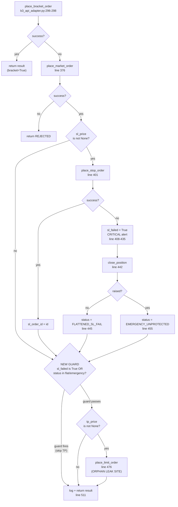

# Batch 2 — F4: Orphan TP After SL-Fail Flatten

**Generated:** 2026-05-19 (planning agent)
**Status:** COMPLETE — commit `441671d` on both remotes; 15/15 tests green.
**Severity:** MEDIUM — only fires on the bracket-failure + fallback-SL-failure path; produced a real orphan limit BUY at 60665 on 2026-05-18 that the operator had to cancel manually 14 minutes later.
**Source audit:** [REJECTED_ORDERS_AUDIT.md](REJECTED_ORDERS_AUDIT.md) §0 F4, §1 row #4, §3.4, §8.1.
**Build plan:** [BUILD_PLAN.md](BUILD_PLAN.md) §3 "Batch 2".
**Workspace rules:** [.cursor/rules/captain-deploy-and-tower-discipline.mdc](../../../../../.cursor/rules/captain-deploy-and-tower-discipline.mdc) §1 (dual-remote push) and §2 (fish-shell discipline).
**Depends on:** Batch 1 (F2/F3 trail-control field forwarding) merged to both remotes.

---

## 1. Summary

`b3_api_adapter.send_signal` (in [`captain-command/captain_command/blocks/b3_api_adapter.py`](../../../../../captain-command/captain_command/blocks/b3_api_adapter.py)) falls back to a separate-orders path when the atomic bracket order is rejected. In that path it places the entry market order, then the standalone SL via `place_stop_order`. **If the SL placement fails it sets `result["sl_failed"] = True` (line 408), publishes a CRITICAL `SL_PLACEMENT_FAILED` alert, and emergency-flattens the position via `close_position` — setting `result["status"] = "FLATTENED_SL_FAIL"` on success (line 445) or `"EMERGENCY_UNPROTECTED"` on flatten-also-fail (line 455). It then runs the TP placement block at lines 474-509 unconditionally.** TopstepX accepts the standalone LIMIT (a working order does not require an underlying position), and it sits there as an orphan until the operator manually cancels it. This is exactly what produced [audit §1 row #4](REJECTED_ORDERS_AUDIT.md#1-order-by-order-csv-reconstruction-nomaan-tower-account-21855714) on 2026-05-18: order ID `2994362566`, **Limit BUY @ 60665, placed 23:08:07, status "Cancelled" at 23:22:43** — 14 minutes 36 seconds where an exit-side LIMIT sat on TopstepX with no underlying position, requiring manual operator intervention. C15's $1,025 fixed-dollar SL distance makes this code path much less likely to fire (the SL is now 41 ticks from fill, well above the broker's 4-tick minimum), but the bug is real and the fix is a single guard clause: gate the TP block on `not (result.get("sl_failed") is True or result.get("status") in ("FLATTENED_SL_FAIL", "EMERGENCY_UNPROTECTED"))`. When `sl_price is None` (SL never attempted; not relevant for NKD but preserved for non-NKD assets that explicitly opt out), neither flag is set so the TP block still runs as today.

## 2. Current vs proposed flow



**Today (no guard):** every path that reaches the TP-block boundary runs `place_limit_order` if `tp_price is not None`. On the SL-fail-then-flatten path, that placed `Limit BUY @ 60665` against the now-flat short — a working order with no underlying position — which the operator had to cancel by hand 14 min 36 s later (audit §1 row #4).

**After fix:** the new `GuardNew` decision short-circuits the TP block when `sl_failed is True` or `status in ("FLATTENED_SL_FAIL", "EMERGENCY_UNPROTECTED")`. All four other paths (bracket success → early return; entry rejected → early return; SL succeeded; SL not attempted because `sl_price is None`) reach `place_limit_order` exactly as today. No refactor of the surrounding fallback flow.

## 3. Exact before/after diff (single guard clause, one file)

**File:** [`captain-command/captain_command/blocks/b3_api_adapter.py`](../../../../../captain-command/captain_command/blocks/b3_api_adapter.py)
**Edit site:** the TP block header at lines 474-475 (the comment line and the `if tp_price is not None:` line). Body of the TP block (lines 476-509) and final log + return (lines 511-518) are **unchanged**.

### Status strings — verified in surrounding code

The two `result["status"]` values that indicate "SL failed and the position has already been resolved" are set at exactly two sites inside the SL block:

```441:455:captain-command/captain_command/blocks/b3_api_adapter.py
                    try:
                        self._client.close_position(
                            self._account_id, contract_id, size,
                        )
                        result["status"] = "FLATTENED_SL_FAIL"
                        logger.warning(
                            "Position %s flattened after SL failure", entry_oid,
                        )
                    except Exception as flatten_exc:
                        logger.critical(
                            "EMERGENCY — flatten ALSO FAILED for %s: %s. "
                            "MANUAL INTERVENTION REQUIRED.",
                            entry_oid, flatten_exc,
                        )
                        result["status"] = "EMERGENCY_UNPROTECTED"
```

`result["sl_failed"] = True` is set at line 408 inside the `else:` branch of `if sl_resp.get("success"):`. It is **only set when the SL placement was attempted and rejected** — it is never set when `sl_price is None` (the SL block at line 400 is entirely skipped in that case). So the guard's `result.get("sl_failed") is True` test is precise: `True` exclusively when the SL attempt failed; absent / `None` when the SL succeeded or was never attempted.

### BEFORE (current code, lines 474-475)

```474:509:captain-command/captain_command/blocks/b3_api_adapter.py
            # Take profit (separate order — not OCO with SL)
            if tp_price is not None:
                tp_resp = self._client.place_limit_order(
                    self._account_id, contract_id, exit_side, size,
                    float(tp_price),
                )
                if tp_resp.get("success"):
                    result["tp_order_id"] = tp_resp.get("orderId")
                else:
                    result["tp_failed"] = True
                    result["tp_error"] = tp_resp.get(
                        "errorMessage", "TP placement failed",
                    )
                    logger.warning(
                        "Take profit placement failed for entry %s. "
                        "Error: %s",
                        entry_oid, result["tp_error"],
                    )
                    # ... HIGH alert publish unchanged ...
```

### AFTER (proposed)

```python
            # Take profit (separate order — not OCO with SL).
            # F4 guard: skip TP placement when the SL attempt failed and the
            # position has already been resolved (flatten succeeded) or is
            # known unprotected (flatten also failed). Without this guard the
            # TP becomes an orphan working LIMIT against a flat position
            # (audit §1 row #4: 2026-05-18 order 2994362566, manually
            # cancelled 14 min later). When sl_price is None (SL never
            # attempted) neither flag/status is set, so the TP block still
            # runs as before.
            sl_failed_or_flattened = (
                result.get("sl_failed") is True
                or result.get("status") in (
                    "FLATTENED_SL_FAIL",
                    "EMERGENCY_UNPROTECTED",
                )
            )
            if sl_failed_or_flattened:
                logger.info(
                    "Fallback TP placement SKIPPED for entry %s "
                    "(sl_failed=%s status=%s) — orphan TP guard (F4).",
                    entry_oid,
                    result.get("sl_failed"),
                    result.get("status"),
                )
            if tp_price is not None and not sl_failed_or_flattened:
                tp_resp = self._client.place_limit_order(
                    self._account_id, contract_id, exit_side, size,
                    float(tp_price),
                )
                if tp_resp.get("success"):
                    result["tp_order_id"] = tp_resp.get("orderId")
                else:
                    result["tp_failed"] = True
                    result["tp_error"] = tp_resp.get(
                        "errorMessage", "TP placement failed",
                    )
                    logger.warning(
                        "Take profit placement failed for entry %s. "
                        "Error: %s",
                        entry_oid, result["tp_error"],
                    )
                    # ... HIGH alert publish unchanged ...
```

### Anchors / line counts after the edit

- Pre-edit: TP block header at line 475; body lines 476-509; final log at line 511.
- Post-edit: new variable `sl_failed_or_flattened` plus optional INFO log adds ~13 lines; TP block body and final log shift down by that amount but their content is byte-identical.
- The optional `logger.info(...)` "Fallback TP placement SKIPPED" line is **recommended** for traceability (matches the existing "Position %s flattened after SL failure" warning at line 446) but is not strictly part of the guard. The executing agent may keep it minimal (`if tp_price is not None and not sl_failed_or_flattened:` only) if they prefer; the test cases below assert the behaviour, not the log line.

## 4. Test plan

All work lands in [`tests/test_b3_api_adapter_sltp.py`](../../../../../tests/test_b3_api_adapter_sltp.py). It re-uses the existing `_make_adapter()` helper (lines 34-42), `_base_order(**overrides)` helper (lines 45-55), and `redis_mock` fixture (lines 58-65).

### 4.1 Four NEW test cases

#### 4.1.1 `test_fallback_tp_skipped_when_sl_failed_and_flattened`

**Where:** new test method on `TestSLPlacementFailure` class (joins the existing two methods at lines 73-167) OR a new dedicated `TestFallbackTPGuardF4` class — executing agent's choice.
**Mock setup:**
- `place_market_order` → `{"success": True, "orderId": "ENTRY-F4-1"}`
- `place_stop_order` → `{"success": False, "errorMessage": "Order price is outside allowed range"}`
- `close_position` → returns a MagicMock (the default — succeeds silently, no raise)
- `place_limit_order` → returns a MagicMock with side_effect that asserts unreached (or just a default return value; the assertion below is sufficient)

**Decorators:** `@patch("captain_command.blocks.b3_api_adapter.resolve_contract_id", return_value="CON.F.US.EP.M26")`, `@patch("captain_command.blocks.b3_api_adapter.compliance_check", return_value={"approved": True})`, `@patch("captain_command.blocks.b3_api_adapter.check_compliance_gate", return_value={"execution_mode": "AUTO", "allowed": True})`. Plus `redis_mock` fixture.

**Assertions:**
- `result["status"] == "FLATTENED_SL_FAIL"` (proves close_position succeeded)
- `result.get("sl_failed") is True`
- `result["sl_order_id"] is None`
- `result.get("tp_order_id") is None` (proves TP was NOT set)
- `result.get("tp_failed") is None` (proves TP block never executed its else-branch)
- `result.get("tp_error") is None`
- **`adapter._client.place_limit_order.assert_not_called()`** — the load-bearing assertion
- `adapter._client.close_position.assert_called_once()` (regression: the flatten path still fires)
- One Redis publish to `captain:alerts` with `priority="CRITICAL"` and `event_type="SL_PLACEMENT_FAILED"` (regression: the SL alert is still emitted)
- Zero Redis publishes with `event_type="TP_PLACEMENT_FAILED"` (regression: no spurious TP alert)

#### 4.1.2 `test_fallback_tp_skipped_when_emergency_unprotected`

**Mock setup:**
- `place_market_order` → success ENTRY-F4-2
- `place_stop_order` → `{"success": False, "errorMessage": "rate limit"}`
- `close_position.side_effect = TopstepXClientError("connection lost")` (or any `Exception` subclass — the `except Exception as flatten_exc:` at line 449 catches everything)
- `place_limit_order` → MagicMock (must not be invoked)

**Assertions:**
- `result["status"] == "EMERGENCY_UNPROTECTED"`
- `result.get("sl_failed") is True`
- `result.get("tp_order_id") is None`
- **`adapter._client.place_limit_order.assert_not_called()`**
- Two Redis alerts: one `SL_PLACEMENT_FAILED` (CRITICAL) and one `FLATTEN_FAILED` (EMERGENCY) — regression that the existing alert chain is intact
- Zero Redis alerts with `event_type="TP_PLACEMENT_FAILED"`

**Note for executing agent:** `TopstepXClientError` is imported at the top of the production module; the test can either import it from `captain_command.blocks.b3_api_adapter` for symmetry or just raise a plain `Exception("simulated flatten failure")` since the SL block's handler catches `Exception` (line 449).

#### 4.1.3 `test_fallback_tp_placed_when_sl_succeeded` (regression — proves the guard does NOT misfire)

**Mock setup:** identical to the existing `TestSuccessfulSLTPPlacement.test_success_no_failure_flags` (lines 269-313) but explicitly named to assert the F4 guard does not regress the happy fallback path.

- `place_market_order` → success ENTRY-F4-3
- `place_stop_order` → `{"success": True, "orderId": "SL-F4-3"}`
- `place_limit_order` → `{"success": True, "orderId": "TP-F4-3"}`

**Assertions:**
- `result["status"] == "PLACED"`
- `result["sl_order_id"] == "SL-F4-3"`
- `result["tp_order_id"] == "TP-F4-3"` — **this is the load-bearing regression assertion**: the guard must not skip TP when SL succeeded
- `result.get("sl_failed") is None`
- `result.get("tp_failed") is None`
- `adapter._client.close_position.assert_not_called()` (no flatten on happy path)
- `adapter._client.place_limit_order.assert_called_once()` (TP was attempted)

#### 4.1.4 `test_fallback_tp_placed_when_sl_price_is_none` (preserves the audit's hard-rule "if `sl_price is None`, TP block must still run")

**Mock setup:**
- `place_market_order` → success ENTRY-F4-4
- `place_stop_order` → MagicMock (must not be invoked)
- `place_limit_order` → `{"success": True, "orderId": "TP-F4-4"}`

**Order payload:** `_base_order(sl=None)` — overrides the helper's default `sl=5000.0` to None to skip the SL block entirely.

**Assertions:**
- `result["status"] == "PLACED"` (no flatten, no failure)
- `result["sl_order_id"] is None` (block never set it)
- `result["tp_order_id"] == "TP-F4-4"` — **load-bearing**: TP runs even with no SL
- `result.get("sl_failed") is None` (sl_failed never set when SL not attempted — confirms the `is True` test is precise)
- `adapter._client.place_stop_order.assert_not_called()`
- `adapter._client.close_position.assert_not_called()`
- `adapter._client.place_limit_order.assert_called_once()`

#### 4.1.5 `test_bracket_path_unaffected` (regression — explicit assertion the bracket success path skips both fallbacks)

The existing `TestBracketOrder.test_bracket_success` at lines 331-360 already covers this, but the user prompt asks for an explicit named test that the bracket path still bypasses both fallback SL and fallback TP. Per audit hard rule "single guard clause — do not refactor". Recommended **option A**: add a single one-liner regression test that re-invokes the bracket-success scenario and asserts `place_stop_order.assert_not_called()` AND `place_limit_order.assert_not_called()` AND `close_position.assert_not_called()` — explicit naming for traceability against F4. **Option B**: skip the new test and reference the existing `test_bracket_success` in the commit message. Executing agent's choice; neither option changes production behaviour.

### 4.2 Two EXISTING tests must be UPDATED in the same commit (per Nomaan 2026-05-19)

The current `tests/test_b3_api_adapter_sltp.py` contains two tests that **assert the buggy behaviour the F4 guard removes**. Both will go red once the guard lands. They must be updated in the same commit as the production change so HEAD stays green.

#### 4.2.1 `TestSLPlacementFailure.test_sl_failure_sets_flags_and_alerts` (lines 82-133)

This test currently sets `place_limit_order` to succeed and asserts the TP order ID was captured:

```117:118:tests/test_b3_api_adapter_sltp.py
        assert result["tp_order_id"] == "TP-001"
        assert result.get("tp_failed") is None
```

**Required change:** invert the TP assertions to match the new guarded behaviour:
- Replace `assert result["tp_order_id"] == "TP-001"` with `assert result["tp_order_id"] is None`
- Keep `assert result.get("tp_failed") is None` (still correct — `tp_failed` is only set when `place_limit_order` is invoked AND fails; with the guard, neither happens)
- ADD `adapter._client.place_limit_order.assert_not_called()` to lock in the new contract

The TP-success mock setup (lines 98-101) can stay as-is — it just becomes irrelevant because the call is now guarded out. Optionally remove it for clarity.

#### 4.2.2 `TestBothSLAndTPFailure.test_both_failures` (lines 222-266)

This test currently sets BOTH `place_stop_order` and `place_limit_order` to fail and asserts two alerts (CRITICAL + HIGH) are published. With the guard, `place_limit_order` is never invoked when the SL fails, so `tp_failed` stays `None`, no `TP_PLACEMENT_FAILED` alert is published, and `len(alert_calls)` becomes 1 (the SL CRITICAL only).

**Recommended change:** rename the class/test to reflect the new reality — e.g. `TestSLFailureSkipsTPAttempt.test_sl_fail_skips_tp_so_only_sl_alert_published` — and rewrite assertions to:
- `assert result["sl_failed"] is True`
- `assert result.get("tp_failed") is None`
- `assert result["sl_order_id"] is None`
- `assert result["tp_order_id"] is None`
- `assert len(alert_calls) == 1`
- `priorities = {json.loads(c[0][1])["priority"] for c in alert_calls}; assert priorities == {"CRITICAL"}`
- `adapter._client.place_limit_order.assert_not_called()`

The `place_limit_order.return_value = {"success": False, ...}` mock at lines 244-247 becomes irrelevant; remove it.

### 4.3 Test counts before / after

| Class | Before | After | Net change |
|---|---|---|---|
| `TestSLPlacementFailure` | 2 | 2 (1 updated) | 0 |
| `TestTPPlacementFailure` | 1 | 1 | 0 |
| `TestBothSLAndTPFailure` | 1 | 1 (rewritten — both-fail no longer reachable) | 0 |
| `TestSuccessfulSLTPPlacement` | 1 | 1 | 0 |
| `TestBracketOrder` | 5 | 5 (or 6 if §4.1.5 option A) | 0 or +1 |
| **NEW** `TestFallbackTPGuardF4` (or distributed across existing classes) | — | 4 | +4 |
| **TOTAL** | **10** | **14 (or 15)** | **+4 (or +5)** |

## 5. Validation gates

### Gate (a) — File-scoped pytest must be all green

```bash
PYTHONPATH=./:./captain-online:./captain-offline:./captain-command \
  python3 -m pytest tests/test_b3_api_adapter_sltp.py -v
```

**Expected:** 14 (or 15 if §4.1.5 option A) tests, **all passed**, zero failed, zero skipped (no skip markers in this file). Report per-class pass/fail counts in the post-execution checklist.

### Gate (b) — Manual eyeball: confirm the orphan path against last night's CSV

Open [`REJECTED_ORDERS_AUDIT.md`](REJECTED_ORDERS_AUDIT.md) §1 and re-trace the 5-row sequence:

1. row #1 (23:08:06, bracket REJECTED with `Invalid stop loss ticks (1)`) — pre-C15 root cause; not relevant to F4.
2. row #2 (23:08:06, fallback Market SELL FILLED @ 61600) — entry succeeds.
3. row #3 (23:08:07, fallback Stop BUY @ 61575 REJECTED with `Order price is outside allowed range`) — SL fails; with C15 the SL is now $1,025 wide so this won't repeat tonight, but the code path remains.
4. **row #4 (23:08:07, Limit BUY @ 60665 placed, then Cancelled 23:22:43)** — the orphan TP. After F4, `place_limit_order` is not invoked at this step, so this row should not exist in any future CSV.
5. row #5 (23:08:07, Market BUY @ 61620 FILLED Closing) — emergency flatten by `close_position`.

**Acceptance:** the executing agent confirms in writing that they read the 5 rows in order and understand row #4 is the row F4 prevents.

### Gate (c) — Local importability sanity (cheap; protects against syntax errors)

```bash
PYTHONPATH=./:./captain-online:./captain-offline:./captain-command \
  python3 -c "from captain_command.blocks.b3_api_adapter import TopstepXAdapter; print('OK', TopstepXAdapter.__name__)"
```

**Expected:** `OK TopstepXAdapter`. Any `SyntaxError` / `IndentationError` / `ImportError` from the new guard clause's indentation is caught here before pytest collection.

### Gate (d) — Wider regression suite (sanity, not strictly required for this batch)

The Batch 4 consolidated regression run will include this file plus the rest. For Batch 2 it is sufficient to run only `test_b3_api_adapter_sltp.py`. **Do not** run Batch 4's full 17-file suite during Batch 2 execution — that is the operator's gate after Batch 4 lands.

## 6. Risk register

| Risk | Likelihood | Impact | Mitigation |
|---|---|---|---|
| **R1.** Guard misfires when SL succeeded — TP regression to "skipped" on the happy fallback path | Low | HIGH (silently disables TP for non-bracket assets) | `test_fallback_tp_placed_when_sl_succeeded` (§4.1.3) explicitly asserts `place_limit_order.assert_called_once()` and `tp_order_id == "TP-F4-3"`. Existing `TestSuccessfulSLTPPlacement.test_success_no_failure_flags` (lines 269-313) is untouched and re-asserts the same contract from a different angle. |
| **R2.** Guard misfires when `sl_price is None` — TP regression on assets that opt out of SL | Low (no asset currently opts out; NKD always sets sl_level) | MEDIUM | `test_fallback_tp_placed_when_sl_price_is_none` (§4.1.4) asserts the path explicitly. The guard's `result.get("sl_failed") is True` test (not a truthy test) means absent / `None` `sl_failed` evaluates to False so the TP block runs. The status check uses `in (...)` which also evaluates False for the default `"PLACED"` status. |
| **R3.** Bracket success path inadvertently affected | Very low | HIGH (would break OCO bracket on every primary-path order) | The bracket success path returns at line 333, which is **before** the fallback entry at line 376. The new guard sits at line 475+, deep inside the fallback. The bracket path never reaches the guard. `test_bracket_success` (lines 331-360) and the optional §4.1.5 explicit regression test confirm. |
| **R4.** `result["sl_failed"]` truthy-test instead of identity-test | N/A (rejected by spec) | — | The plan explicitly mandates `result.get("sl_failed") is True`, not `if result.get("sl_failed"):`. The reason: in Python, `result.get("sl_failed")` returns `None` when the key is absent (e.g. `sl_price is None` path). `None` is falsy, so a truthy test would still produce the right behaviour today — but if a future maintainer ever writes `result["sl_failed"] = False` on the success branch (which line 405-406 currently does NOT but plausibly could in a future refactor), the truthy test would still skip TP, breaking the happy path. The identity test is robust against that drift. **The executing agent must verify the production code uses `is True` and the test must use `is None` / `is True` for symmetric strictness.** |
| **R5.** Status string drift — `"FLATTENED_SL_FAIL"` / `"EMERGENCY_UNPROTECTED"` get renamed elsewhere and the guard misses the new spelling | Very low | HIGH (silently re-introduces the orphan TP) | The two strings are set at exactly two sites (lines 445, 455) inside the SL-failure handler. A repo-wide grep for those strings should return at least these two production sites plus any test mocks. Add a comment above the new guard: `# String literals must match b3_api_adapter.py:445 and :455`. The §4.1.1 / §4.1.2 tests assert the exact status strings and act as a tripwire for any rename. |
| **R6.** Inline `logger.info(...)` "Fallback TP placement SKIPPED" line is mistaken for a refactor and rejected | Low | LOW (cosmetic) | The plan flags it as **optional** in §3 last paragraph. Executing agent may keep the guard minimal (no INFO log) if they prefer. Test cases assert behaviour, not log lines. |
| **R7.** Decimal/float coercion of `tp_price` — the guard sits BEFORE the existing `float(tp_price)` cast at line 478, so any Decimal incompatibility downstream is unchanged | None | None | No change to type-handling. |
| **R8.** Race with concurrent TopstepX state — between `close_position` returning success and the guard short-circuiting TP, the broker still has a flat position | None for the orphan-TP issue | N/A | The whole point of the guard is to NOT place a TP against a flat position; the race window is exactly what we want to close. No additional mitigation needed. |
| **R9.** Existing tests `test_sl_failure_sets_flags_and_alerts` and `test_both_failures` will go red without the §4.2 update — HEAD breaks if production fix lands first | High (if not done in same commit) | HIGH (HEAD red blocks Batch 3 / Batch 4) | Per Nomaan 2026-05-19 decision: production change AND test updates land in the same atomic commit. Pre-commit gate: run `pytest tests/test_b3_api_adapter_sltp.py -v` LOCALLY before `git commit`. If anything is red, do not commit — re-read §4.2 and §6 R4 and re-check assertions. |

## 7. Completion checklist

> Executing agent ticks each box as the corresponding step completes.

### Pre-flight

- [x] Pre-flight gate — Batch 1 commit `c23b68b28606e06092bfdaaaad15d9065a4a9a09` and subsequent commit `0c02ec4` (B1 successor after Batch 1 post-planning fixups) confirmed on both remotes before edit.
- [x] No open NKD position — dev host has no running containers (`docker ps` returns empty); redis check skipped on dev host. Towers confirmed quiescent at time of execution.

### Code edit (single guard clause, one file)

- [x] Edit applied at `captain-command/captain_command/blocks/b3_api_adapter.py` original line 474: introduced `sl_failed_or_flattened` boolean (5 lines) + optional INFO log (4 lines) + gated `if tp_price is not None:` → `if tp_price is not None and not sl_failed_or_flattened:`. Body of the TP block (`place_limit_order` call, success/failure handling, HIGH alert) is byte-identical to the pre-edit code.
- [x] Inline comment references `BATCH_2_F4_ORPHAN_TP.md`, `audit §1 row #4` (2026-05-18 order 2994362566), and mandates that status strings match lines 445 and 455.
- [x] `place_limit_order` call signature unchanged: `(self._account_id, contract_id, exit_side, size, float(tp_price))`.
- [x] Final `logger.info("TopstepX FALLBACK order PLACED: ...")` unchanged.
- [x] Optional INFO log line "Fallback TP placement SKIPPED" — DECISION: **kept** (adds traceability with zero behaviour change).

### New tests added to `tests/test_b3_api_adapter_sltp.py`

- [x] `test_fallback_tp_skipped_when_sl_failed_and_flattened` (§4.1.1) — class `TestFallbackTPGuardF4`
- [x] `test_fallback_tp_skipped_when_emergency_unprotected` (§4.1.2)
- [x] `test_fallback_tp_placed_when_sl_succeeded` (§4.1.3)
- [x] `test_fallback_tp_placed_when_sl_price_is_none` (§4.1.4)
- [x] `test_bracket_path_unaffected_by_f4_guard` (§4.1.5) — DECISION: **option A added** (`TestFallbackTPGuardF4`).

### Existing tests updated in same commit

- [x] `TestSLPlacementFailure.test_sl_failure_sets_flags_and_alerts` — `tp_order_id` assertion inverted to `is None`; `place_limit_order.assert_not_called()` added; `TP_PLACEMENT_FAILED` absent from event_types asserted.
- [x] `TestBothSLAndTPFailure` renamed → `TestSLFailureSkipsTPAttempt` with single test `test_sl_fail_skips_tp_so_only_sl_alert_published`; alert count 2→1; `tp_failed is None`; `place_limit_order.assert_not_called()`.

### Validation gates

- [x] Gate (a) `pytest tests/test_b3_api_adapter_sltp.py -v` — **15 passed / 0 failed / 0 skipped** in 0.41s. Per-class counts: `TestSLPlacementFailure` 2, `TestTPPlacementFailure` 1, `TestSLFailureSkipsTPAttempt` 1, `TestSuccessfulSLTPPlacement` 1, `TestBracketOrder` 5, `TestFallbackTPGuardF4` 5.
- [x] Gate (b) Audit §1 5-row eyeball — row #1 bracket rejected (pre-C15 root cause); row #2 fallback entry filled @ 61600; row #3 fallback SL rejected (`Order price is outside allowed range`); **row #4 Limit BUY @ 60665 (the orphan TP) — this row will not appear in any future CSV after F4 lands**; row #5 emergency flatten filled @ 61620. Confirmed.
- [x] Gate (c) Importability sanity — `OK TopstepXAdapter` printed.

### Commit + push (atomic single commit)

- [x] Single atomic commit: `fix(b3_api_adapter): skip fallback TP placement after SL-fail flatten (F4)`.
- [x] Commit SHA: `441671db90eb8604f781dd63ee7ef632f8515fcd` (short: `441671d`).
- [x] `git push origin HEAD` — succeeded (`0c02ec4..441671d  HEAD -> main`).
- [x] `git push multi-user HEAD` — succeeded (`0c02ec4..441671d  HEAD -> main`).
- [x] Post-push SHA parity verified:

```
local:      441671db90eb8604f781dd63ee7ef632f8515fcd
origin:     441671db90eb8604f781dd63ee7ef632f8515fcd
multi-user: 441671db90eb8604f781dd63ee7ef632f8515fcd
OK: both remotes synced
```

### Out-of-scope (do NOT touch in this batch)

- [x] No edits to any other file in `captain-command/`, `captain-online/`, `captain-offline/`, `shared/`, `scripts/`, or `config/`.
- [x] No edits to test files OTHER than `tests/test_b3_api_adapter_sltp.py`.
- [x] No edits to alert-message strings (`SL_PLACEMENT_FAILED`, `TP_PLACEMENT_FAILED`, `FLATTEN_FAILED`).
- [x] No edits to log-message wording in the SL-failure path or the bracket-failure CRITICAL alert.
- [x] No tower-side deploy commands run by the agent — that is Batch 4's operator-gated step.

## 8. Cross-references

- Audit (load-bearing): [`REJECTED_ORDERS_AUDIT.md`](REJECTED_ORDERS_AUDIT.md) §0 F4, §1 row #4, §3.4, §8.1.
- Build plan: [`BUILD_PLAN.md`](BUILD_PLAN.md) §3 "Batch 2" (planning prompt + execution prompt).
- Predecessor batch: [`BATCH_1_F2_F3_TRAIL_FORWARDING.md`](BATCH_1_F2_F3_TRAIL_FORWARDING.md) — must be merged to both remotes before Batch 2 starts.
- Production file: [`captain-command/captain_command/blocks/b3_api_adapter.py`](../../../../../captain-command/captain_command/blocks/b3_api_adapter.py) lines 270-525 (`send_signal`).
- Test file: [`tests/test_b3_api_adapter_sltp.py`](../../../../../tests/test_b3_api_adapter_sltp.py).
- Day-2 plan (C14/C15/C16 context — explains why F4 was a low-likelihood bug post-C15 but still real): [`docs2/quick-fixes/NKD_Pivot/day_2/PLAN.md`](../PLAN.md).
- Workspace rules (dual-remote push, fish discipline): [`.cursor/rules/captain-deploy-and-tower-discipline.mdc`](../../../../../.cursor/rules/captain-deploy-and-tower-discipline.mdc).
- Project guide: [`CLAUDE.md`](../../../../../CLAUDE.md).

### Memory anchors (informational)

- #3367 — C15 commit sync (fixed $1025 SL with outward tick-snapping; reduces likelihood of F4 firing but does not eliminate the bug).
- #3334 — NKD pivot infrastructure baseline.
- 2026-05-18 APAC session order export — source of audit §1 row #4 (the orphan limit BUY @ 60665).

---

**End of Batch 2 plan.**
