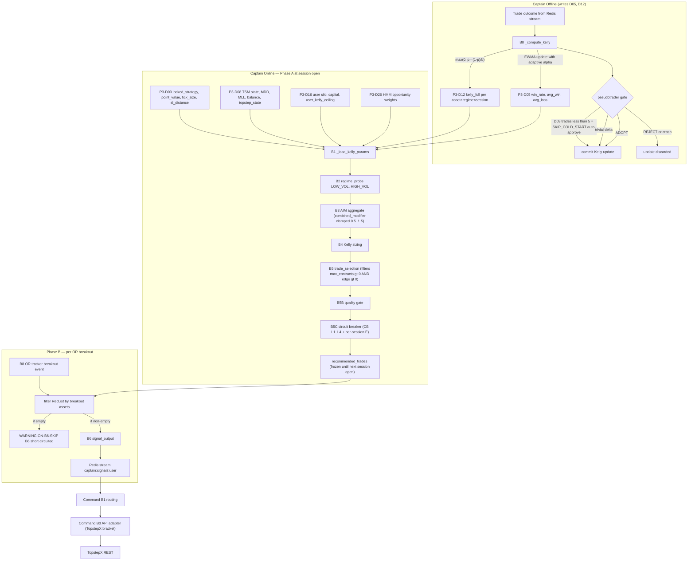
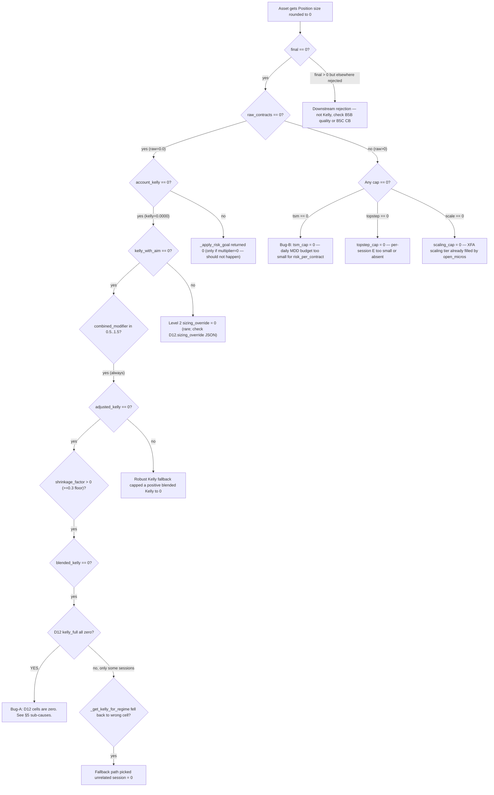

# Kelly = 0 Audit Map — 2026-05-21 NY Open

> Author: read-only audit (no code edits).
> Evidence: [docs2/quick-fixes/kello-zero-fix/reference_logs.md](./reference_logs.md) (Tower A, 2026-05-21 09:25–09:50 ET).
> Companion mechanism doc: [docs2/logs-raw_html/log-illustations/kelly-sizing-mechanism-2026-05-13.md](../../logs-raw_html/log-illustations/kelly-sizing-mechanism-2026-05-13.md).
> Spec source-of-truth: [docs2/spec-docs-01/08_Kelly_Sizing_Pipeline.md](../../spec-docs-01/08_Kelly_Sizing_Pipeline.md).

This document is the **information-gathering deliverable** for a follow-on planning agent. It maps the full signal → sizing → order pipeline, decodes the 2026-05-21 log line-by-line, identifies the two distinct bugs that combined to block all 8 eligible NY-open assets, proposes invariants/guards, and outlines a minimum-safe patch sequence.

---

## 0. TL;DR — One paragraph

Across 2026-05-21 NY open, every eligible asset got `Position size rounded to 0` and **no** signal published. The cause is **two independent bugs that share one downstream symptom**:

1. **Bug-A (the headline issue, 7/8 assets):** `P3-D12.kelly_full` is effectively `0` for **ZN, ZB, MYM, MNQ, MES, M2K, ES** in the (regime, session) cells consulted at session open. The Kelly clamp in [captain-offline/captain_offline/blocks/b8_kelly_update.py](../../../captain-offline/captain_offline/blocks/b8_kelly_update.py#L130) returns `0.0` whenever `win_rate − (1−win_rate)/b ≤ 0`, and there is **no warm-up / Bayesian-prior / Kelly-floor guard**. After a few cold-start losses (or with default `(win_rate=0.5, avg_win=0.01, avg_loss=0.01)` defaults), the entire 6-cell map collapses to zero. AIM modifier is clamped to `[0.5, 1.5]` so it cannot be the zeroing source.

2. **Bug-B (NQ-only structural cap, 1/8 assets):** NQ shows `kelly=0.0724 → 17.4 (raw)` but is then clipped to `0` by `tsm=0` and `topstep=0`. With NQ's per-contract risk ≈ $531 and the Topstep daily MDD slice ≈ $250 (`remaining_mdd / budget_divisor = 5000 / 20`), `max_by_mdd = floor(250/531) = 0`. NQ is mathematically untradeable on a $150 K combine until either `budget_divisor` shrinks, MDD headroom grows, or the strategy SL distance drops.

The orchestrator computes the kelly-sized recommendation **once at session open (09:25)** as Phase A, and Phase B (fired per OR breakout at 09:35, 09:37, 09:39, 09:50…) **only re-invokes B6 with the already-empty Phase-A recommendation list**. So even when later breakouts fire, no signal can be published until the next session open.

---

## 1. Pipeline map — Signal → Sizing → Order



**Phase A vs Phase B is the critical timing detail.** Phase A's `recommended_trades` (output of B4 → B5 → B5B → B5C) is frozen at session open. Phase B reuses that list. If every asset got `Position size rounded to 0` at Phase A, Phase B is a permanent no-op for the rest of the session, even when OR breakouts later resolve.

---

## 2. Pipeline stages — inputs / outputs / storage / code anchors

- **OFF-B8 _compute_kelly + EWMA update**
  - Input: `trade_outcome {asset, pnl, contracts, regime_at_entry, session}` from Redis stream `captain:trade_outcomes`.
  - Inputs read: P3-D04 `current_changepoint_probability` (for adaptive alpha), P3-D05 existing EWMA.
  - Output: `proposed_ewma`, `proposed_kelly[(regime, session)]`, `shrinkage` (one shrinkage per asset).
  - Writes: P3-D05 (the trigger cell), P3-D12 (6 per-cell rows + 1 "ALL/0" shrinkage row per asset).
  - Code: [b8_kelly_update.py L130-139 (_compute_kelly)](../../../captain-offline/captain_offline/blocks/b8_kelly_update.py#L130), [L193-326 (run_kelly_update)](../../../captain-offline/captain_offline/blocks/b8_kelly_update.py#L193).
  - **Zero-emit conditions:** `avg_loss ≤ 0` OR `win_rate ≤ 0` OR `win_rate − (1−win_rate)/(avg_win/avg_loss) ≤ 0`. No min-N gate, no Bayesian prior, no floor.

- **OFF orchestrator pseudotrader gate** ([captain-offline/captain_offline/blocks/orchestrator.py L98-192](../../../captain-offline/captain_offline/blocks/orchestrator.py#L98))
  - `COLD_START_MIN_TRADES = 5`: if D03 has < 5 trades for the asset, gate AUTO-APPROVES (commits Kelly update without replay).
  - Trivial change (< `PSEUDOTRADER_EPSILON = 1e-4`) → commits directly.
  - Pseudotrader REJECT or crash → does NOT commit.
  - **Implication:** during cold start, Kelly updates flow through unvalidated, so the first ~4 trades can pull all 6 cells into the no-edge region with no overfitting brake.

- **ON-B1 _load_kelly_params** ([captain-online/captain_online/blocks/b1_data_ingestion.py L198-228](../../../captain-online/captain_online/blocks/b1_data_ingestion.py#L198))
  - Reads `p3_d12_kelly_parameters` ordered by `last_updated DESC`, dedup by `(asset_id, regime, session)`, keeps latest only.
  - Returns `result[key] = {kelly_full, shrinkage_factor}` and `sizing_overrides[asset_id]`.
  - **Quirk:** uses `r[3] or 0.0` for `kelly_full` and `r[4] or 1.0` for `shrinkage_factor`. A legitimately learned `kelly_full = 0.0` is indistinguishable from "no row" downstream.

- **ON-B4 run_kelly_sizing** ([captain-online/captain_online/blocks/b4_kelly_sizing.py](../../../captain-online/captain_online/blocks/b4_kelly_sizing.py))
  - Inputs: D12 `kelly_params`, D05 `ewma_states`, B2 `regime_probs`/`regime_uncertain`, B3 `combined_modifier`, D16 `user_silo`, D08 `tsm_configs`, `sizing_overrides`, `locked_strategies`, `assets_detail`, `session_id`.
  - Pipeline per (asset, account):
    1. Silo drawdown check (>30% → BLOCKED everything).
    2. `blended_kelly = Σ regime_prob × _get_kelly_for_regime(...)` — falls back to ANY session for same (asset, regime) if exact `session_id` row missing ([b4_kelly_sizing.py L306-316](../../../captain-online/captain_online/blocks/b4_kelly_sizing.py#L306)).
    3. `adjusted_kelly = blended_kelly × shrinkage_factor` (shrinkage floored at 0.3 in OFF-B8, but `0 × 0.3 = 0`).
    4. Robust Kelly fallback when `regime_uncertain[u]` — `min(adjusted_kelly, f_robust)` — can only *reduce* Kelly. From the log: 8/8 assets are flagged uncertain because regime max_prob = 0.500.
    5. `kelly_with_aim = adjusted_kelly × combined_modifier` — modifier clamped `[0.5, 1.5]` so this CANNOT zero.
    6. `kelly_with_aim = min(kelly_with_aim, user_kelly_ceiling)` (= 1.0 from bootstrap).
    7. Level 2 sizing_override (NULL in fresh systems).
    8. `account_kelly = _apply_risk_goal(...)` — for `GROW_CAPITAL` identity, for `PASS_EVAL` × 0.85 (or × 0.7 / × 0.5 if `pass_probability` low).
    9. `kelly_contracts = account_kelly × account_capital / risk_per_contract_with_fee` (continuous).
    10. `raw_contracts = floor(kelly_contracts)`.
    11. `final = min(raw_contracts, tsm_cap, topstep_daily_cap, scaling_cap)` then `max(final, 0)`.
  - Writes: nothing. Returns `final_contracts`, `account_recommendation`, `account_skip_reason`. Final == 0 with no daily-loss / MDD-headroom block → reason `"Position size rounded to 0"` ([b4_kelly_sizing.py L265-276](../../../captain-online/captain_online/blocks/b4_kelly_sizing.py#L265)).

- **ON-B4 _compute_tsm_cap** ([b4_kelly_sizing.py L350-429](../../../captain-online/captain_online/blocks/b4_kelly_sizing.py#L350))
  - PROP_EVAL/FUNDED/SCALING branch: `daily_budget = remaining_mdd / budget_divisor`, `max_by_mdd = floor(daily_budget / (strategy_sl × point_value))`.
  - Default `budget_divisor = tsm_budget_divisor_default = 20` when `evaluation_end_date IS NULL` (open-ended combine).
  - Then `cap = min(max_by_mdd, max_by_mll, max_contracts)` (max_contracts is `BOOTSTRAP_MAX_CONTRACTS = 15` from env).
  - **NQ-specific zeroing point** — see §3 below.

- **ON-B4 _compute_topstep_daily_cap** ([b4_kelly_sizing.py L432-473](../../../captain-online/captain_online/blocks/b4_kelly_sizing.py#L432))
  - Only active when `tsm.topstep_optimisation == True`.
  - Reads per-session `E_daily_exposure` from `D08.topstep_state.computed_sod.session.<NY|LON|APAC>.E_daily_exposure` (via [shared/sod_session_budget.py](../../../shared/sod_session_budget.py)).
  - `cap = floor(E_session / (strategy_sl × point_value))`.
  - Falls back to `topstep_params.daily_contract_cap = 999` if SOD never computed.

- **ON-B5 trade_selection** ([b5_trade_selection.py L31-148](../../../captain-online/captain_online/blocks/b5_trade_selection.py#L31))
  - `selected_trades = [u for u in ranked if max_contracts > 0 AND expected_edge > 0]`.
  - If all assets sized to 0 by B4 → `selected_trades = []`.
  - NKD has an unconditional bypass (`final_contracts[NKD] = 1` no matter what).

- **ON-B5B quality_gate / ON-B5C circuit_breaker** — pass-through when no candidates; produce `cb_result["recommended_trades"]`.

- **ON-orchestrator Phase A → Phase B handoff** ([captain-online/captain_online/blocks/orchestrator.py L494-737](../../../captain-online/captain_online/blocks/orchestrator.py#L494))
  - Phase A `cb_result` is cached per user at session open.
  - Phase B (`_run_b6_for_user`) filters `recommended_full` by newly-resolved OR breakouts. **If `recommended_full == []` it emits `WARNING ON-B6-SKIP … — B6 short-circuited (no candidates)`** and returns no signals. This is **exactly** the log we see at 09:35:01, 09:35:02, 09:37:15, 09:37:19, 09:39:50, 09:50:03 in `reference_logs.md`.

- **ON-B6 signal_output** ([captain-online/captain_online/blocks/b6_signal_output.py](../../../captain-online/captain_online/blocks/b6_signal_output.py))
  - For each recommended trade, builds `signal = {signal_id, asset, direction, size, tp_level, sl_level, per_account, _context}`.
  - Additional fail-safe: `if total_size <= 0: continue` with warning `ON-B6: Skipping … zero contracts after sizing`. Never reached when Phase A already produced `[]`.
  - Publishes to Redis stream `STREAM_SIGNALS` (= `captain:signals:{user_id}`).

- **CMD-B1 routing** → **CMD-B3 API adapter** → TopstepX bracket. None of this stage is reached for blocked assets.

---

## 3. Decoding the 2026-05-21 log line-by-line

The decisive lines are at `09:25:06,649 – 09:25:06,664`:

```text
ON-B4: ZN  ac=21855714 kelly=0.0000→0.0000(rg)→0.0(raw)  risk/c=12.2  cap=150000 tsm=15 topstep=47 scale=999 → 0 contracts [SKIP]
ON-B4: ZB  ac=21855714 kelly=0.0000→0.0000(rg)→0.0(raw)  risk/c=22.3  cap=150000 tsm=15 topstep=23 scale=999 → 0 contracts [SKIP]
ON-B4: NQ  ac=21855714 kelly=0.0724→0.0616(rg)→17.4(raw) risk/c=531.3 cap=150000 tsm=0  topstep=0  scale=999 → 0 contracts [SKIP]
ON-B4: MYM ac=21855714 kelly=0.0000→0.0000(rg)→0.0(raw)  risk/c=28.1  cap=150000 tsm=15 topstep=17 scale=999 → 0 contracts [SKIP]
ON-B4: MNQ ac=21855714 kelly=0.0000→0.0000(rg)→0.0(raw)  risk/c=54.5  cap=150000 tsm=8  topstep=8  scale=999 → 0 contracts [SKIP]
ON-B4: MES ac=21855714 kelly=0.0000→0.0000(rg)→0.0(raw)  risk/c=19.7  cap=150000 tsm=15 topstep=25 scale=999 → 0 contracts [SKIP]
ON-B4: M2K ac=21855714 kelly=0.0000→0.0000(rg)→0.0(raw)  risk/c=20.4  cap=150000 tsm=15 topstep=26 scale=999 → 0 contracts [SKIP]
ON-B4: ES  ac=21855714 kelly=0.0000→0.0000(rg)→0.0(raw)  risk/c=191.2 cap=150000 tsm=2  topstep=2  scale=999 → 0 contracts [SKIP]
```

Field semantics from [b4_kelly_sizing.py L250-254](../../../captain-online/captain_online/blocks/b4_kelly_sizing.py#L250):

- `kelly=X` = `kelly_with_aim` (after blend × shrinkage × robust × AIM × ceiling × override).
- `(rg)` = `account_kelly` (after risk-goal multiplier).
- `(raw)` = `kelly_contracts` (continuous, before `floor()`).
- `risk/c` = `strategy_sl × point_value + expected_fee`.
- `cap` = `account_capital` (= `current_balance`, NOT a Kelly cap).
- `tsm` = `_compute_tsm_cap(...)` output.
- `topstep` = `_compute_topstep_daily_cap(...)` output.
- `scale` = `_compute_scaling_cap(...)` output (999 = no scaling plan).

**Two distinct failure modes are visible:**

| Asset class | kelly | raw | tsm | topstep | scale | Diagnosis |
|---|---|---|---|---|---|---|
| ES, MES, MNQ, M2K, MYM, ZB, ZN | 0.0000 | 0.0 | 2–15 | 17–47 | 999 | **Bug-A**: D12 kelly_full is zero. Caps non-binding. |
| NQ | 0.0724 | 17.4 | **0** | **0** | 999 | **Bug-B**: positive Kelly, structural cap = 0. |

**The orchestrator wrap-up** at 09:25:06,665 confirms B5 selected `0/8` assets; at 09:25:06,672 `Phase A — user primary_user: 0 recommended, 0 below threshold`. Every later `ON-B6-SKIP` warning at 09:35:01–09:50:03 is the same Phase-A `[]` list being re-checked against new breakouts.

Also worth noting at 09:25:06,592: `B2 Regime uncertainty for ZN/ZB/NQ/MYM/MNQ/MES/M2K/ES: max_prob=0.500 — robust Kelly will be used`. With max regime probability stuck at exactly 0.5, the system is in maximum-uncertainty mode — robust Kelly fallback can only further reduce sizing.

---

## 4. Root-cause decision tree



---

## 5. Concrete diagnosis

### 5.1 Bug-A — `D12.kelly_full = 0` for 7/8 assets

**Where the zero is created.** Code in [b8_kelly_update.py L130-139](../../../captain-offline/captain_offline/blocks/b8_kelly_update.py#L130):

```48:54:captain-offline/captain_offline/blocks/b8_kelly_update.py
def _compute_kelly(win_rate: float, avg_win: float, avg_loss: float) -> float:
    if avg_loss <= 0 or win_rate <= 0:
        return 0.0
    b = avg_win / avg_loss
    kelly = win_rate - (1 - win_rate) / b
    return max(0.0, kelly)
```

**Sub-causes (ranked by likelihood given the 7/8 spread):**

1. **Cold-start EWMA collapse.** Once a (regime, session) cell has only 1–2 EWMA samples and one is a loss, `win_rate` drops fast under `alpha = 2/(span+1) ≈ 0.095` (default span=20). E.g. starting `(0.5, 0.01, 0.01)`, one loss of $100 with `pnl_per_contract=−100`: `win_rate → 0.452`, `avg_loss → 9.50`, `avg_win → 0.01`, b = 0.001 → Kelly massively negative → clamped to 0. **No floor catches this.**

2. **Bootstrap defaults silently emit Kelly = 0.** [bootstrap.py L64-77 (_compute_unconditional)](../../../captain-offline/captain_offline/blocks/bootstrap.py#L64) returns `(0.5, 0.01, 0.01)` when `returns == []`. `_compute_kelly(0.5, 0.01, 0.01) = 0.5 − 0.5/1.0 = 0.0` exactly. Any asset whose P1 D-22 trade log has empty regime-conditional returns falls through to defaults → Kelly = 0 for that cell on first persist.

3. **`_load_ewma` masks zero learnings.** [b8_kelly_update.py L107-114](../../../captain-offline/captain_offline/blocks/b8_kelly_update.py#L107):
   ```python
   "win_rate": row[0] or 0.5,
   "avg_win":  row[1] or 0.01,
   "avg_loss": row[2] or 0.01,
   ```
   A legitimately learned `0.0` win-rate is rewritten to `0.5`. Same for the other two. This makes the EWMA non-monotonic in the worst direction during cold start.

4. **Pseudotrader gate is permissive during cold start.** [orchestrator.py L120-148](../../../captain-offline/captain_offline/blocks/orchestrator.py#L120) auto-approves Kelly updates when D03 trade count `< COLD_START_MIN_TRADES = 5`. So the first 4 losses on a freshly-bootstrapped asset bypass the anti-overfit replay AND collapse all 6 cells to Kelly=0 with no brake.

5. **Last-known-good supersedence.** D12 is append-only and ON-B1 reads `ORDER BY last_updated DESC` then dedup by `(asset_id, regime, session)`. If a single zero-emitting OFF-B8 run lands, it permanently overrides any earlier positive Kelly for that cell until the next learned update — which itself may also emit zero (sub-causes 1, 2, 3).

6. **NKD trail/Q2-strict path** does NOT touch D12 for other assets, but the NKD outcome bypass in [orchestrator.py L386-403](../../../captain-offline/captain_offline/blocks/orchestrator.py#L386) skips DMA/BOCPD/Kelly entirely on NKD outcomes — irrelevant here, called out only because the user query mentioned "weight drops to 0 after a loss".

**What rules out other suspects:**
- **AIM cannot zero.** `combined_modifier ∈ [0.5, 1.5]` ([shared/aim_compute.py L165, L300](../../../shared/aim_compute.py#L165)).
- **Shrinkage cannot zero.** `_compute_shrinkage` clamps `max(0.3, 1.0 − estimation_variance)` ([b8_kelly_update.py L183-190](../../../captain-offline/captain_offline/blocks/b8_kelly_update.py#L183)).
- **`user_kelly_ceiling` = 1.0** at bootstrap (D16, [scripts/bootstrap_production.py L322](../../../scripts/bootstrap_production.py#L322)).
- **`sizing_override`** would have to be 0 in D12 — possible but very rare. The log shows `kelly_with_aim = 0.0000` already at the `kelly=` field, **before** override math would matter relative to the `0` baseline. Override × 0 = 0 either way, so override is not adding anything; the bug is upstream.

**Concrete verification queries** (read-only, run against QuestDB on Tower A):

```sql
-- 1. Confirm all 6 cells for each blocked asset have kelly_full = 0
SELECT asset_id, regime, session, kelly_full, shrinkage_factor, last_updated
FROM p3_d12_kelly_parameters
WHERE asset_id IN ('ES','MES','MNQ','MYM','M2K','ZN','ZB')
  AND regime IN ('LOW_VOL','HIGH_VOL')
  AND session IN (1,2,3)
LATEST ON last_updated PARTITION BY asset_id, regime, session;

-- 2. Inspect the EWMA stats those Kellys were computed from
SELECT asset_id, regime, session, win_rate, avg_win, avg_loss, n_trades, last_updated
FROM p3_d05_ewma_states
WHERE asset_id IN ('ES','MES','MNQ','MYM','M2K','ZN','ZB')
LATEST ON last_updated PARTITION BY asset_id, regime, session;

-- 3. Count D03 trades per asset (cold-start gate threshold)
SELECT asset, count() AS n_trades, min(ts) AS first_trade, max(ts) AS last_trade
FROM p3_d03_trade_outcome_log
WHERE asset IN ('ES','MES','MNQ','MYM','M2K','ZN','ZB')
GROUP BY asset;

-- 4. Look for the most recent Kelly update timestamps per cell
SELECT asset_id, regime, session, max(last_updated) AS last_update
FROM p3_d12_kelly_parameters
GROUP BY asset_id, regime, session
ORDER BY last_update DESC LIMIT 50;
```

If query 3 returns `< 5` rows per asset → confirms cold-start regime is active and the pseudotrader gate is auto-approving every Kelly update with no anti-overfit brake.

### 5.2 Bug-B — NQ structural cap (`tsm=0`, `topstep=0`)

NQ at 09:25:06 had `kelly=0.0724`, `account_kelly=0.0616`, `kelly_contracts=17.4`. Math:

```
account_kelly × account_capital / risk_per_contract_with_fee
  = 0.0616 × 150_000 / 531.3
  = 17.4 contracts
```

Then `final = min(floor(17.4), tsm=0, topstep=0, scale=999) = 0`.

**Why tsm_cap = 0:**

```text
budget_divisor = 20  (tsm_budget_divisor_default; evaluation_end_date is NULL)
remaining_mdd  ≈ 5_000  (Topstep 150 K combine MDD headroom, fresh-day)
daily_budget   = 5_000 / 20 = 250
risk_per_contract = strategy_sl × point_value
                  = 20 × 20 = 400    (or with OR-range method: similar magnitude)
max_by_mdd = floor(250 / 400) = 0    # (using $531 with fees the result is identical)
```

This is a **structural mismatch**: NQ's per-contract risk ($400–$531) exceeds the per-day MDD slice ($250) at a $150 K combine with `budget_divisor = 20`. With current parameters, NQ is mathematically untradeable; no learning change in D12/D05 will fix it.

**Why topstep_cap = 0:**
With `topstep_optimisation = True` and a small per-session `E_daily_exposure` (≈ $500 NY share of $1500 with `c=1.0`), `floor(500 / 531) = 0`. Same risk-per-contract vs budget-slice problem from a second angle.

**Knobs that would change this** (for the planning agent, not implemented here):
- Raise `tsm_budget_divisor_default` numerator (e.g. consume more of remaining MDD per day) — risky.
- Lower the divisor (e.g. 10 instead of 20) — slightly less risky.
- Drop NQ's `sl_distance` in [bootstrap_production.py L67](../../../scripts/bootstrap_production.py#L67) from 20 to ~5–10 — strategy change.
- Force MNQ-only on the $150 K combine (NQ moves to $250 K combine when account scales).
- Raise `c` in Topstep optimisation params to give NY a bigger session share.

**This is a parameter-policy decision, not a code bug.** Document it, do not patch silently.

### 5.3 Why Phase B couldn't recover

[orchestrator.py L724-737](../../../captain-online/captain_online/blocks/orchestrator.py#L724) is the critical bit:

```text
recommended_full = list(cb_result["recommended_trades"])   # frozen at session open
recommended = list(recommended_full)
if assets is not None:
    recommended = [a for a in recommended if a in assets]
if not recommended:
    logger.warning("ON-B6-SKIP user=... B6 short-circuited (no candidates)")
    return []
```

`cb_result` is built once per (user, session) in `_evaluate_phase_a`. Phase B never re-runs B4/B5/B5B/B5C — it only filters Phase A's output and feeds it to B6.

**This means a stale Kelly snapshot at 09:25 condemns the entire NY session.** Even if a Kelly update lands at 09:30 from an external feed (it can't, because the offline orchestrator only updates on trade outcomes), Phase B would still see the old empty list.

---

## 6. Invariants & guards (for the planning agent to enforce)

Proposed invariants the system should preserve, with the code location each guard would live in:

- **I-1 (Kelly range):** `0 ≤ kelly_full ≤ 1.0` for every D12 row.
  - Enforce in: [b8_kelly_update._compute_kelly](../../../captain-offline/captain_offline/blocks/b8_kelly_update.py#L130) (already clamps to ≥0; add upper bound).
  - Lint: scheduled check that no D12 row violates this; alert via `CH_ALERTS`.

- **I-2 (Kelly-zero requires reason code):** if `kelly_full == 0` is persisted, an accompanying `reason_tag` MUST exist (one of `NO_EDGE`, `WARMUP_INSUFFICIENT_N`, `WARMUP_NO_HISTORY`, `RECENT_DECAY_HALT`).
  - Enforce in: D12 schema (add `reason_tag` SYMBOL column) + b8 writer + b4 reader logs.
  - This makes the failure mode visible in QuestDB and the GUI.

- **I-3 (Eligible assets minimum contracts):** when an asset's `captain_status` is `ACTIVE` AND warm-up complete, B4 MUST produce `final_contracts ≥ 1` for at least one regime/session every session unless `final == 0` is justified by a hard block (`SILO_DRAWDOWN`, `Daily loss limit reached`, `Insufficient MDD headroom`, or `Position size rounded to 0 [WARMUP_FLOOR_APPLIED]`).
  - Enforce in: B4 sizing summary log + nightly diagnostic in [b9_diagnostic.py](../../../captain-offline/captain_offline/blocks/b9_diagnostic.py).

- **I-4 (Bootstrap edge sanity):** after `asset_bootstrap`, at least one (regime, session) cell per asset MUST have `kelly_full > kelly_floor` (default 0.01) OR the asset stays in `WARM_UP`.
  - Enforce in: [bootstrap.py asset_bootstrap](../../../captain-offline/captain_offline/blocks/bootstrap.py#L80) tail check.

- **I-5 (TSM cap monotonicity):** if `tsm_cap = 0` due to `max_by_mdd = 0` AND raw Kelly > 0, log a `STRUCTURAL_CAP_BLOCK` alert per session per asset — this is operationally meaningful, not noise.
  - Enforce in: [_compute_tsm_cap](../../../captain-online/captain_online/blocks/b4_kelly_sizing.py#L350) — add explicit alert path when `max_by_mdd = 0` while Kelly > 0.

- **I-6 (Phase A staleness):** Phase A's `recommended_trades` SHOULD be re-derived (or at least re-checked) when an OR breakout lands in Phase B if more than N seconds have elapsed since Phase A. Today it never is. Discussion item, not a blocker.

- **I-7 (Pseudotrader cold-start protection):** auto-approval below `COLD_START_MIN_TRADES = 5` is too permissive when proposed Kelly is `0` AND current Kelly is `>0`. Require an explicit "no-edge" justification before persisting a zero in this branch.
  - Enforce in: [_pseudotrader_gate cold-start branch](../../../captain-offline/captain_offline/blocks/orchestrator.py#L126-148).

- **I-8 (No silent EWMA defaults masking learning):** [b8_kelly_update._load_ewma](../../../captain-offline/captain_offline/blocks/b8_kelly_update.py#L107) `row[N] or default` pattern must become `default if row[N] is None else row[N]`. Mixing learned-zero with not-set-yet is the central footgun.

---

## 7. Warm-up policy options

Three credible options; each addresses Bug-A. The planning agent should pick exactly one (and possibly stack with shrinkage floor strengthening). Parameter values below are starting points, **not** final.

### Option W-A — Bayesian beta prior on win rate

**Idea.** Treat the EWMA win-rate as a posterior estimate; combine each cell's observed wins with a weak prior (e.g. `Beta(2, 2)` ≡ "prior 4 trades, 2 wins"). Pull `_compute_kelly` toward the prior until N is large.

```python
def kelly_with_prior(wins: int, losses: int, avg_win: float, avg_loss: float,
                     prior_wins: float = 2.0, prior_losses: float = 2.0) -> float:
    p_post = (wins + prior_wins) / (wins + losses + prior_wins + prior_losses)
    if avg_loss <= 0:
        return 0.0
    b = avg_win / avg_loss
    return max(0.0, p_post - (1 - p_post) / b)
```

- **Pros:** Statistically principled; smooth degrade as N → ∞ posterior → empirical; AI-research-friendly framing.
- **Cons:** Requires tracking `wins`/`losses` integer counters separately from EWMA-smoothed values; bigger code change to b8_kelly_update + bootstrap.

### Option W-B — Min-N gate with explicit floor during warm-up

**Idea.** Below a threshold of trades per cell (e.g. `MIN_KELLY_N = 10`), B4 uses a Kelly floor (e.g. `KELLY_WARMUP_FLOOR = 0.02`) so eligible assets always get sized to ≥1 contract whenever caps permit. Above the threshold, behaviour reverts to current `_compute_kelly`.

```python
def kelly_with_warmup(p, W, L, n_trades, min_n=10, floor=0.02):
    raw = _compute_kelly(p, W, L)
    if n_trades < min_n:
        return max(raw, floor)
    return raw
```

- **Pros:** Smallest code change; explicit policy knob; warm-up regime visible in logs.
- **Cons:** Arbitrary floor (decoupled from edge); risk of trading negative-edge cells; floor must be small enough to be safe with hard caps but big enough to clear `floor(account_kelly × capital / risk_per_contract) ≥ 1`.

For NQ even W-B doesn't help (caps zero it anyway — Bug-B). For ES at $150 K with `risk/c=191`, `floor=0.02` would give `0.02 × 150 000 / 191 = 15.7 → 15 contracts` — way too many. So the floor must be **dynamic**: `KELLY_WARMUP_FLOOR = max(floor, 1 contract / capital × risk_per_contract) × buffer`. In practice ~`0.0015` for ES.

### Option W-C — Eligibility vs allocation separation (recommended hybrid)

**Idea.** Decouple two questions:
1. **Eligible?** (Boolean — does the asset have enough history to participate today?) Based on D03 trade count + EWMA `n_trades` per cell. **Independent of Kelly.**
2. **Allocation?** Kelly × capital × caps as today, but with **a floor of 1 contract when eligible** if all caps permit ≥ 1 and Kelly ≥ `kelly_floor_warmup`.

```python
def warmup_eligible(asset_id, n_d03_trades, ewma_states, regime, session,
                    min_d03=5, min_cell_n=3):
    if n_d03_trades < min_d03:
        return False
    cell = ewma_states.get((asset_id, regime, session))
    if not cell or cell['n_trades'] < min_cell_n:
        return False
    return True

# in B4: if eligible AND raw_contracts == 0 AND tsm_cap >= 1 AND topstep_cap >= 1:
#   final = 1
#   reason_tag = "WARMUP_FLOOR_APPLIED"
```

- **Pros:** Cleanly separates "this asset has earned trade time" from "Kelly says how aggressive". Allows asset to keep trading 1-contract while EWMA matures. Reason tag visible in D12 + per_account skip_reason.
- **Cons:** New eligibility table or per-cell field; requires the planning agent to define `min_d03` and `min_cell_n`.

**Suggested starting parameters (option W-C):**
- `WARMUP_MIN_D03 = 5` (aligns with existing `COLD_START_MIN_TRADES`).
- `WARMUP_MIN_CELL_N = 3` (EWMA needs at least 3 observations in the regime/session cell).
- `WARMUP_KELLY_FLOOR = 1 contract` (not a fraction — promote raw `0` to exactly `1` when eligible AND caps permit).
- `WARMUP_MAX_DAYS = 20` (auto-exit warm-up after this if `WARMUP_MIN_CELL_N` never reached).

**Recommendation:** option **W-C** with parameters above, **stacked with** invariant I-2 (`reason_tag` column in D12) and I-8 (`_load_ewma` default-masking fix). This addresses Bug-A end-to-end without changing the Kelly math itself.

**Bug-B** is independent of warm-up; treat as a separate parameter/policy decision (see §5.2 knobs).

---

## 8. Instrumentation plan

What to add **before** any fix, so we can reproduce and verify.

### 8.1 New telemetry table — `p3_d12_kelly_diagnostic`

Companion table to D12, written by `b8_kelly_update.run_kelly_update`:

```sql
CREATE TABLE IF NOT EXISTS p3_d12_kelly_diagnostic (
    asset_id SYMBOL,
    regime STRING,
    session INT,
    win_rate DOUBLE,         -- input
    avg_win DOUBLE,          -- input
    avg_loss DOUBLE,         -- input
    n_trades INT,            -- input (cell-level)
    cp_prob DOUBLE,          -- alpha-driver
    alpha DOUBLE,            -- adaptive alpha used
    blended_kelly DOUBLE,    -- ON-B4 intermediate (if computed)
    shrinkage_factor DOUBLE,
    final_kelly_full DOUBLE,
    reason_tag SYMBOL,       -- NO_EDGE, EDGE, WARMUP_FLOOR_APPLIED, etc.
    trigger STRING,          -- trade_outcome | signal_outcome | bootstrap
    trade_id STRING,
    last_updated TIMESTAMP
) TIMESTAMP(last_updated) PARTITION BY DAY WAL;
```

Every B8 commit writes one row per (asset, regime, session) it touched, with the inputs that produced the Kelly. This makes `kelly_full = 0` events directly traceable to win_rate / avg_loss / n_trades.

### 8.2 B4 logging upgrade

Augment the existing `ON-B4` log line ([b4_kelly_sizing.py L250-254](../../../captain-online/captain_online/blocks/b4_kelly_sizing.py#L250)) to include:

```text
ON-B4: ES ac=21855714 | blended=0.0000 shr=0.300 robust=0.0000 aim=1.00 ceil=1.00
            | kelly=0.0000→0.0000(rg)→0.0(raw) [reason=NO_EDGE_ALL_CELLS]
            | risk/c=191.2 cap=150000 tsm=2 topstep=2 scale=999 → 0 contracts [SKIP]
            | warmup_n=2 eligible=True
```

Two new fields: `[reason=…]` and `warmup_n=N eligible=Bool`.

### 8.3 Phase A end-of-step assertion log

In the orchestrator's `_evaluate_phase_a` ([orchestrator.py L640-707](../../../captain-online/captain_online/blocks/orchestrator.py#L640)), when `len(recommended) == 0` AND `len(active_assets) > 0`, emit a CRITICAL alert with a per-asset cause summary, e.g.:

```text
ON-OrchA-ZERO-RECOMMEND user=primary_user session=NY active=8 recommended=0
   reasons={ES:NO_EDGE, MES:NO_EDGE, NQ:STRUCTURAL_CAP, ...}
```

This surfaces the systemic problem **at the moment it happens**, instead of waiting for an OR breakout to fire and silently `ON-B6-SKIP` later.

### 8.4 GUI panel

Two new GUI views (Captain-GUI, `src/components/aim/`):

- **Kelly Map**: per-asset 2×3 heatmap of `kelly_full` values (LOW_VOL/HIGH_VOL × NY/LON/APAC). Highlights all-zero rows.
- **Warm-up Status**: per-asset bar showing D03 count vs `WARMUP_MIN_D03`, per-cell `n_trades` vs `WARMUP_MIN_CELL_N`.

Both consume the new `p3_d12_kelly_diagnostic` table.

### 8.5 Operator QuestDB diagnostic queries

Save these as `scripts/diagnostic/kelly_zero_audit.sql` (host-side reference):

```sql
-- A. Per-asset kelly_full snapshot
SELECT asset_id, regime, session, kelly_full, shrinkage_factor, last_updated
FROM p3_d12_kelly_parameters
LATEST ON last_updated PARTITION BY asset_id, regime, session
ORDER BY asset_id, regime, session;

-- B. Cells where ALL kelly_full = 0 (one row per asset if all six zero)
WITH latest AS (
  SELECT asset_id, regime, session, kelly_full
  FROM p3_d12_kelly_parameters
  LATEST ON last_updated PARTITION BY asset_id, regime, session
)
SELECT asset_id, count() AS zero_cells, sum(case when kelly_full = 0 then 1 else 0 end) AS zero_total
FROM latest
WHERE regime IN ('LOW_VOL','HIGH_VOL') AND session IN (1,2,3)
GROUP BY asset_id
HAVING zero_cells = zero_total;

-- C. EWMA win-rate per cell
SELECT asset_id, regime, session, win_rate, avg_win, avg_loss, n_trades
FROM p3_d05_ewma_states
LATEST ON last_updated PARTITION BY asset_id, regime, session;

-- D. D03 trade count (cold-start gate)
SELECT asset, count() AS n_trades
FROM p3_d03_trade_outcome_log
GROUP BY asset
ORDER BY n_trades DESC;
```

---

## 9. Minimum safe patch sequence (for the planning agent)

Strictly **diagnostics → reproduction → fix → tests → live verification**, in this order. Each step is independent so it can be reverted.

1. **Step 1 (diagnostics-only, no behaviour change).**
   - Add new SYMBOL column `reason_tag` to `p3_d12_kelly_parameters` (canonical schema in [shared/canonical_schemas.py L249-260](../../../shared/canonical_schemas.py#L249)).
   - Create `p3_d12_kelly_diagnostic` (see §8.1).
   - Augment B4 log line (see §8.2) — purely additive fields.
   - Add Phase-A zero-recommend alert (see §8.3).
   - **Smoke test:** run `cap-run bootstrap_production.py --dry-run` then `dco logs captain-online | grep ON-B4`. Verify new fields appear.
   - **Tower deploy:** standard `git pull → captain-start.sh`. Idempotent.

2. **Step 2 (reproduction on a real asset).**
   - Pick one suspected asset (e.g. ES). Run `cmd-run kelly_zero_audit.sql` against QuestDB on Tower A to capture today's D12/D05 state.
   - Compare to the kelly-sizing-mechanism doc's expected values from a positive-edge bootstrap.
   - Write a unit test under `tests/test_b8_kelly_warmup.py` that reproduces the collapse: bootstrap with 20 P1 trades, inject 3 sequential losses, assert all 6 cells go to 0 under current code.

3. **Step 3 (fix the EWMA default mask — I-8).**
   - Replace `row[N] or default` with `default if row[N] is None else row[N]` in [_load_ewma](../../../captain-offline/captain_offline/blocks/b8_kelly_update.py#L107).
   - Add unit test: setting `win_rate = 0.0` in D05 should NOT cause _load_ewma to return 0.5.

4. **Step 4 (implement warm-up option W-C in B4).**
   - Add `WARMUP_MIN_D03`, `WARMUP_MIN_CELL_N`, `WARMUP_KELLY_FLOOR` to [shared/constants.py](../../../shared/constants.py).
   - In [b4_kelly_sizing.run_kelly_sizing](../../../captain-online/captain_online/blocks/b4_kelly_sizing.py#L53), after `raw_contracts = math.floor(kelly_contracts)`, if `raw_contracts == 0 AND eligible(asset) AND tsm_cap ≥ 1 AND topstep_cap ≥ 1`, set `raw_contracts = 1` and `account_skip_reason = None`, `account_recommendation = "TRADE_WARMUP"`.
   - `eligible(asset)` reads D03 count + per-cell `n_trades` from `kelly_params` (already loaded in B4) — no extra DB hop.

5. **Step 5 (Bug-B parameter decision — separate from W-C).**
   - Decide policy: keep NQ untradeable for $150 K, OR shrink `tsm_budget_divisor_default`, OR drop NQ's `sl_distance`, OR raise Topstep `c`.
   - This is a **product/risk decision**, not a code bug. Document the chosen knob in the rule file [.cursor/rules/captain-deploy-and-tower-discipline.mdc](../../../.cursor/rules/captain-deploy-and-tower-discipline.mdc) §5.

6. **Step 6 (regression tests).**
   - Extend [tests/test_b4_kelly.py](../../../tests/test_b4_kelly.py) with a `TestWarmupFloor` class:
     - `test_warmup_floor_applied_when_eligible_and_caps_ok`
     - `test_warmup_floor_NOT_applied_when_ineligible_n_lt_min`
     - `test_warmup_floor_NOT_applied_when_tsm_cap_is_zero` (Bug-B preserved)
     - `test_kelly_collapse_does_not_silently_zero_after_few_losses`
   - Re-run full block-test suite from [CLAUDE.md "Running Tests"](../../../CLAUDE.md) on dev host.

7. **Step 7 (live validation).**
   - Deploy to Tower A only first. Run one full NY session.
   - Verify with QuestDB queries (§8.5) and GUI Kelly Map.
   - If healthy after 1 session, deploy Tower B per [.cursor/rules/captain-deploy-and-tower-discipline.mdc](../../../.cursor/rules/captain-deploy-and-tower-discipline.mdc) §1 (dual-remote push).

---

## 10. Open questions for the planning agent

1. Should warm-up option **W-A (Bayesian prior)** be revisited if Isaac's specs already call for a prior? Cross-check [docs2/spec-docs-02/offline/32_P3_Offline_Full_Pseudocode.md](../../spec-docs-02/offline/32_P3_Offline_Full_Pseudocode.md) (Kelly block, PG-15).
2. For Bug-B, is the right policy to **add `tsm_budget_divisor` per-asset** (so high-risk-per-contract assets get a smaller divisor / larger daily slice)? Or move NQ to a min-MNQ-equivalent-only policy?
3. Should Phase B re-run B4 (not just filter Phase A) when an OR breakout fires more than N minutes after session open? This is an architectural change and out of scope of the current bug but the audit makes it visible.
4. Are there asset-specific `default_direction` or `feature_threshold` issues that contribute to `max_prob = 0.500` regime uncertainty in B2? That uncertainty is what triggers Robust Kelly fallback for all 8 assets — independent of Kelly being zero, but worth a follow-on audit.

---

## Appendix A — Code anchors (one-line each)

- Kelly clamp: [b8_kelly_update.py:130 _compute_kelly](../../../captain-offline/captain_offline/blocks/b8_kelly_update.py#L130)
- EWMA default mask bug: [b8_kelly_update.py:107 _load_ewma](../../../captain-offline/captain_offline/blocks/b8_kelly_update.py#L107)
- Shrinkage floor: [b8_kelly_update.py:183 _compute_shrinkage](../../../captain-offline/captain_offline/blocks/b8_kelly_update.py#L183)
- Pseudotrader cold-start auto-approve: [orchestrator.py:126-148 _pseudotrader_gate](../../../captain-offline/captain_offline/blocks/orchestrator.py#L126)
- B4 main entry: [b4_kelly_sizing.py:53 run_kelly_sizing](../../../captain-online/captain_online/blocks/b4_kelly_sizing.py#L53)
- B4 zero-skip reason: [b4_kelly_sizing.py:265-276](../../../captain-online/captain_online/blocks/b4_kelly_sizing.py#L265)
- TSM cap (Bug-B math): [b4_kelly_sizing.py:350-414 _compute_tsm_cap](../../../captain-online/captain_online/blocks/b4_kelly_sizing.py#L350)
- Topstep daily cap: [b4_kelly_sizing.py:432-473 _compute_topstep_daily_cap](../../../captain-online/captain_online/blocks/b4_kelly_sizing.py#L432)
- Phase B short-circuit: [orchestrator.py:730-737 _run_b6_for_user](../../../captain-online/captain_online/blocks/orchestrator.py#L730)
- Bootstrap zero-default: [bootstrap.py:64-77 _compute_unconditional](../../../captain-offline/captain_offline/blocks/bootstrap.py#L64)
- AIM modifier clamp: [shared/aim_compute.py:165, 300](../../../shared/aim_compute.py#L165)
- D12 schema: [shared/canonical_schemas.py:249-260 D12_KELLY_PARAMETERS](../../../shared/canonical_schemas.py#L249)
- Sizing helper SL: [shared/sizing_helpers.py resolve_sizing_sl](../../../shared/sizing_helpers.py)
- Session budget: [shared/sod_session_budget.py get_session_e_exposure](../../../shared/sod_session_budget.py)

## Appendix B — Reference logs cross-reference

- 2026-05-21 NY open: [reference_logs.md](./reference_logs.md) lines 71–84 (B4 sizing), 110–148 (B6-SKIP cascade).
- 2026-05-13 mechanism analysis: [kelly-sizing-mechanism-2026-05-13.md](../../logs-raw_html/log-illustations/kelly-sizing-mechanism-2026-05-13.md).
- 2026-05-11 to 2026-05-13 raw log: [docs2/logs-raw_html/logs_11-13_05.html](../../logs-raw_html/logs_11-13_05.html) — confirms B6-SKIP pattern is recurring (MGC LON, MYM/MNQ/ZN NY).
